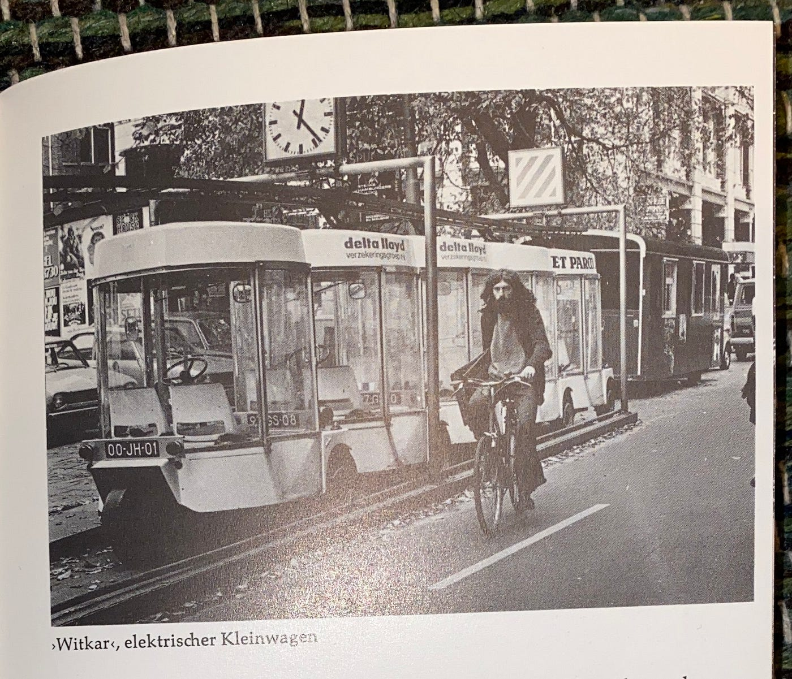
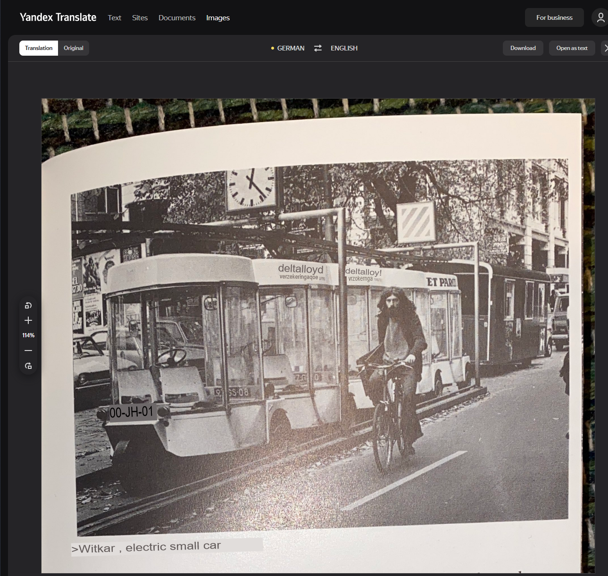
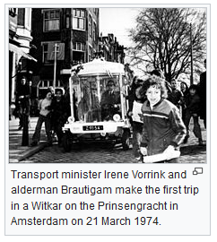
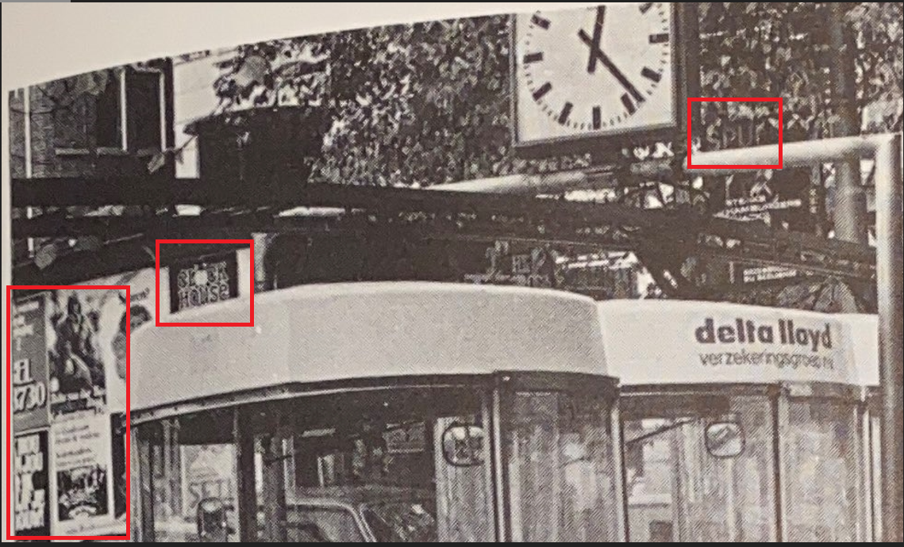
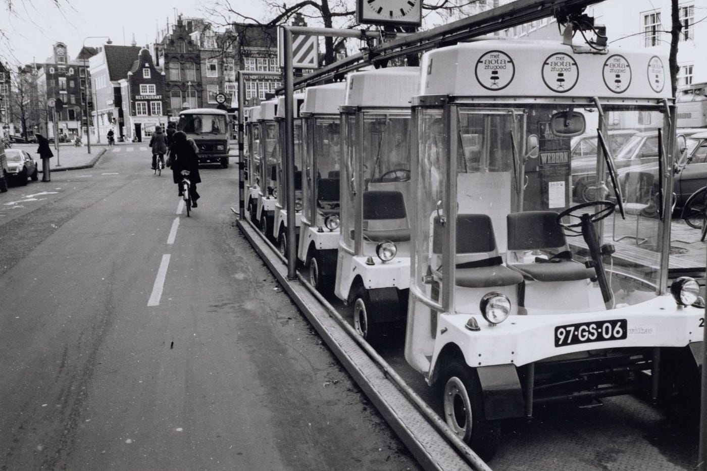
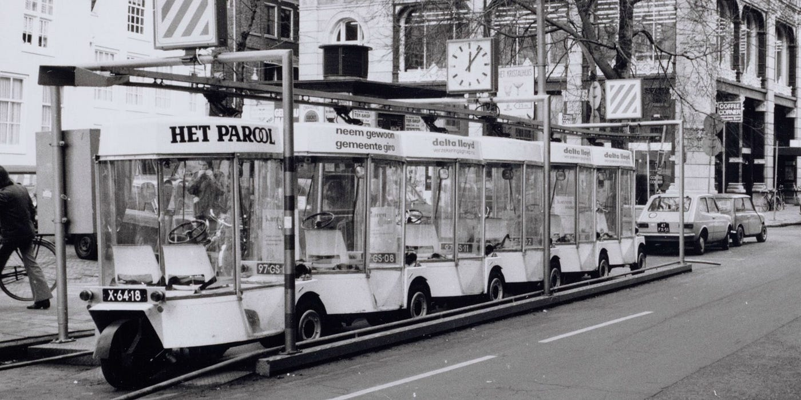
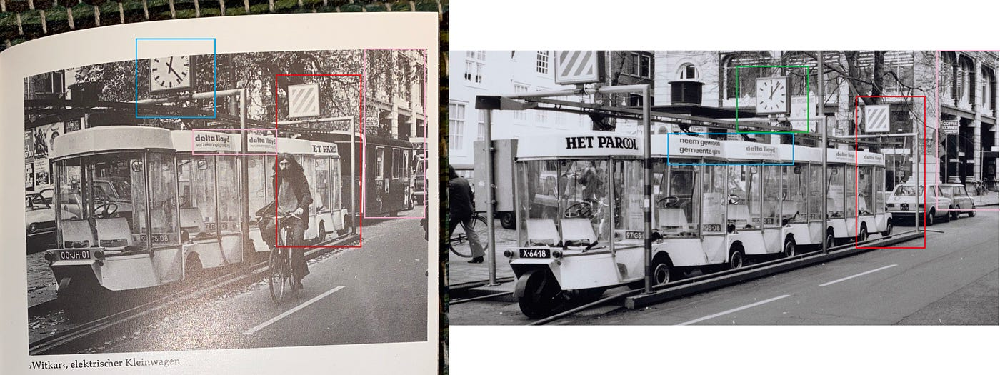
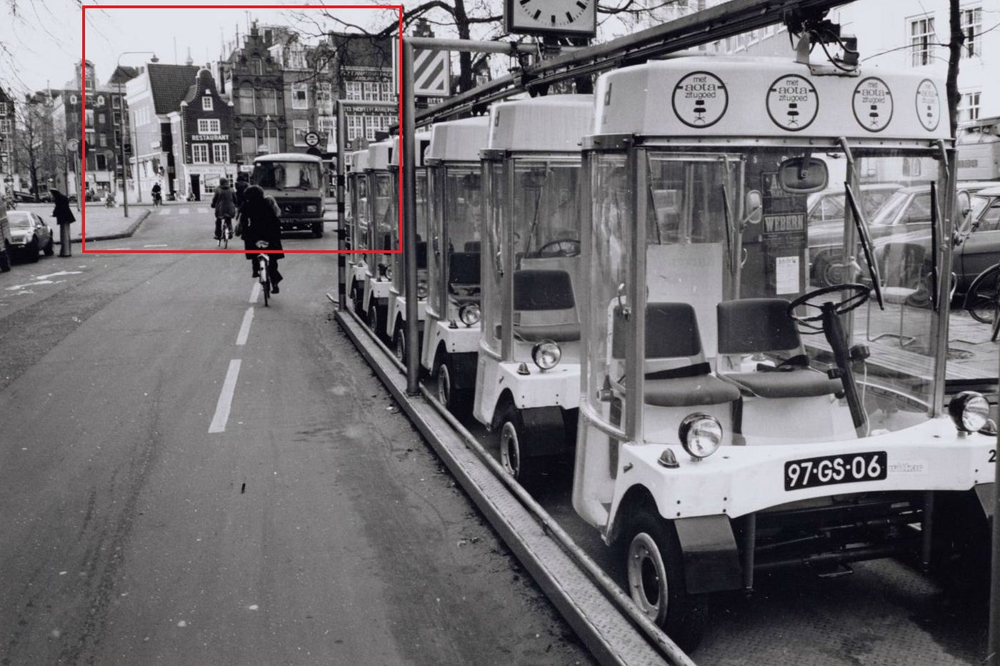
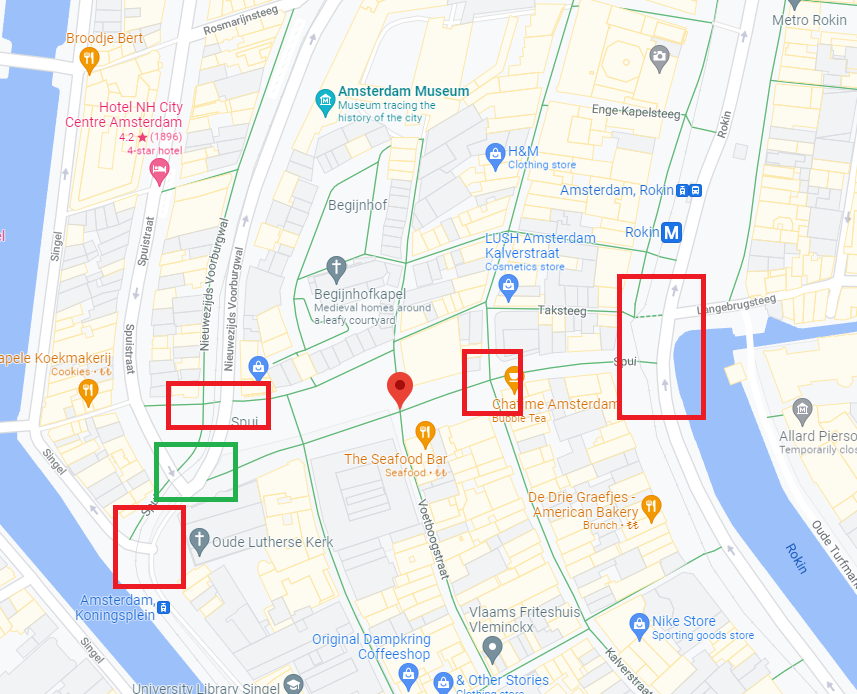

### Time Travel to 1974 — OSINT Challenge 1

On December 29, 2021, Quiztime \(contributor @ [twone2](https://twitter.com/twone2) \) shared a new OSINT quiz\. The objective was, for me, at least not very simple\. We had to Locate the place provide the book's name, and when the photo was taken\. Please refer to the embedded link below for the original post:

■■■■■■■■■■■■■■ 
> **[Tilman | 🇺🇦 | Now also: @twone2@journa.host](https://twitter.com/twone2) @ Twitter Says:** 

> > Happy holidays with @[quiztime](https://twitter.com/quiztime)! Welcome to the #WednesdayQuiz 🔖

1️⃣ Where is this?
2️⃣ What book is it from?
3️⃣ From what year?

🔁 to invite others
🤝 cooperations welcome
✅ Solutions👇🏻 the GIF
💬 Explain how you did it
⛔ No solutions below this tweet! https://t.co/v9nCayhHR7 

> **Tweeted at [2021-12-29 18:44:34](https://twitter.com/twone2/status/1476262886699945988).** 

■■■■■■■■■■■■■■ 

Don't read any further if you'd like to test your geolocation skills\. Open the picture and give it a try\. Don't scroll further down as I will be discussing how I found it and since I just started this hobby, ill probably be doing the long way around :\)

> Lastly, English is not my native language\. So, I apologise for any mistakes that I might do\. 

### Warning spoilers ahead

So, the first thing I did was to see what that weird language this was\. To do this, I used Yandex Translate simply because it has built\-in OCR capabilities\.

Translation: witkar, small electric car ??

Okay\. So, the text says, **"witkar, small electric car",** and Yandex thinks this is German\. Okay, this could mean that this witkar is from Germany but let's leave that for now\.

The other text I hadn't noticed before OCR'ing this image was the weird text that reads **"deltalloyd"** quick google search shows this as an insurance company based in **Amsterdam, Netherlands** \. Hmm, okay, weird\. They also work in Germany so that it could mean nothing\. Anyway, let's note that and move on to what a **witkar** is\.

So, once you search **witkar** and open Wikipedia or some new articles, it seems that this **witkar** thing is actually from Amsterdam and someplace in Germany\. Cool\.

Cool, Very old

> Side note, before opening Wikipedia I got stuck and searched for witkar/random words\+ Germany then I realized that this book is German but the place is in Amsterdam lol\. 

Anyways, now we know this thing came after 1974, and it was in Amsterdam, meaning we have a nice starting point\. Oh, and also, the wiki has different place names where witkar operated, but it's too much of a task to search them all\.

To be honest, after finding these districts? I went back to the image and tried to find texts that I might have missed before\.

So there were parts of the image where I could barely read\.

After much ENHANCE operation recognized the word **"Spui"** this is a District name that was mentioned in the wiki\. Nice\. After this, I was lost for a very long time couldn't find anything\. Then I randomly came across this flicker page\.

[Witkarstation: 97\-GS\-06 bestaat nog\! \| Spui 1975 beeldbank\.a… \| Flickr](https://www.flickr.com/photos/michielverburgh/39472657821/in/photostream/)

Basically, had all the information I needed\.

These images were what allowed me to find the correct spot

wow, everything Checks out,

Let's find these buildings :\)

So, there are 5 possible places to check, shown below\. Sadly the last one I checked was the correct place\. It's marked green\.

Spui district?
### Location Proof

](assets/96770336d4df/1*FikhHvEkMB83G8vSAC0xfg.png)

Yey — Location Link: [27 Spui — Google Maps](https://www.google.com/maps/@52.3686141,4.8895548,3a,75y,242.42h,75.21t/data=!3m6!1e1!3m4!1sjS4cppB16EiBrpxx6X1Plw!2e0!7i13312!8i6656)

Location Coordinates: [52\.3686141,4\.8895548](https://www.google.com/maps/place/52%C2%B022'07.0%22N+4%C2%B053'22.4%22E/@52.3686153,4.8887564,18z/data=!3m1!4b1!4m5!3m4!1s0x0:0x6d5b80684eebb21!8m2!3d52.3686141!4d4.8895548)

Thank you, Quiztime, for the questions\. I'll be randomly picking questions from your Twitter and solving them from now on\.

[**JavaScript is not available\.**](https://twitter.com/quiztime) 
[_Edit description_ twitter\.com](https://twitter.com/quiztime)

_[Post](https://medium.com/@leventd/quiztime-random-osint-challange-1-96770336d4df) converted from Medium by [ZMediumToMarkdown](https://github.com/ZhgChgLi/ZMediumToMarkdown)._
