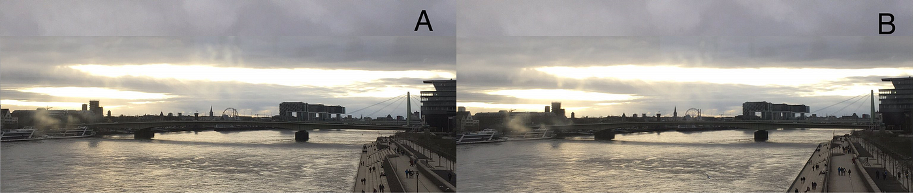
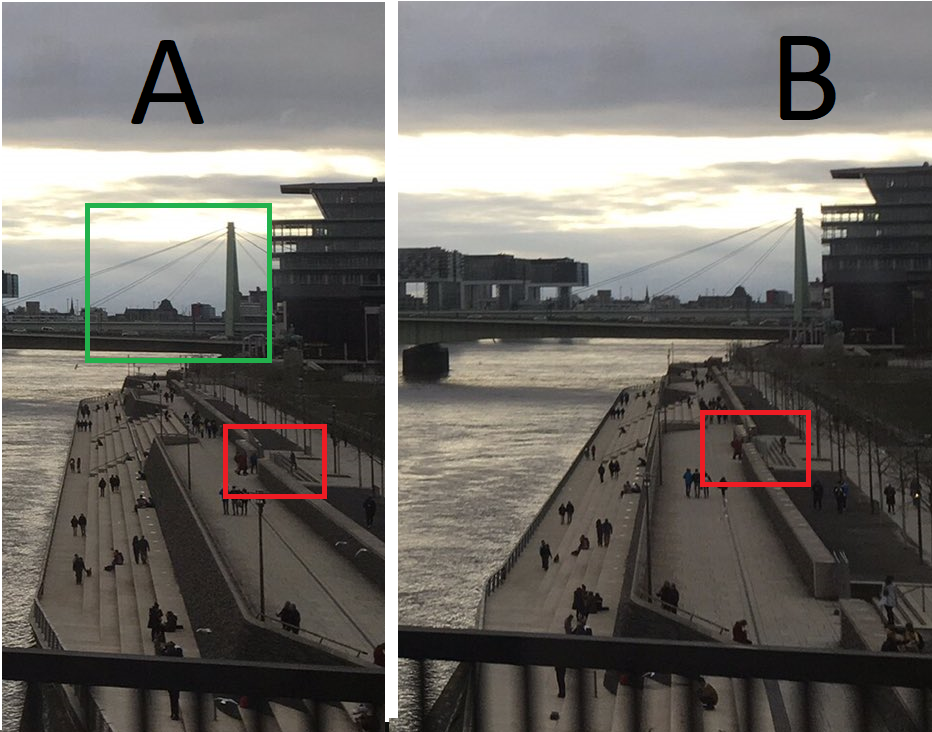
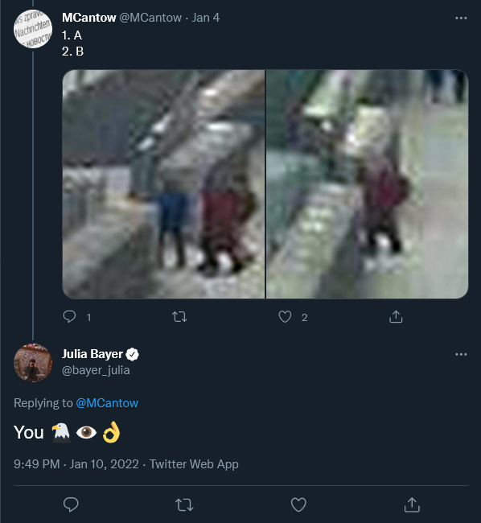
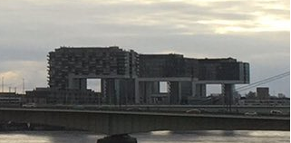

### Please Don't Flip The Images — OSINT Challenge 2

On Jan 1, 2022, Quiztime \(contributor @ [bayer\_julia](https://twitter.com/bayer_julia) \) shared a new OSINT quiz with us\. The objective was simple\. We had to figure out which picture was taken first\. But since I'm new at this, ill also try to Locate the place where the photo was taken\. Please refer to the embedded link below for the original post:

■■■■■■■■■■■■■■ 
> **[Julia Bayer](https://twitter.com/bayer_julia) @ Twitter Says:** 

> > It‘s @Quiztime 🥳 and the 1st in #2022. Time to say THANK YOU ❤️ You are truly an amazing community. This is my present for you today:

🔮 Which photo was taken first: A or B?

✍️ Reply to me with your answer 
🤝 Reply to all for collaboration 
🌈 Good luck with the #MondayQuiz https://t.co/oriHGSKmw2 

> **Tweeted at [2022-01-03 21:36:59](https://twitter.com/bayer_julia/status/1478118214936760321).** 

■■■■■■■■■■■■■■ 

Don't read any further if you'd like to test your geolocation skills\. Open the picture and give it a try\. Don't scroll further down as I will be discussing how I found it and since I just started this hobby, ill probably be doing the long way around :\)

> Lastly, English is not my native language\. So, I apologise for any mistakes that I might do\. 

### Warning spoilers ahead

Well, first, I started checking the cars on the bridge to see if I could figure out if they were moving, but I couldn't be sure because of the image resolution\.

Very Sad

So instead, I started checking out the people on the right side, and would you believe it, people actually walk, how interesting\.

Anyway, then I saw a couple who were walking towards the stairs\. You can clearly see that picture A is the one taken first as no person in their right mind would try to walk on a stair backwards 😊

Cool\.
### Validation by the Question Creator

Someone had the same idea as me :\)

> Note: Apparently some people found some cars on that bridge\. An guessed correctly :\) 

Yey, Quiz finished, but I said I'd find the location, so here we go\.

Kranhaus

The first thing I did was to search " **L shaped building Europe"** and found the building fairly quickly\. This is the Kranhaus in Cologne\. Cool\.

Then I opened Google maps and searched for a bridge that would see these buildings from the left\. Well, what do you know, there are no bridges like that, so I thought the images must be filliped for some reason and went to the other side\.

Very sad, I thought I found the correct bridge at first

And since there is supposed to be a big support thing on the first bridge \(Green Box\), the second bridge was the location we were looking for\.

But when I checked Streetview, the distance seemed off by a lot\. \(Red Box\)

So, I moved to another bridge, [**Hohenzollernbrücke**](https://goo.gl/maps/V7rxUCnqfE2Khnmr5) , \(Blue Box\) \. And finally found the correct bridge\.

](assets/cd9ca6a7015b/1*6fGnLKB9qt_Ul4eOUTKz_g.png)

[Google Streetview Link](https://www.google.com/maps/@50.9412766,6.9672666,3a,75y,95.83h,91.3t/data=!3m11!1e1!3m9!1sAF1QipPqQXDHPljZgzkFxO3kqOs6jrdIz2eRJMGONW80!2e10!3e11!6shttps:%2F%2Flh5.googleusercontent.com%2Fp%2FAF1QipPqQXDHPljZgzkFxO3kqOs6jrdIz2eRJMGONW80%3Dw203-h100-k-no-pi-0-ya218.92493-ro0-fo100!7i13996!8i6998!9m2!1b1!2i27?hl=en)

As you can see, the distance matches fairly well, So, this time, I'm confident that this is correct\.
### Validation by the Question Creator

■■■■■■■■■■■■■■ 
> **[Ran Locar 🔥🌉 ران لوكار](https://twitter.com/ranlocar) @ Twitter Says:** 

> > @[spmoraes](https://twitter.com/spmoraes) @wodka85 @[bayer_julia](https://twitter.com/bayer_julia) @[quiztime](https://twitter.com/quiztime) i checked again. you're right. it's flipped. this is the hohenzollernbrucke 

> **Tweeted at [2022-01-04 16:27:21](https://twitter.com/ranlocar/status/1478402683576983552).** 

■■■■■■■■■■■■■■ 

Thank you, Quiztime, for the questions\. I'll be randomly picking questions from your Twitter and solving them from now on\.

[**JavaScript is not available\.**](https://twitter.com/quiztime) 
[_Edit description_ twitter\.com](https://twitter.com/quiztime)

_[Post](https://medium.com/@leventd/quiztime-random-osint-challenge-2-cd9ca6a7015b) converted from Medium by [ZMediumToMarkdown](https://github.com/ZhgChgLi/ZMediumToMarkdown)._
