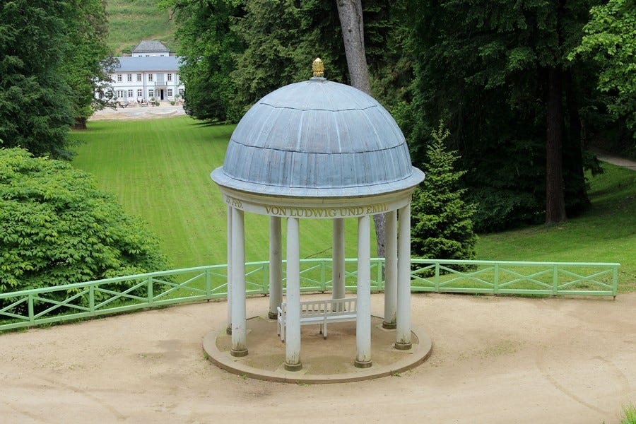
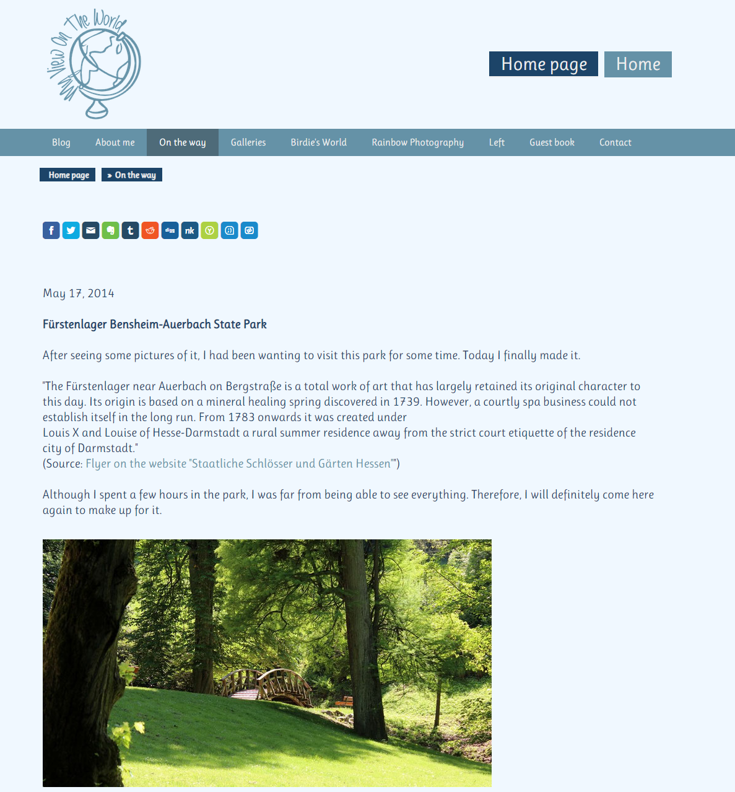
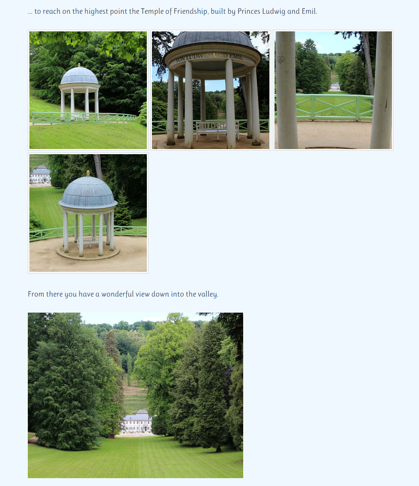
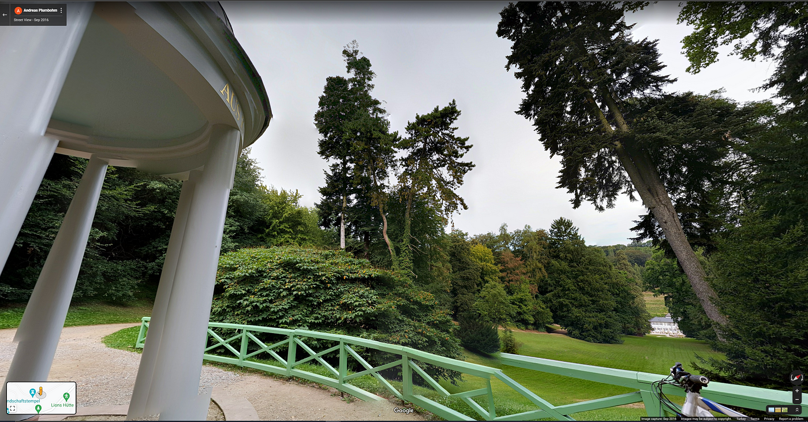

### Temple of Friendship — OSINT Challenge 3

On Jan 5, 2022, Quiztime \(contributor @ [twone2](https://twitter.com/twone2) \) shared a new OSINT quiz with us\. The objective was weird :\) \. We had to figure out what was written on the temple\. So let's try to Locate the place\. Please refer to the embedded link below for the original post:

■■■■■■■■■■■■■■ 
> **[Tilman | 🇺🇦 | Now also: @twone2@journa.host](https://twitter.com/twone2) @ Twitter Says:** 

> > Happy New Year, lovely @[quiztime](https://twitter.com/quiztime) community!

My New Years walk brought me past this temple in the foreground. What’s written along it’s side?

🔁 to invite others
🤝 cooperations welcome
✅ Solutions👇🏻 the GIF
💬 Explain how you did it https://t.co/bf6ASdeMGV 

> **Tweeted at [2022-01-05 12:27:05](https://twitter.com/twone2/status/1478704606280658944).** 

■■■■■■■■■■■■■■ 

Don't read any further if you'd like to test your geolocation skills\. Open the picture and give it a try\. Don't scroll further down as I will be discussing how I found it and since I just started this hobby, ill probably be doing the long way around :\)

> Lastly, English is not my native language\. So, I apologise for any mistakes that I might do\. 

### Warning spoilers ahead

The first thing I did was crop the photo so reverse image search wouldn't give any trees as a result\. I Used Google Images for this\.

Cropped version

One of the first results was a promising match, so I checked it\.

Similar looking image

Well, at first glance, the Dome and the Building at the back matches perfectly\. So was it this easy? Yes, it was\.

The image sent me to a site, [Staatspark Fürstenlager Bensheim\-Auerbach — Birgit Vorfelder](https://www.birgitvorfelder.com/startseite/unterwegs/staatspark-f%C3%BCrstenlager-bensheim-auerbach/) , apparently its a State Park\.

Cool Site

Lovely place\. There are many photos from this site, and the answers to the question can be found here\.

Very Nice

It reads **“AUS KINDLICHER LIEBE 15\. Feb\. VON LUDWIG UND EMIL 1824”** also called the Temple of Friendship\. \(Freundschaftstempel\)

Here is a StreetView Photosphere [Andreas Plumbohm — Google Maps](https://www.google.com/maps/@49.6975881,8.6368181,3a,75y,318.99h,100.74t/data=!3m8!1e1!3m6!1sAF1QipPdrm04f7VaW8cZaYOqNtYWfqNLzukz7-Ss69ef!2e10!3e11!6shttps:%2F%2Flh5.googleusercontent.com%2Fp%2FAF1QipPdrm04f7VaW8cZaYOqNtYWfqNLzukz7-Ss69ef%3Dw203-h100-k-no-pi0-ya254.93167-ro-0-fo100!7i10240!8i5120)

Thank you, Quiztime, for the questions\. I'll be randomly picking questions from your Twitter and solving them from now on\.

[**JavaScript is not available\.**](https://twitter.com/quiztime) 
[_Edit description_ twitter\.com](https://twitter.com/quiztime)

_[Post](https://medium.com/@leventd/quiztime-random-osint-challenge-3-718c887aa6cf) converted from Medium by [ZMediumToMarkdown](https://github.com/ZhgChgLi/ZMediumToMarkdown)._
