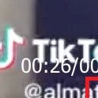
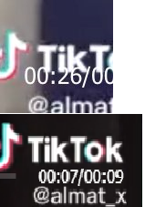
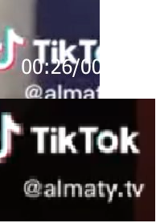

### I Still Don't like TikTok — OSINT Challenge 4

On Jan 7, 2022, Quiztime \(contributor @ [fiete\_stegers](https://twitter.com/fiete_stegers) \) shared a new OSINT quiz with us\. The objective was weird :\) \. We had to figure out what was written on the temple\. So let's try to Locate the place\. Please refer to the embedded link below for the original post:

■■■■■■■■■■■■■■ 
> **[Fiete Stegers | @fiete@mastodon.social](https://twitter.com/fiete_stegers) @ Twitter Says:** 

> > Hi @[quiztime](https://twitter.com/quiztime) crowd, just 2 quick questions for today's #Fridayquiz: 
❔Which TikTok channel is this?
❔Since when does the channel exist?

‼️ Solutions to me only or👇🏻 the GIF
🤝 reply to others to cooperate
💬 Explain how you did it https://t.co/Vf2YL63xfR 

> **Tweeted at [2022-01-07 17:56:57](https://twitter.com/fiete_stegers/status/1479512396066660352).** 

■■■■■■■■■■■■■■ 

Don't read any further if you'd like to test your geolocation skills\. Open the picture and give it a try\. Don't scroll further down as I will be discussing how I found it and since I just started this hobby, ill probably be doing the long way around :\)

> Lastly, English is not my native language\. So, I apologise for any mistakes that I might do\. 

### Warning spoilers ahead

So, the first thing I checked was whether that small letter was "T" or a "1"\. After checking 2 accounts, it's safe to say that is a `t`

So very small :\)

Let's search for some accounts with the name "almat" in them\. Maybe it's Almaty? I don't know\.

So, I opened some dude's accounts named "almat\_x" and "almat\_akerke", but these names don't seem to match the length ratio with the Tiktok Logo\. It had to be longer than this account name\.

My terrible paint skills

At this point, I wanted to try my Almaty theory just for fun\. Well, my theory which had no basis, was spot on\. The "Almaty\.tv" character length was almost perfect\. \(I tried other accounts, but they didn't work very well\)

"@" location is perfect\.

Since the positioning is perfect, I assumed this was the correct account and started searching for a 26\-second video\. But couldn't find it :\(

I'm confident that this is the account, but I couldn't find the video\. I searched for around 45 minutes or more\. Then I gave up\. I'll solve it some other time\.
### A small update after I tried this

■■■■■■■■■■■■■■ 
> **[Ivano Somaini](https://twitter.com/IvanoSomaini) @ Twitter Says:** 

> > @[fiete_stegers](https://twitter.com/fiete_stegers) [almaty.tv](http://almaty.tv) https://t.co/g5XLtE0p4O 

> **Tweeted at [2022-01-08 23:48:56](https://twitter.com/ivanosomaini/status/1479963360493977605).** 

■■■■■■■■■■■■■■ 

According to this tweet, the account I found is correct, but the video was posted on 28\. June 2020\. Interestingly I can't see any videos before 2021\. I'll check why this happens later\. If I find anything, I'll update this part later\.

Thank you, Quiztime, for the questions\. I'll be randomly picking questions from your Twitter and solving them from now on\.

[**JavaScript is not available\.**](https://twitter.com/quiztime) 
[_Edit description_ twitter\.com](https://twitter.com/quiztime)

_[Post](https://medium.com/@leventd/quiztime-random-osint-challenge-4-6e882e5601a0) converted from Medium by [ZMediumToMarkdown](https://github.com/ZhgChgLi/ZMediumToMarkdown)._
