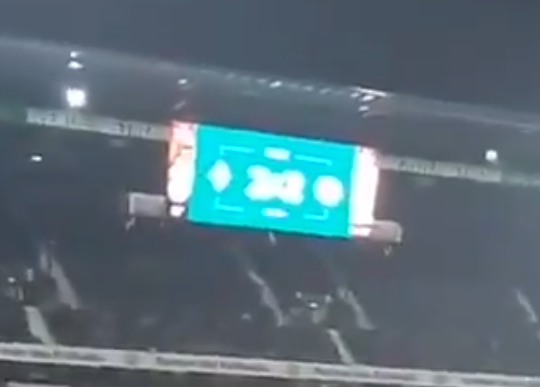
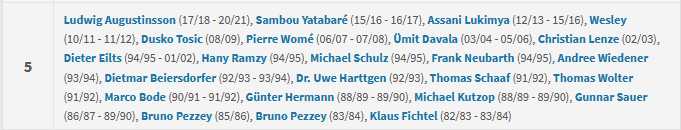
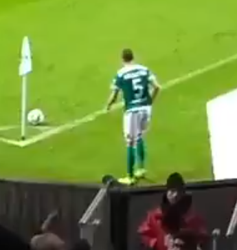
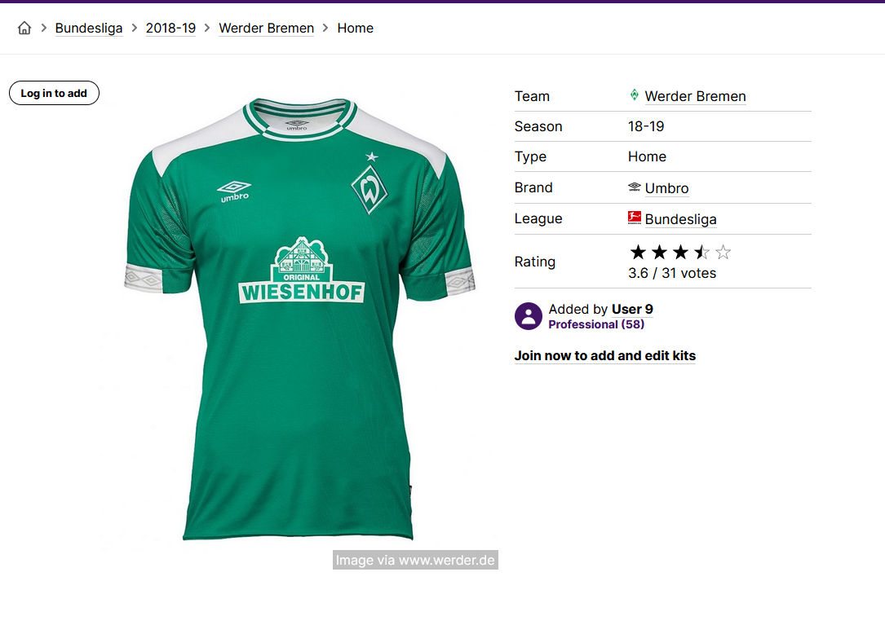
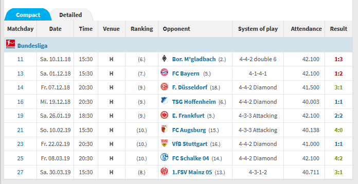
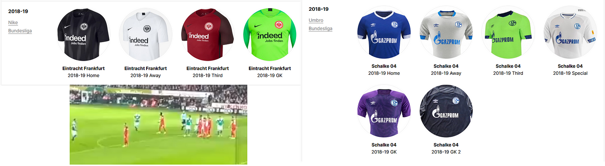

### Who Knew Soccer Was This Complicated— OSINT Challenge 5

On Jan 14, 2022, Quiztime \(contributor [@dondude](https://twitter.com/dondude) \) shared a new OSINT quiz with us\. The objective was pretty simple\. We had to figure out when the video was taken\. Please refer to the embedded link below for the original post:

Don't read any further if you'd like to test your own geolocation skills\. Open the picture and give it a try\. Don't scroll further down as I will be discussing how I found it and since I just started this hobby\. I'll probably be doing the long way around :\) Oh, and this is actually a **Chronolocation** question _\._

> Lastly, English is not my native language\. So, I apologise for any mistakes that I might do\. 

### Warning spoilers ahead

Location is fairly straightforward since many adverts say " [Werderstrom](https://www.werder-strom.de/) "\. Google says the stadium is "WESERSTADION" used by Bundesliga club **Werder Bremen** \. You can check the inside of the stadium from [a Photosphere here](https://goo.gl/maps/tmd4XfmDp1kUPZaL7) \. Cool info\. Okay, now what\.

Hoping that's 2–2

There are two things to do first: find matches with a score of 2–2 or more\. Secondly, since that could be a long list, we need to find player 5, to narrow down the list\. The main problem I see here is the time\. We could be looking for 10 to 15 years of games to find this match\. :\(

I don't watch soccer, but I have lots of friends who do\. I sent them a quick text asking if there were any cool sites with historical information\. And they sent me a link, how nice of them\. Apparently, there is a site called Transfermarkt which I believe to be a soccer database\.

The link they sent had a list of players that wore the [No 5 shirt for Werder Bremen](https://www.transfermarkt.com/sv-werder-bremen/rueckennummern/verein/86) \.

The no 5 list

After this, I realized this video couldn't be before the 2000s as there were no phones with cameras\. So, let's find out when phones started shooting videos\. According to Google, the first HD Video recording smartphone was from 2009 and SD or lower happened somewhere in 2007–2008\. Meaning this video can't be older than 2007\. Nice\. \(This guess was made by a friend, it seemed very likely\) \.
- Ludwig Augustinsson \(17/18–20/21\),
- Sambou Yatabaré \(15/16–16/17\),
- Assani Lukimya \(12/13–15/16\),
- Wesley \(10/11–11/12\),
- Dusko Tosic \(08/09\),
- Pierre Womé \(06/07–07/08\),

So, we have 6 potential people to look for\. After this, I was stuck for a while couldn't figure out what to do next\. Then I accidentally clicked our boy Assani and realized some of the players are not white\.

Player 5

The only white players who wore no 5 shirts in this period were Dusko Tosic \(2008–2009\) and Ludwig Augustinsson \(2017–2021\) \.

Since his last name appears to be very long, it's probably **Ludwig Augustinsson \(2017–2021\)** \.

Yey, now we have a time frame\. All we have to do is now find the match\.

Yeah, this was not a good idea\. There are still so many matches we need to narrow our 2017–2021 time frame\. I mean, They played close to 60 games in the 2020/2021 season alone\. We need to find a better way to do this\.

So again, I texted my soccer buddies, asking for a way to narrow down this time frame\. Two of them had excellent ideas\. One was to see what seasons that green kit was worn in\. The other idea was that this game was in winter/autumn since the fans' clothing tells us that it is cold\.

So searching various sites, I found this page from [footballkitarchive](https://www.footballkitarchive.com/werder-bremen-kits/#2010s) \. After searching the seasons from 2017 to 2020, I found that this kit/uniform is from the [18/19 season](https://www.footballkitarchive.com/werder-bremen-2018-19-home-kit/) \.

Nice\.

Okay, we now know,
- It's a Home match
- Between November 2018 and March 2019 \(winter/autumn\)
- The score was 2–2 or higher\.

So, using transfermarkt, we can search using the parameters above, and the result is,

This

Meaning there are two options
- E\. Frankfurt on Sa\. 26\.01\.19 18:30
- FC Schalke 04 on Fr\. 08\.03\.19 20:30

So, let's check the team colours to find the exact match\.

As seen here, E\. Frankfurt uses red kits/uniforms\.

From here, I tried to find some sites to see if I could pinpoint the exact minute that free\-kick happened\. But couldn't\. And got too bored to check YouTube\. So here is my answer\.

So, to answer the quiz,
- Location: Weser\-Stadion, Berlin Germany
- Start Date: 26\.01\.19– 6:30 PM
- Time: Sometime between 7:38 PM and 8:00 PM \(At 68min mark, the score became 2–2\)

### Validation by the Question Creator

 , Meh close enough](assets/6d0bbee43d06/1*0pN1g513cGduJi2n-Ud2HQ.png)

[https://twitter\.com/twelfthman/status/1482081935539249153](https://twitter.com/twelfthman/status/1482081935539249153) , Meh close enough

Thank you, Quiztime, for the questions\. I'll be randomly picking questions from your Twitter and solving them from now on

[**JavaScript is not available\.**](https://twitter.com/quiztime) 
[_Edit description_ twitter\.com](https://twitter.com/quiztime)

_[Post](https://medium.com/@leventd/quiztime-random-osint-challenge-5-6d0bbee43d06) converted from Medium by [ZMediumToMarkdown](https://github.com/ZhgChgLi/ZMediumToMarkdown)._
