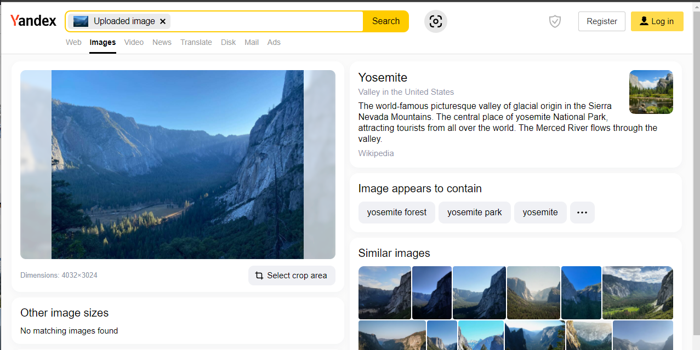
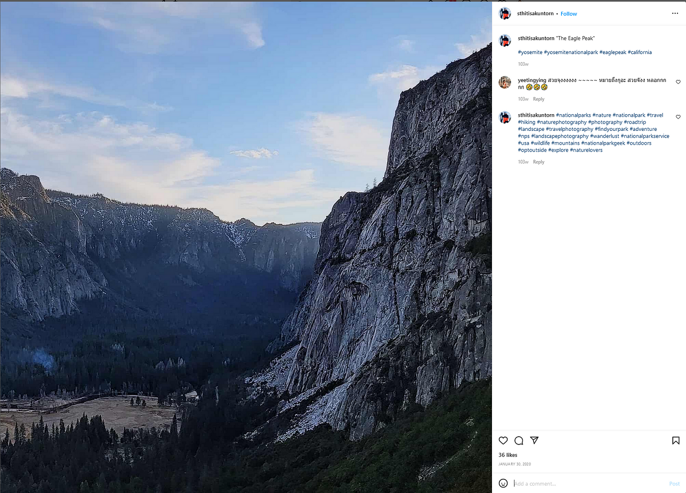
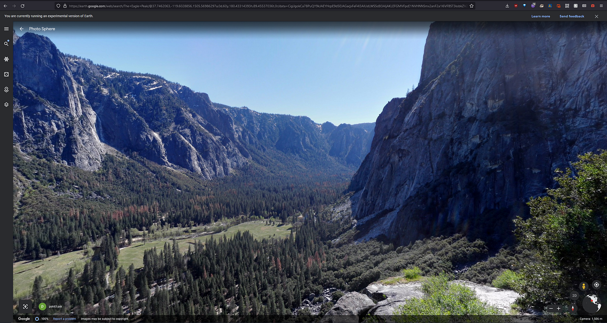
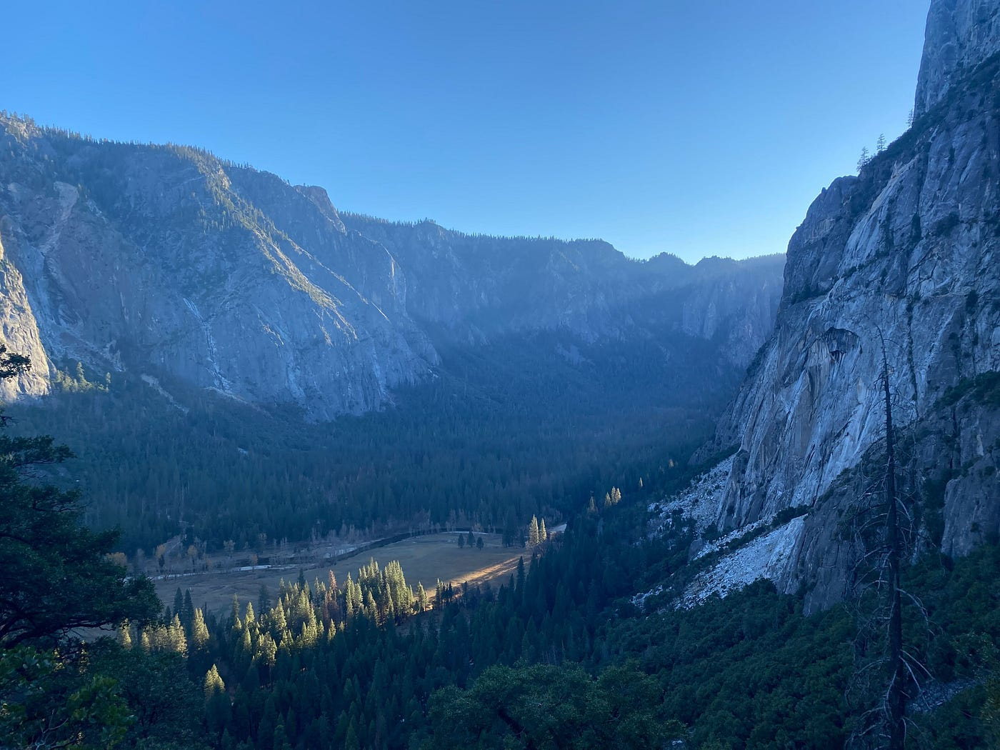
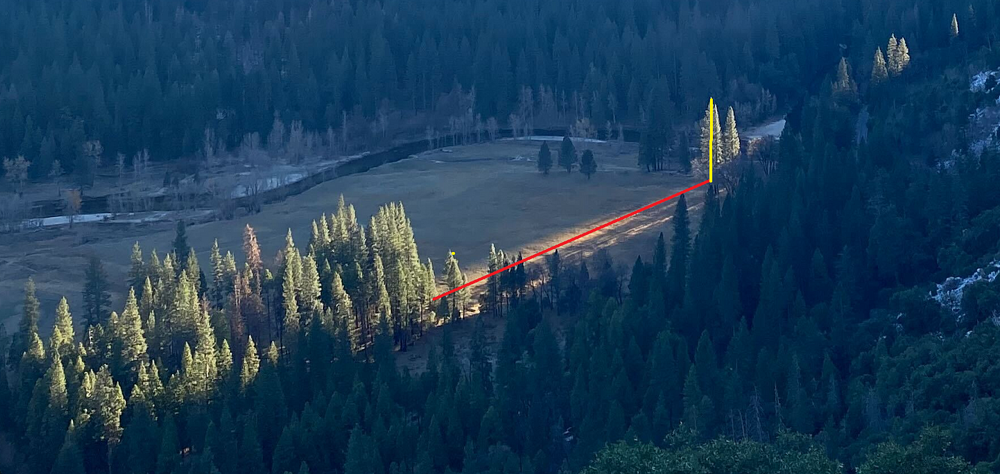
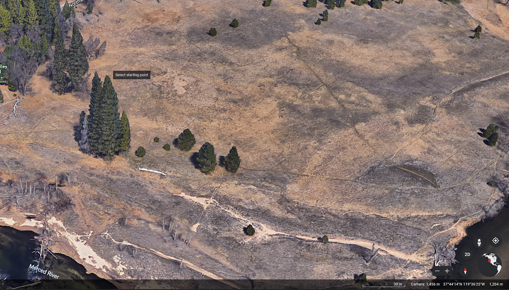

### Time For Some C **hronolocation —** OSINT Challenge 6

On Jan 13, 2022, Quiztime \(contributor [@N\_Waters89](https://twitter.com/N_Waters89) \) shared a new OSINT quiz with us\. The objective is simple\. We had to figure out where and when the photo was taken\. Please refer to the embedded link below for the original post:

Don't read any further if you'd like to test your geolocation skills\. Open the picture and give it a try\. Don't scroll further down as I will be discussing how I found it and since I just started this hobby, ill probably be doing the long way around :\)

> Lastly, English is not my native language\. So, I apologise for any mistakes that I might do\. 

### Warning spoilers ahead

The first thing I usually do is do a reverse image to see if anything similar pops up\. This gave me the location\. :\)

Yosemite National Park

From this Instagram post, we find that this place is called **The Eagle Peak**

Thanks, random Instagram guy\.

Okay, let's go there now,

](assets/1e9c0c609533/1*GHIzvKpEumKPzBdgVS6X1A.png)

[https://earth\.google\.com/web/search/The\+Eagle\+Peak/@37\.74240585,\-119\.60383831,1232\.47261412a,1913\.32677334d,35y,\-152\.5673559h,52\.34890325t,0r/data=CigiJgokCa78PuQY9kJAEYHcpE9d5EJAGacjxFeF4l3AIUdLWS5c8l3A](https://earth.google.com/web/search/The+Eagle+Peak/@37.74240585,-119.60383831,1232.47261412a,1913.32677334d,35y,-152.5673559h,52.34890325t,0r/data=CigiJgokCa78PuQY9kJAEYHcpE9d5EJAGacjxFeF4l3AIUdLWS5c8l3A)

I guess that it's somewhere close to the Columbia Rock marker\. Thankfully there are some Streetview's on there\. So I checked, and, just below that marker, there is another edge, and that height makes more sense\. Look here\.

Compare pls

The elevation is correct, but the positions seem slightly different, so I started checking different locations latterly and found a perfect match\.

](assets/1e9c0c609533/1*XZtaK-8doofp4lky5hAx_g.png)

[Click Here](https://www.google.com/maps/@37.746299,-119.6034325,2a,75y,195.16h,86.9t/data=!3m6!1e1!3m4!1sQ72DsMfr9sNuKQXlZqBO1w!2e0!7i13312!8i6656)

So my location guess is: 37°44'46\.6 "N and 119°36'12\.3 "W

So time for some **Chronolocation\.**

The best way I could come up with ways to find the height of these trees and then calculate the length of the shadow from [https://www\.suncalc\.org/](https://www.suncalc.org/) \.

Meh

Google Earth says these two long trees are 40 meters, hmm I could be wrong, but I don't think it will matter\.

40\-meter trees

So now let's open suncalc\.org, Since I'm assuming the shadows stop at the end of the red line\. The suncalc will look like this\.

](assets/1e9c0c609533/1*fsXXd72I9sMKOwFrGxxKnQ.png)

[https://www\.suncalc\.org/\#/37\.7365,\-119\.6073,17/2021\.12\.01/15:51/40/1](https://www.suncalc.org/#/37.7365,-119.6073,17/2021.12.01/15:51/40/1)

Meaning the potential time range is: 15:47 and 15:57

**My Final answer,**
- **Time: Between 15:47 and 15:57**
- **Location: 37°44'46\.6"N and 119°36'12\.3"W**

### Validation by the Question Creator

](assets/1e9c0c609533/1*PtE0bGL1eExy-hJ63Mxi1w.png)

[https://twitter\.com/y\_vdw/status/1483040995973517313](https://twitter.com/y_vdw/status/1483040995973517313)

So, in the end, my location was almost perfect; I was off by 9 meters\.

But my timing was off by 7 minutes at best and 17 minutes at worst\. Hmm, I need to work on my C **hronolocation** skills\.

Since I see myself as a newbie, I consider this to be an absolute win :\) I hope it'll be better next time\.

Thank you, Quiztime, for the questions\. I'll be randomly picking questions from your Twitter and solving them from now on\.

[**JavaScript is not available\.**](https://twitter.com/quiztime) 
[_Edit description_ twitter\.com](https://twitter.com/quiztime)

_[Post](https://medium.com/@leventd/quiztime-random-osint-challenge-6-1e9c0c609533) converted from Medium by [ZMediumToMarkdown](https://github.com/ZhgChgLi/ZMediumToMarkdown)._
