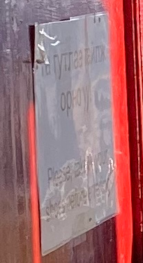
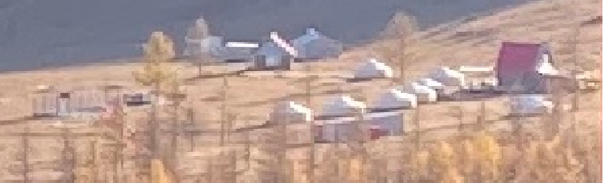
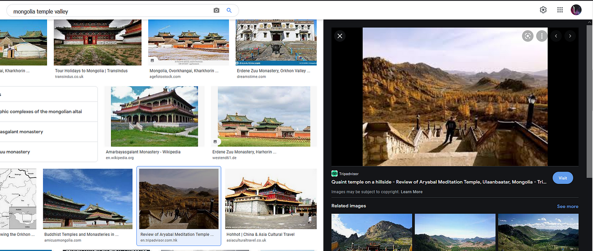
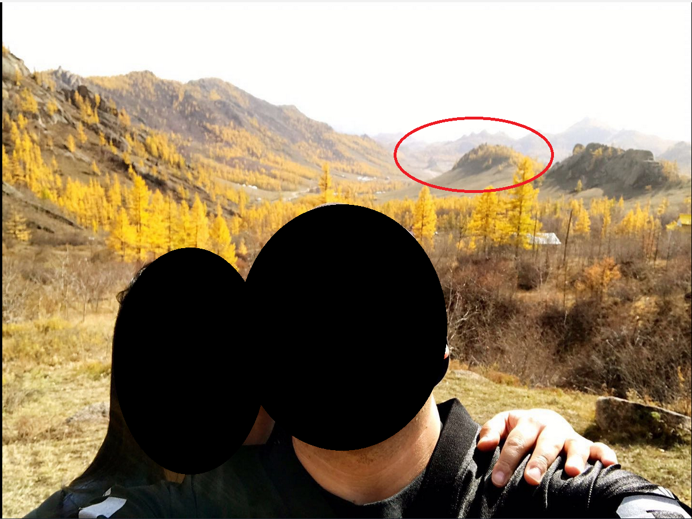
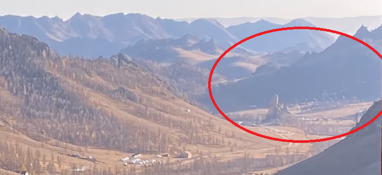
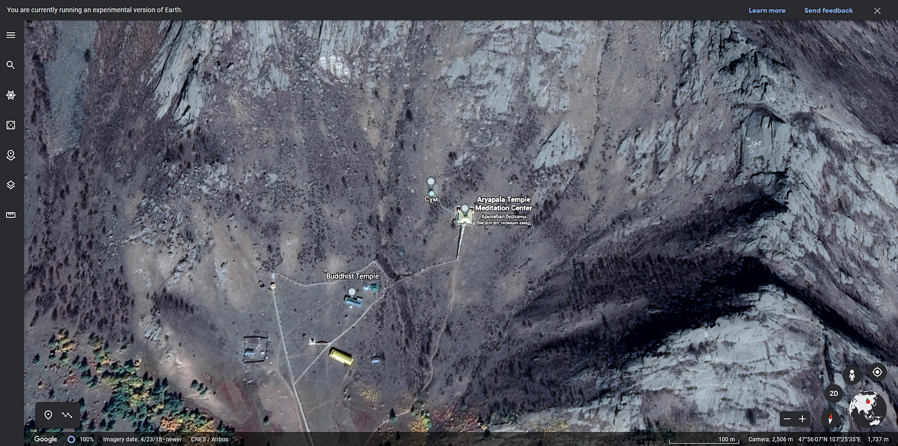
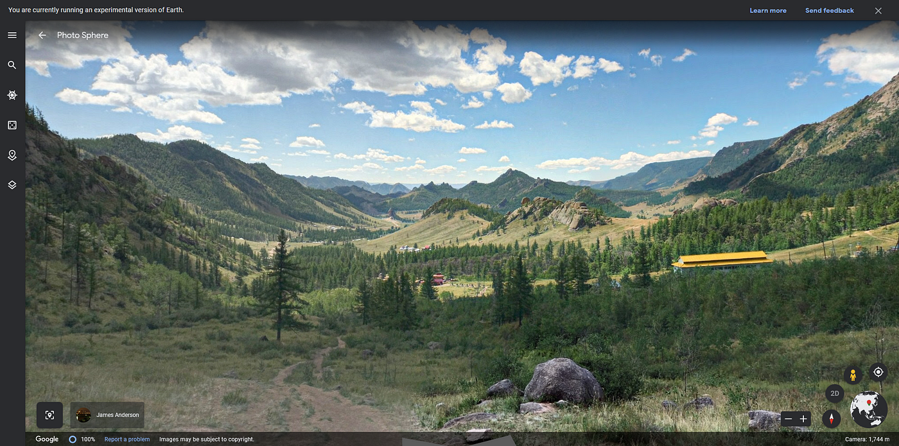
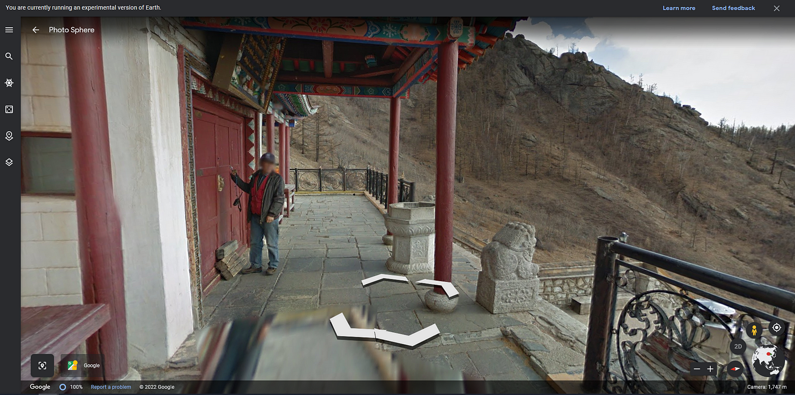

### Time to Visit Central Asia — OSINT Challenge 7

On Jan 12, 2022, Quiztime \(contributor @ [twone2](https://twitter.com/twone2) \) shared a new OSINT quiz with us\. The objective was simple\. We had to figure out where and when this photo was taken\. Please refer to the embedded link below for the original post:

■■■■■■■■■■■■■■ 
> **[Tilman | 🇺🇦 | Now also: @twone2@journa.host](https://twitter.com/twone2) @ Twitter Says:** 

> > Oh @[quiztime](https://twitter.com/quiztime), how I miss traveling. So many fond memories, like this one from my trip to ... 

1️⃣ Where was it?
2️⃣ When was it?

🔁 to invite others to this #WednesdayQuiz
🤝 cooperations welcome
✅ Solutions👇🏻 the GIF or via DM 🙋🏻‍♂️
💬 Explain how you did it! https://t.co/q4eEFFYLRc 

> **Tweeted at [2022-01-12 12:32:39](https://twitter.com/twone2/status/1481242719280418821).** 

■■■■■■■■■■■■■■ 

Don't read any further if you'd like to test your geolocation skills\. Open the picture and give it a try\. Don't scroll further down as I will be discussing how I found it and since I just started this hobby, ill probably be doing the long way around :\)

> Lastly, English is not my native language\. So, I apologise for any mistakes that I might do\. 

### Warning spoilers ahead

As always, I first did a reverse image search and failed spectacularly\. So, let's check the photo\. There are two distinct things aside from the weird thing in the centre\.

Interesting tents, hmm

The sign here uses **Cyrillic script,** and Cyrillic is mainly used in Central Asia \(I think?\),

So let's search for something like " **Tents Central Asia"** most of the results come from Mongolia, Kyrgyzstan, Uzbekistan and Kazakhstan\. But mostly from Mongolia\.

Not helpful, but hey, we dropped down from 195 possible countries to 4, lol\. I'll assume it's Mongolia for now\.

Time to search weird word combinations :\) like **"Mongolia temple valley"** and randomly click some [sites,](https://en.tripadvisor.com.hk/ShowUserReviews-g293956-d12666035-r595777906-Aryabal_Meditation_Temple-Ulaanbaatar.html) but wait, I found something,

Seems familiar

So let's check this out\. While I couldn't find the photo above, I did find this\. Somewhere named [**Aryabal Meditation Temple\.**](https://goo.gl/maps/tgkCc7NjWgx6BTkP7)

Yey, I found the place\.

Here it is,

**Aryabal Meditation Temple**

Okay, cool, I found that weird thing too,

That thing

But when is it? No idea\. I can't find any information\. \(It seems to be winter, I but don't have a date\) But that thing was there in [Jul 2017](https://en.tripadvisor.com.hk/ShowUserReviews-g293956-d12666035-r595777906-Aryabal_Meditation_Temple-Ulaanbaatar.html#photos;aggregationId=101&albumid=101&filter=7&ff=268469759) :\)

I'll come back to this challenge later and try to determine the date as well\.

Thank you, Quiztime, for the questions\. I'll be randomly picking questions from your Twitter and solving them from now on\.

[**JavaScript is not available\.**](https://twitter.com/quiztime) 
[_Edit description_ twitter\.com](https://twitter.com/quiztime)

_[Post](https://medium.com/@leventd/quiztime-random-osint-challenge-7-fc0d5113bec3) converted from Medium by [ZMediumToMarkdown](https://github.com/ZhgChgLi/ZMediumToMarkdown)._
