### Who Throws Away Canvassed Satellite Images? \- OSINT Challenge 8 with Overpass Turbo

On Jan 16, 2022, Quiztime \(contributor @ [trbrtc](https://twitter.com/trbrtc) \) shared a new OSINT quiz with us\. The objective was simple but cool\. We had to figure out the location of these satellite images\. So let's try to Locate the place\. Please refer to the embedded link below for the original post:


■■■■■■■■■■■■■■ 
> **[Christiaan Triebert](https://twitter.com/trbrtc) @ Twitter Says:** 

> > Here’s a #SundayQuiz for @[quiztime](https://twitter.com/quiztime). Someone at a New York City government building apparently threw away these canvassed satellite images. Who can find the locations they show? https://t.co/z9n1GUJmzd 

> **Tweeted at [2022-01-16 19:16:38](https://twitter.com/trbrtc/status/1482793938989858819).** 

■■■■■■■■■■■■■■ 


Don't read any further if you'd like to test your geolocation skills\. Open the picture and give it a try\. Don't scroll further down as I will be discussing how I found it and since I just started this hobby, ill probably be doing the long way around :\)


> Note: At the very end, I try to find the second picture with [Overpasss Turbo](https://overpass-turbo.eu/) 


> _Lastly, English is not my native language\. So, I apologise for any mistakes that I might do\._ 


### Warning spoilers ahead

As I always do, I started by doing a reverse image search \(Google Lens and Yandex Image\) \. Both results tell me that this is, in fact, Aerial Imagery, not Satellite Imagery \(I knew something was off \)


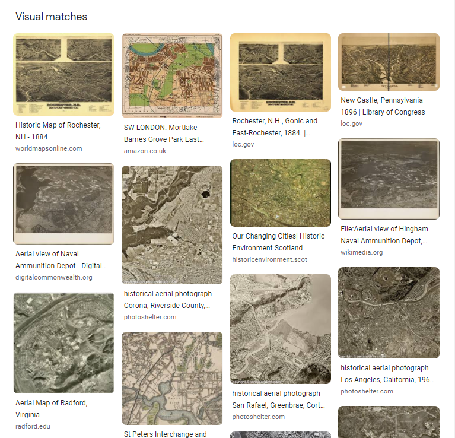

Cool

At this point, having found no matches on Yandex, Google or Bing, I thought of using [**O _verpass Turbo_**](https://overpass-turbo.eu/) **_,_** _an API for_ [**OpenStreetMap**](https://www.openstreetmap.org/) **\. You** can read this fantastic blog post from @ [NixIntel](https://nixintel.info/) on how to use it [here](https://nixintel.info/osint-tools/getting-started-with-overpass-turbo-part-1/) \(for [Part\-2](https://nixintel.info/osint-tools/getting-started-with-overpass-turbo-part-2/) \) \. But first, I'll try to solve this without Overpass Turbo\.

Anyway, let's start\. Since the photos seemed like they were decently developed places, I searched " **Lake** " on all majorly populated areas in New York, as seen below,


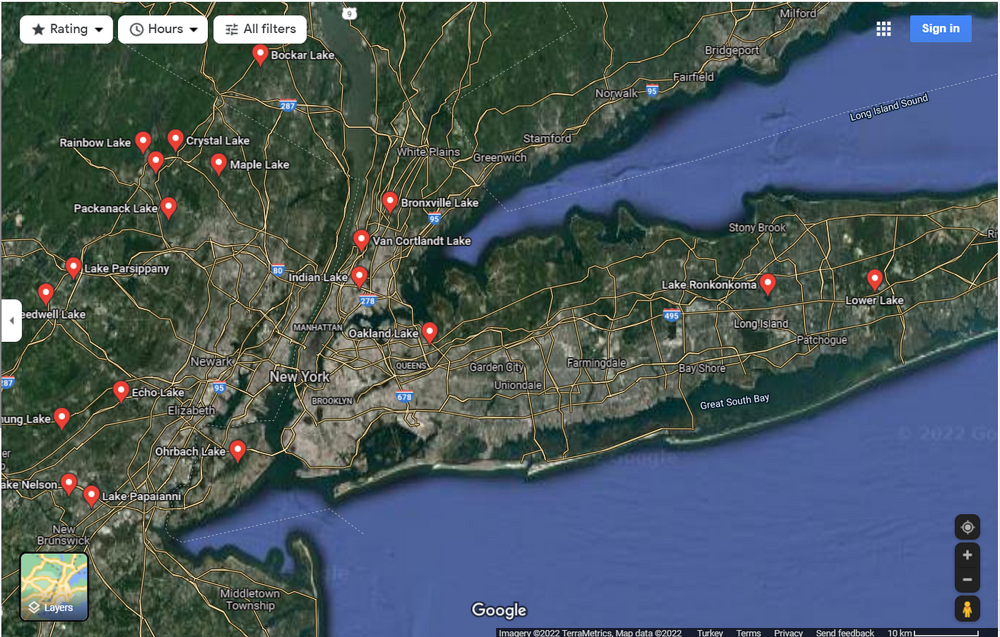

New York, New York

If you are wondering why I'm checking New York, please read the quiz tweet\. About 5 minutes later, I came across this Lake called **Indian Lake\.**


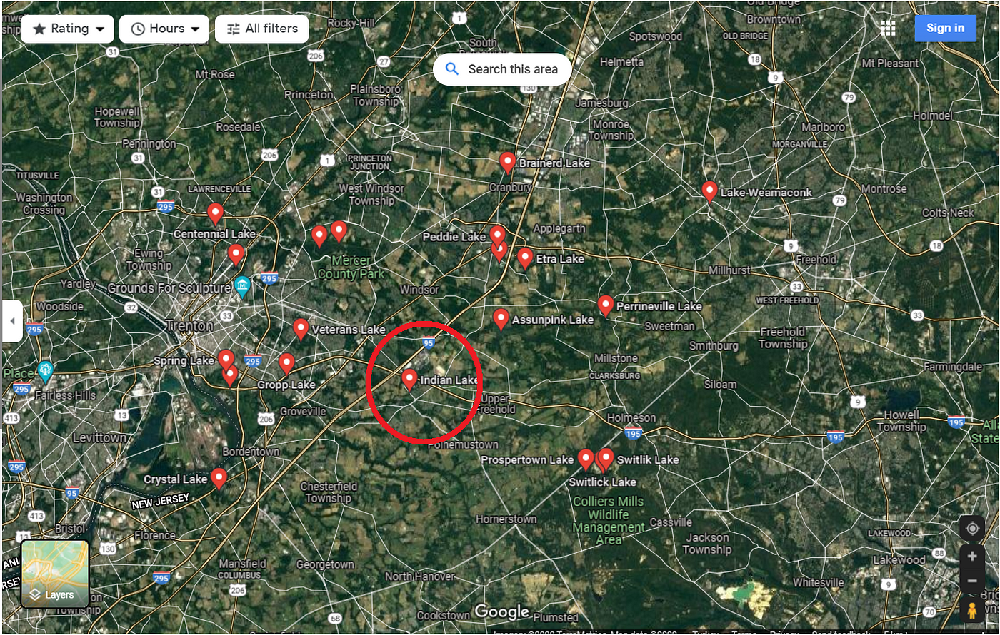

So many Lakes…

And since I'm checking almost each lake one by one, when I zoomed in here, [I found](https://goo.gl/maps/c2G212xpCnUkzc2o7) the place I was looking for\. \(By the way, I'm not checking every lake there is, only the ones that have some river connected to it\)


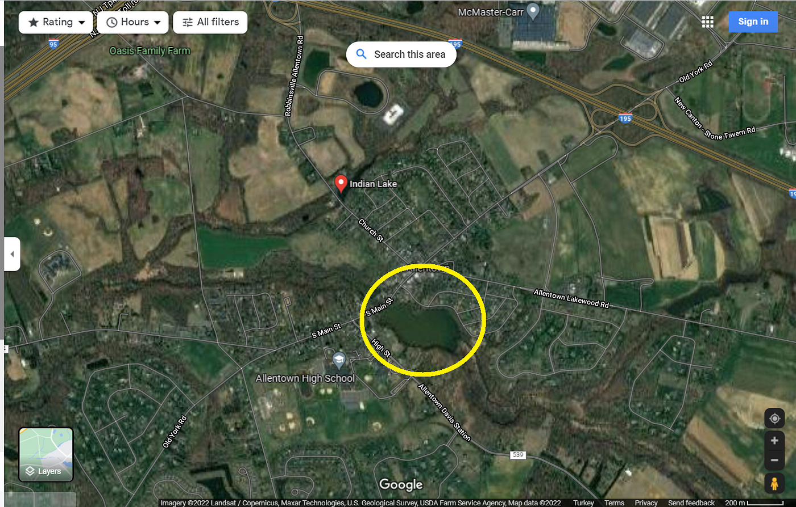

Yey found it\.

Okay, cool, I found the first image\. So let's look at the other picture,


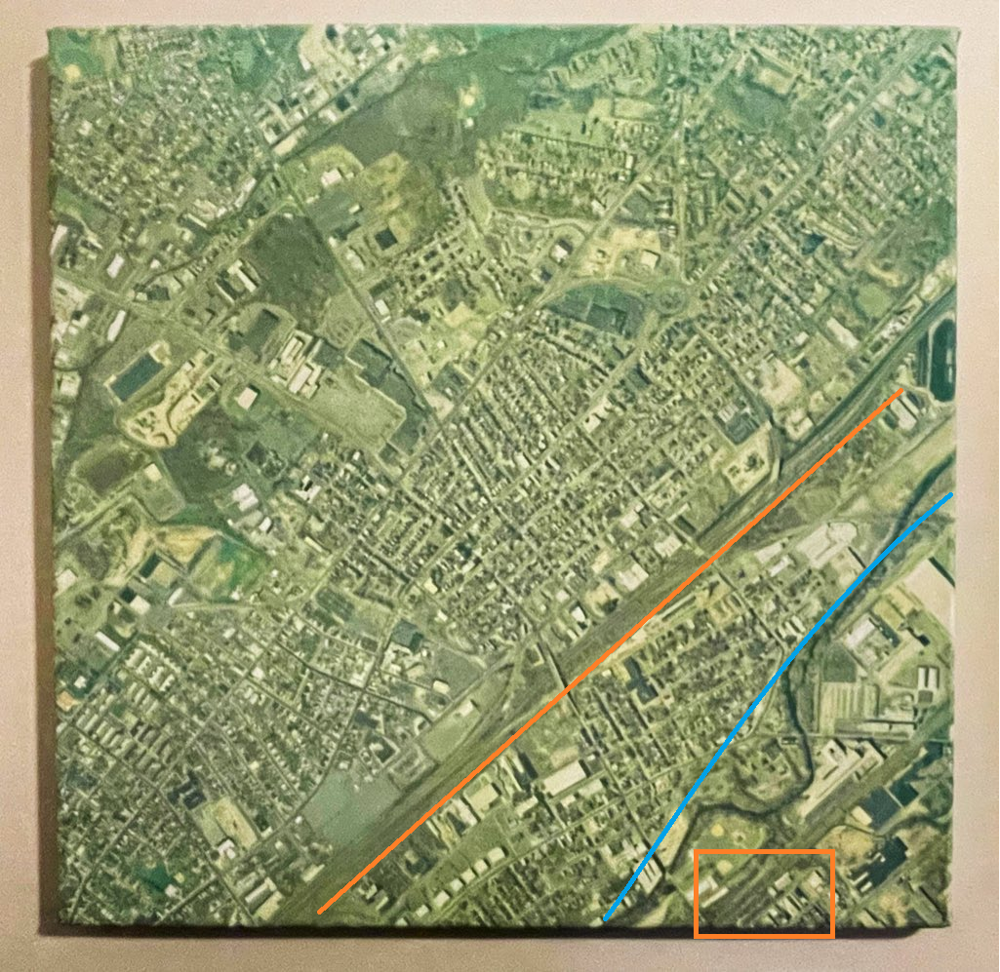

Second Image

While not, I'm not sure, I believe we can see some railways here \(marked in orange\), and the blue line should be a river\. So, assuming this image is not incredibly old, and those railways are still intact, we can find this place by searching Train Stops/Depots, etc\. And with a gut feeling, I started exploring places close to where I found the first image\. \(Normally, **Overpass Turbo** would make our life's so much easier, but I won't use it for now\. \)

Oh, and you might be asking, why would that mean there is a stop/depot? Well, it doesn't, but the right side of the image seems like an Industrial place, so I'm assuming there is a depot/stop near there\.


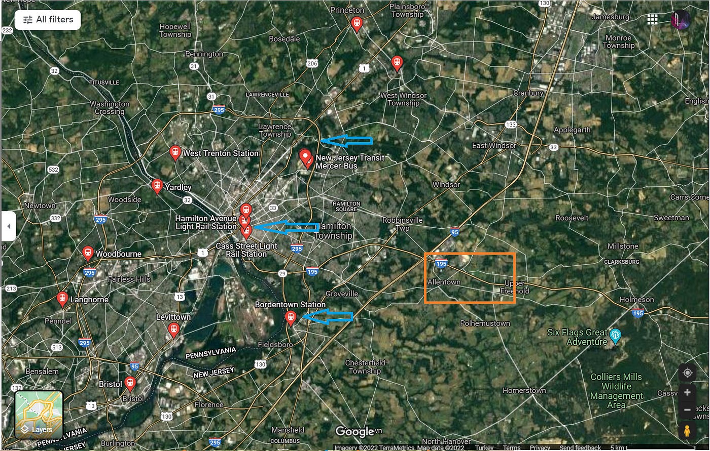

Orange Box marks our first image location — lake\.

So, after I searched for " **Train** ", I directly went to the nearest Train Station, " **Bordentown Station** " but it wasn't populated enough so, since they all should logically be connected, I went to " [Hamilton Station](https://goo.gl/maps/bSRZKbtiGhJ127xg7) " while following the line to see if it split anywhere\.


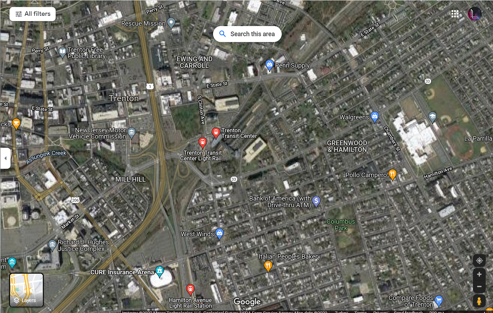

Cool

Okay so, this place is more populated, but it isn't right\. Having no great Ideas, I simply followed the railway\. A couple of clicks later, I found the second place\.


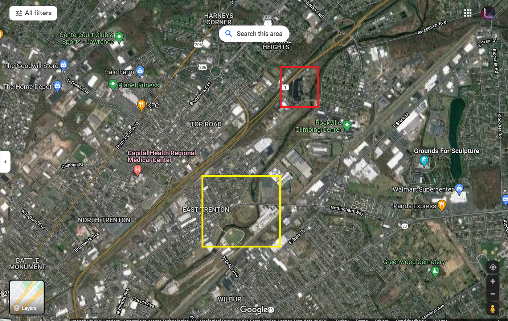


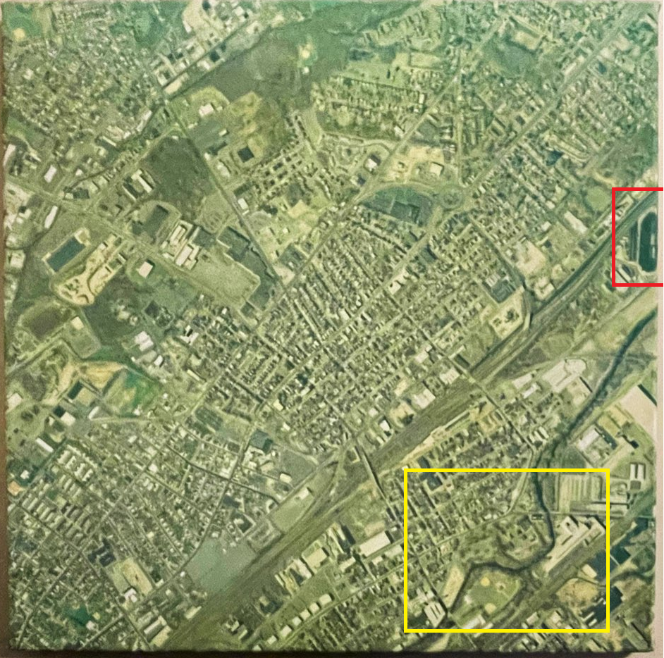

Cool it matches

I was wrong about the long orange line \(the one I marked\) being a railway, but I correctly guessed that the orange box marker was a railway\. \(Now that I that think about it, both of them being railways was very stupid, lol\)


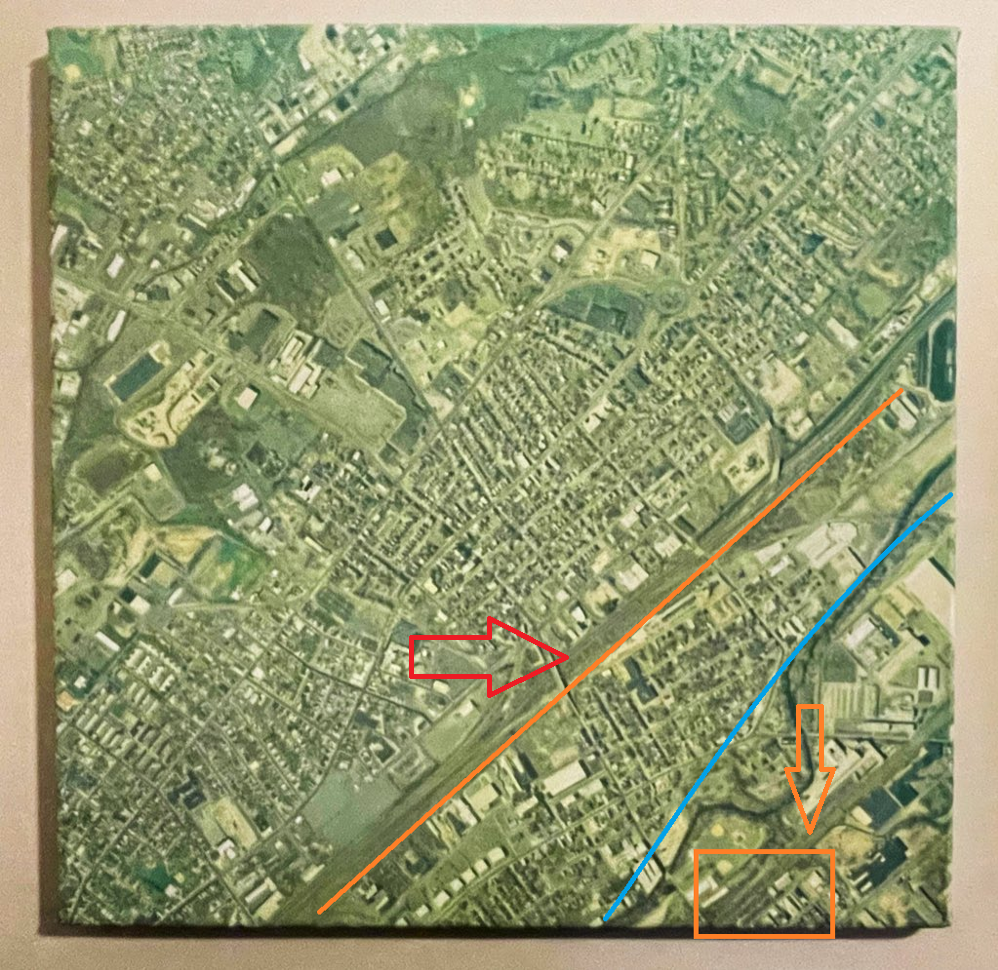


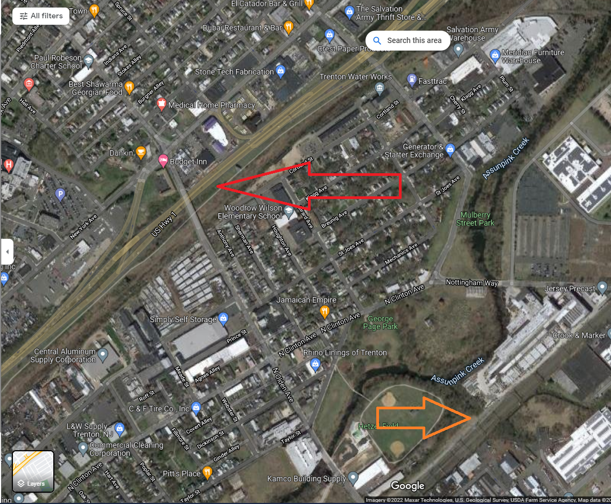

The long orange line was, in fact, a Highway


> Side Note: Even though Google, Yandex, and I assumed this to be an Ariel image, it still could be a satellite image\.
 

> I will try to find the possible date these photos were taken some other time\. 


### Using Overpass Turbo

So since we know the place we are searching for is close to New York, we move the map to create a search area \(by default, the visible map is the search area\) \.


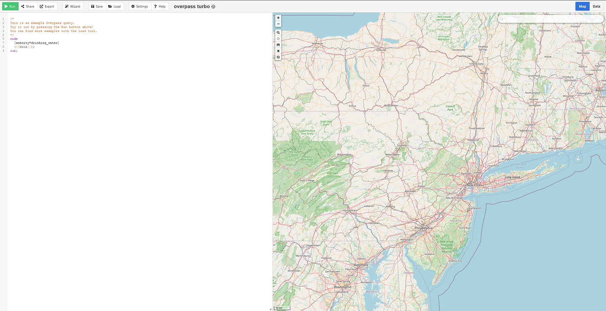

Center New York on the map\.

Okay, time for some codding\. I had to read like 20 minutes worth of API documents, then realized that I could just [modify this query](https://wiki.openstreetmap.org/wiki/Overpass_API/Overpass_API_by_Example#Banks_far_away_from_police_stations) to solve this question\. Here are the documents I used,
- [https://wiki\.openstreetmap\.org/wiki/Key:waterway?uselang=en\-GB](https://wiki.openstreetmap.org/wiki/Key:waterway?uselang=en-GB)
- [https://wiki\.openstreetmap\.org/wiki/Overpass\_API/Overpass\_API\_by\_Example\#Banks\_far\_away\_from\_police\_stations](https://wiki.openstreetmap.org/wiki/Overpass_API/Overpass_API_by_Example#Banks_far_away_from_police_stations)


After making the relevant changes to that Bank Query,
```text
/*
This query bring railways close to rivers 
*/
[out:json][bbox:{{bbox}}][timeout:800];

// determine set of police stations
(
  way["railway"="rail"];
)->.rail_p; // put them into the set "rail_p"
 
// determine set of banks
(
  nwr["waterway"="river"];
)->.rivers_p; // put them into the set "rivers_p"
  
// determine set of railways near rivers
(
  nwr.rail_p(around.rivers_p:50); //meters
)->.railnearrivier; // put them into the set "railnearrivier"

// show all rivers and railways
(.rivers_p; .railnearrivier;);

// return node, ways, relations as determined above
out geom meta;
```

Using that query gives this,


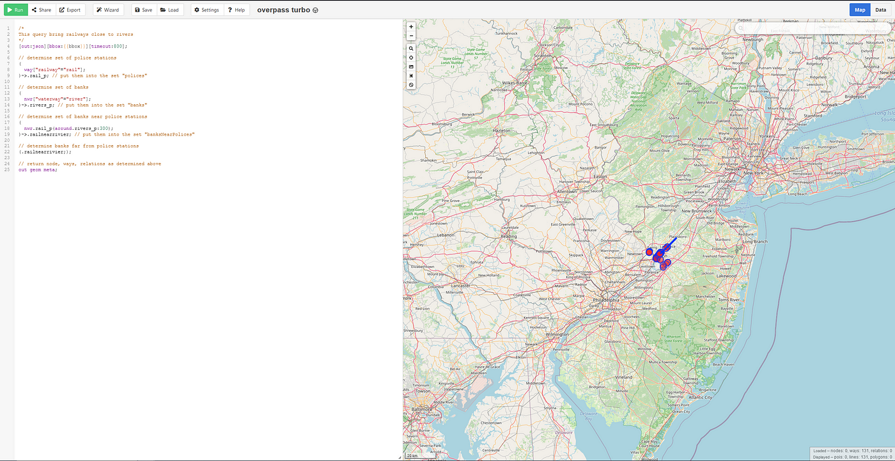

Whoa it worked


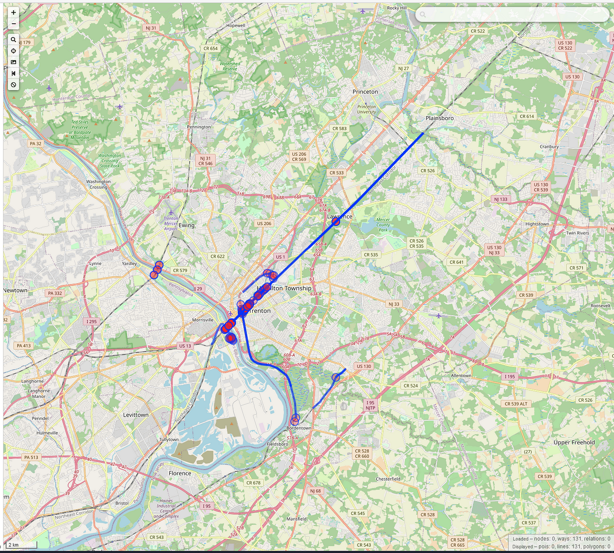

OOO Cool


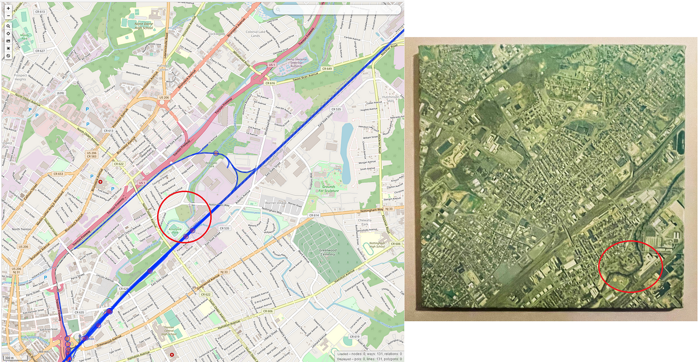

O0O Cool, it worked

I have to say [Overpass Turbo](https://overpass-turbo.eu/) , OpenStreetMap API is a fantastic tool but seems hard to learn\. I'll try to use more from now on\.

Thank you, Quiztime, for the questions\. I'll be randomly picking questions from your Twitter and solving them from now on\.

[**JavaScript is not available\.**](https://twitter.com/quiztime) 
[_Edit description_ twitter\.com](https://twitter.com/quiztime)


_[Post](https://medium.com/@leventd/quiztime-random-osint-challenge-8-ec1dc743a508) converted from Medium by [ZMediumToMarkdown](https://github.com/ZhgChgLi/ZMediumToMarkdown)._
