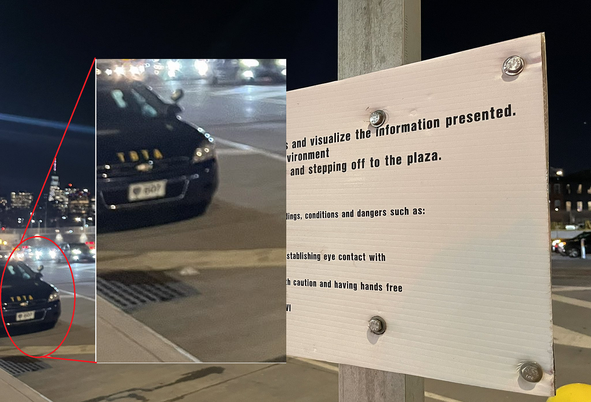
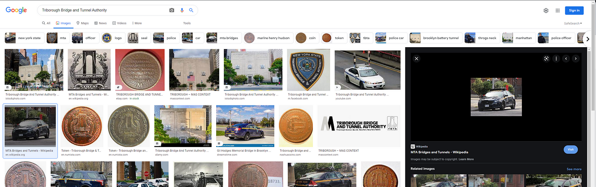
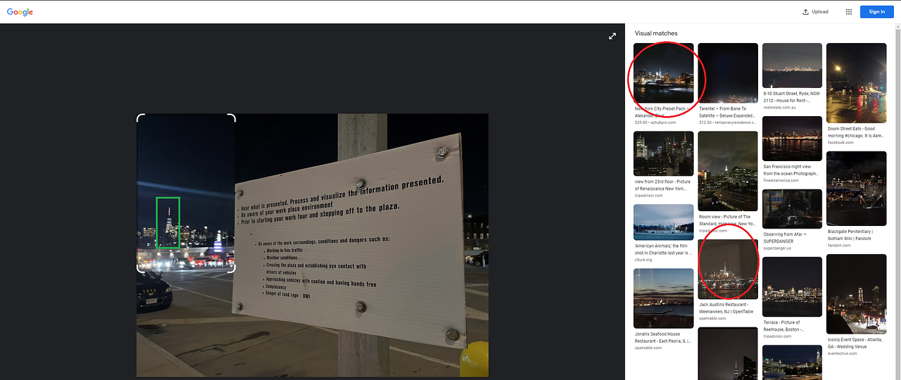
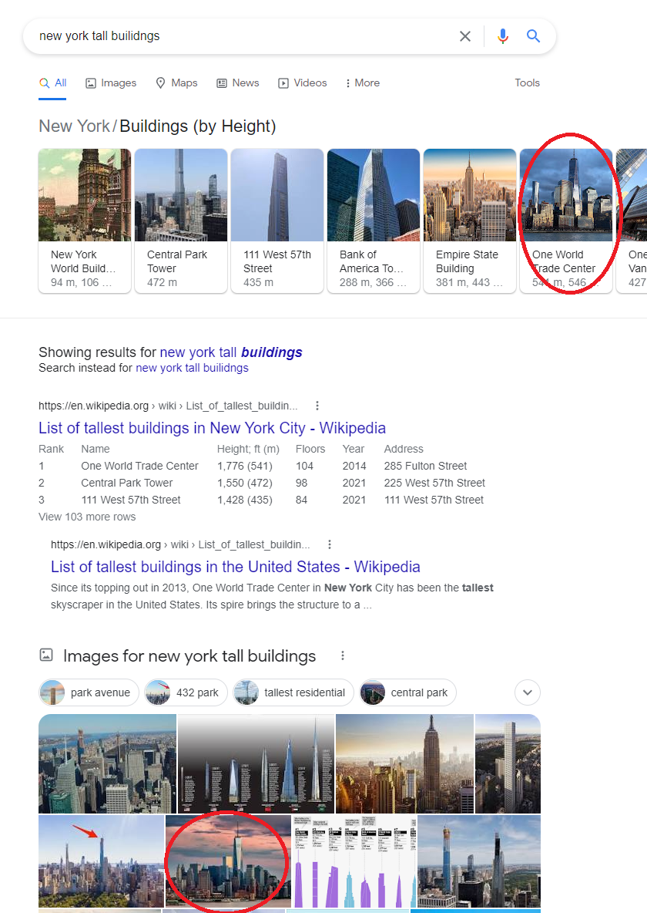
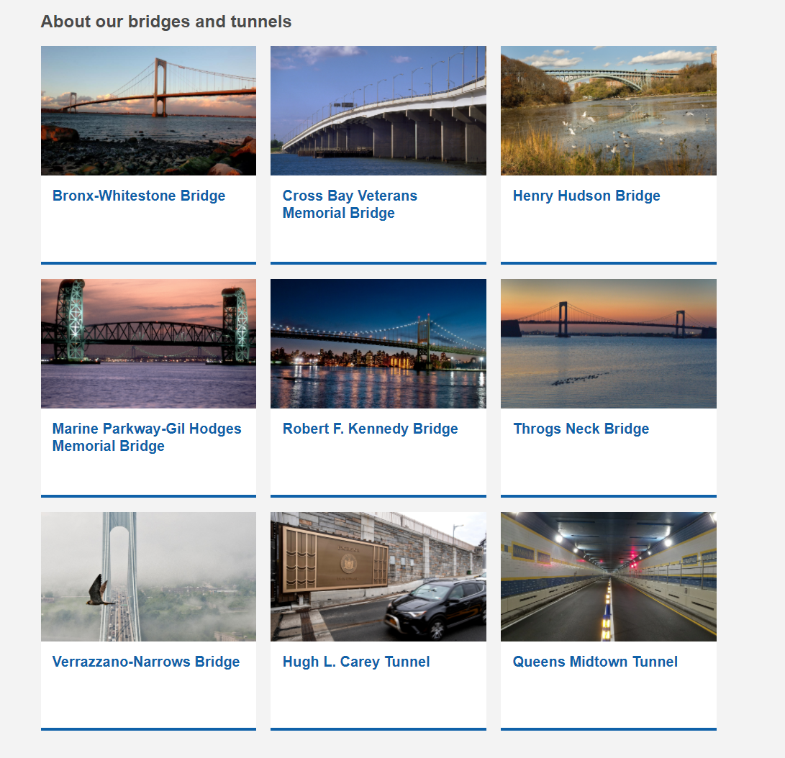
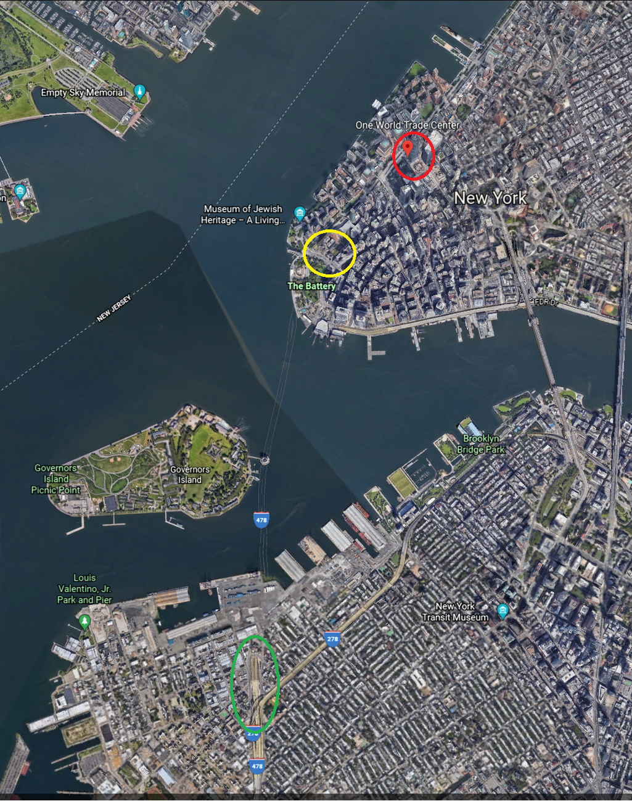
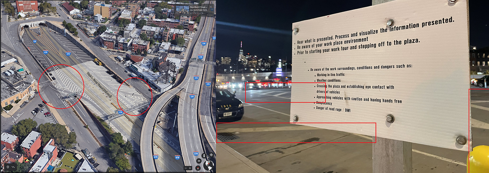
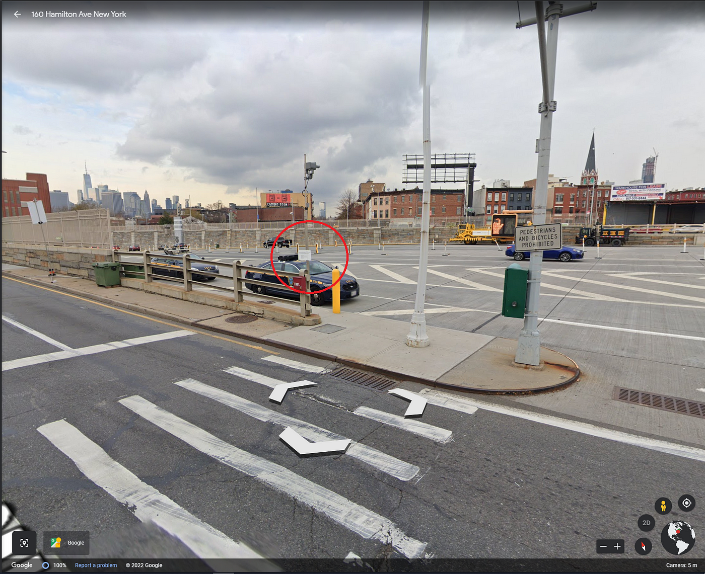

### Who knew Triborough was in New York, Not me — OSINT Challenge 10

On Jan 20, 2022, Quiztime \(contributor [@trbrtc](https://twitter.com/trbrtc) \) shared a new OSINT quiz with us\. The objective was interesting\. We had to figure out where the photo was taken and what was it for\. So let's try to Locate the place\. Please refer to the embedded link below for the original post:

■■■■■■■■■■■■■■ 
> **[Christiaan Triebert](https://twitter.com/trbrtc) @ Twitter Says:** 

> > Time for @Quiztime’s #ThursdayQuiz. Where is this exactly and what is it for? https://t.co/APNLJuqrYB 

> **Tweeted at [2022-01-20 05:00:11](https://twitter.com/trbrtc/status/1484027956326543362).** 

■■■■■■■■■■■■■■ 

Don't read any further if you'd like to test your geolocation skills\. Open the picture and give it a try\. Don't scroll further down as I will be discussing how I found it and since I just started this hobby\. I'll probably be doing this the long way around :\)

> Note: Some of you might have noticed that I skipped Challenge 9, simply because I failed to solve it\. If I ever do solve it\. I’ll post it on medium\. Here is the link to [Challenge 9](https://twitter.com/kollege/status/1483526186525470729/photo/1) 

> _Lastly, English is not my native language\. So, I apologise for any mistakes that I might do\._ 

### Warning spoilers ahead

As always, I tried Google Lens, Images and Yandex Images, which brought nothing\. Having found nothing, I tried to read texts other than the ones on the sign\.

Some weird license plated car with TBTA written on it

As you can see, we have a vehicle with an odd license\(very few characters\) plate\. Also, It has TBTA written on it\. After a quick google search, "TBTA Organization" brings me this organization " **Triborough Bridge and Tunnel Authority** ", and from images seen below, we can safely say that this is correct\.

The car plate confirms it\.

Then I realized something, I forgot to crop the Image on Google Lens,

Hmm

The images in the red circle look awfully similar to the green marked building there\. But since the original image is very blurry, I will assume that these pictures are from the same skyscraper\. Oh, and the Red marked photos are from New York City\.

So now we know that,
- This picture is probably from New York City\.
- Assumed to be managed by Triborough Bridge and Tunnel Authority

And When you search tall buildings in New York, you can easily find that tower\.

One World Trade Center

Okay, now, we can pick the places shown below in New York and can see One World Trade Center\. \(Only now I realized that TBTA operates solely in New York hahahha😂\) Any how let's start checking\.

Here are my findings,
- Cross Bay Veterans Memorial Bridge \-> Too far away to see the building\.
- Henry Hudson Bridge \-> Too far away to see the building\.
- Whitestone Bridge \-> Too far away to see the building\.
- Robert F\. Kennedy Bridge \-> Too far away to see the building\.
- Marine Parkway Bridge \-> Too far away to see the building\.
- Throgs Neck Bridge \->Too far away to see the building\.
- Verrazzano\-Narrows Bridge \-> Could be it\.
- Hugh L\. Carey Tunnel \-> Could be it\.
- Queens Midtown Tunnel \-> Could be, but not likely\.

Since Hugh L\. Carey Tunnel is closer, let's check that first\. Let's take a look at the Green Marked entrance\.

Cool Tunnel

Green Marked Entrance

As seen above, there are two possible places\. Since we can see cars parked on the left side, let's try that first\. Oh, and since Yellow Ballard would be easier to spot, that's what I looked for\. Only after I found the ballards, I searched for the sign\.

Cool

Yep, that checks out\.

Here is the answer,
- [Google Earth Web StreetView](https://earth.google.com/web/search/40%c2%b040%2749.81%22N,++74%c2%b0+0%2717.71%22W/@40.68030341,-74.00499646,4.57232475a,0d,72.89126598y,24.89223749h,75.79437815t,0r/data=CigiJgokCdOmDAYNV0RAEUg5WlUJV0RAGfGL8mNHgFLAIXEgekNJgFLAIhoKFkxJQ21CUFBmYW85ZXZCbDZobVd2OXcQAg)
- Google Maps Coordinates: [40\.680396760933, \-74\.00493955896816](https://www.google.com/maps/@40.6803777,-74.004908,75m/data=!3m1!1e3)

Thank you, Quiztime, for the questions\. I'll be randomly picking questions from your Twitter and solving them from now on\.

[**JavaScript is not available\.**](https://twitter.com/quiztime) 
[_Edit description_ twitter\.com](https://twitter.com/quiztime)

_[Post](https://medium.com/@leventd/quiztime-random-osint-challenge-10-634be8a0b739) converted from Medium by [ZMediumToMarkdown](https://github.com/ZhgChgLi/ZMediumToMarkdown)._
