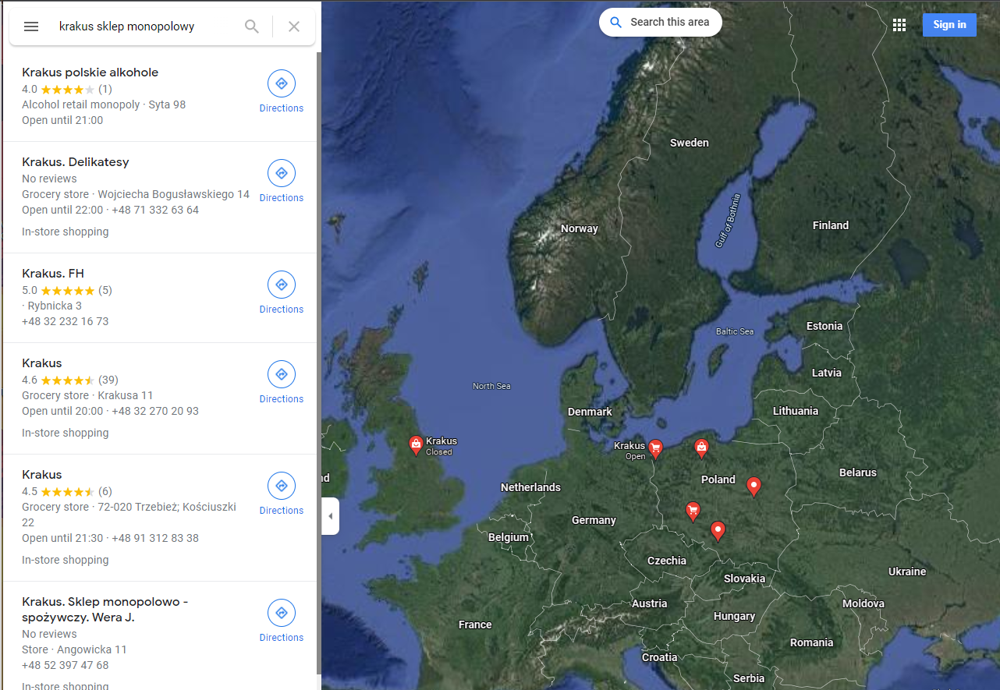
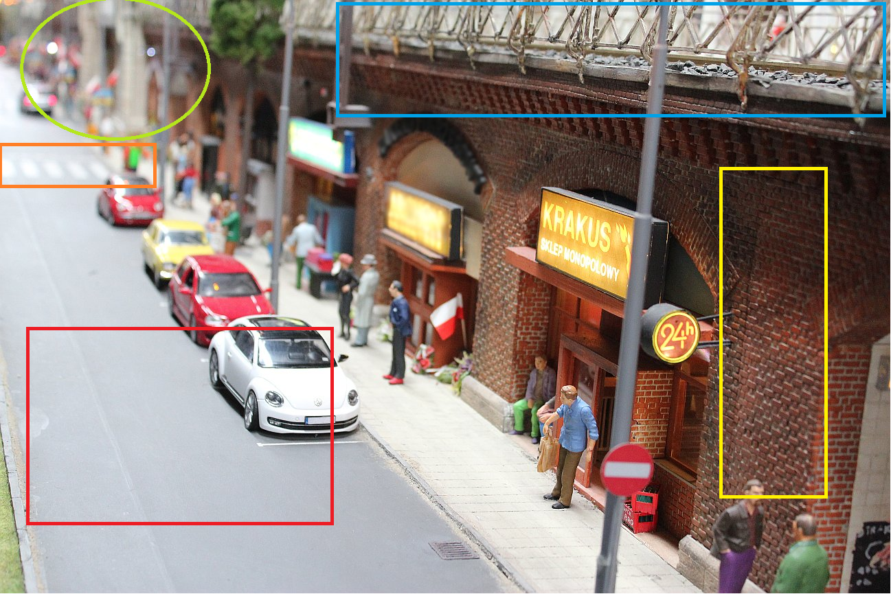
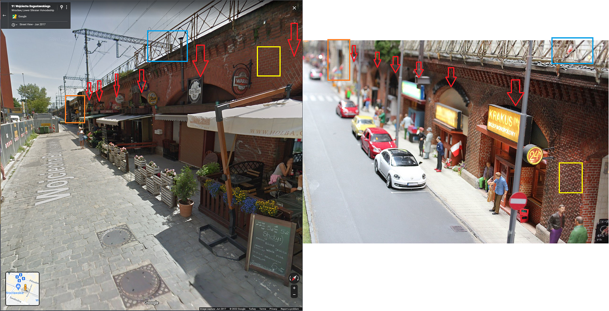
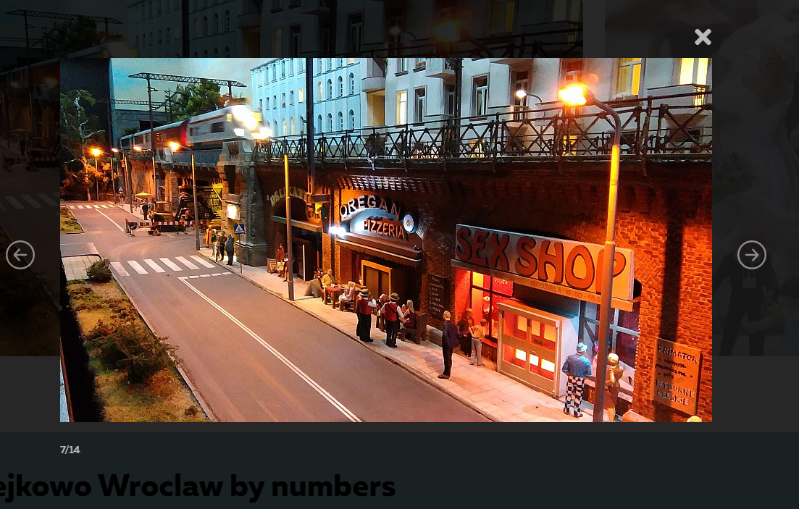
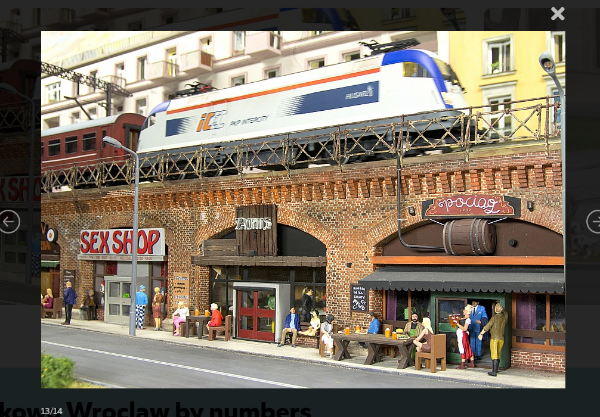

### Last Toy Train Home — OSINT Challenge 11

On Jan 23, 2022, Quiztime \(contributor [@SEINT\_pl](https://twitter.com/SEINT_pl) \) shared a new OSINT quiz with us\. The objective was simple\. We had to figure out where the photo was taken\. Please refer to the embedded link below for the original post:

■■■■■■■■■■■■■■ 
> **[The SEINT](https://twitter.com/SEINT_pl) @ Twitter Says:** 

> > Welcome to anither #SundayQuiz along with @[quiztime](https://twitter.com/quiztime)! 

Can you tell: 
1️⃣ What street is shown in the photo? 
2️⃣ Where was this photo taken?

🔄 to invite others 
✅ Solutions below👇 the GIF 
💬 Explain your solution 
🧩 Enjoy! https://t.co/uFlerIvXKK 

> **Tweeted at [2022-01-23 10:15:45](https://twitter.com/seint_pl/status/1485194537064673282).** 

■■■■■■■■■■■■■■ 

Don't read any further if you'd like to test your geolocation skills\. Open the picture and give it a try\. Don't scroll further down as I will be discussing how I found it and since I just started this hobby\. I'll probably be doing this the long way around :\)

> _Lastly, English is not my native language\. So, I apologise for any mistakes that I might make\._ 

### Warning spoilers ahead

Before doing a reverse image search, I simply searched that stores name, " **krakus sklep monopolowy** " text seems Polish, and since there is a Polish flag beneath the store, I assumed this is in Poland\.

Okey

There were 12 "Karakus" in Europe, and I thought, well, this is going to be easy to find\.

Okay, take a look

But before I started, I noted/guessed some things to look for while searching the map,
- Blue Marker \-> Could be a railway
- Yellow Marker \-> We need to find Brick walls
- Red Marker \-> 2 Lane Road next to it
- Orange Marker\-> There is a crossing near it
- Light Green Marker \-> It Seems the walls are changing colour or type\. There could be some kind of road passing through there\.

](assets/abc5ea122597/1*SzPoGgYW_Umrc-nqD-Ky9Q.png)

Here is the [Link](https://www.google.com/maps/search/krakus+sklep+monopolowy/@51.100195,17.0293549,214m/data=!3m1!1e3)

The second "Karkus" on the list gave this location with a Railroad near it\. As you can see, the marker is on the other building, so I moved on and searched the other ones, but the other ones were simply wrong\. So I came back here\.

Opening Streetview proved that this was the correct location, Bu I couldn't find **Karkus\.** Hmmm\.

As you can see, everything except the road checks out\. This could mean two things: the location is on the other side of the railroad, or the Streetview is older/newer than the image\. Actually, it could still be someplace else along this railroad\. Hmmm\. But I'm not going to search for it, for now\. Let's assume this is correct\.

So now we know where this place is we need to find its toy? version… Let's search **"Wrocław miniature city"** and hope we find something good\.

](assets/abc5ea122597/1*RpvX1edG75VenwE_u8iuEQ.png)

[https://kolejkowo\.pl/en/wroclaw](https://kolejkowo.pl/en/wroclaw)

Google brought me to the site above\. Apparently, there is a place called **"kolejkowo"\.** The image above shows that this " **kolejkowo"** place should be the correct location\.

**Hey, we just saw this place from Streetview\. How cool is that?**

This “ **kolejkowo”** place is here: [Powstańców Śląskich 95/I piętro, 53–332 Wrocław, Poland](https://g.page/kolejkowo?share) \.

Well, that's it… This was a weird one but fun nonetheless\.

Thank you, Quiztime, for the questions\. I'll be randomly picking questions from your Twitter and solving them from now on\.

[**JavaScript is not available\.**](https://twitter.com/quiztime) 
[_Edit description_ twitter\.com](https://twitter.com/quiztime)

_[Post](https://medium.com/@leventd/quiztime-random-osint-challenge-11-abc5ea122597) converted from Medium by [ZMediumToMarkdown](https://github.com/ZhgChgLi/ZMediumToMarkdown)._
