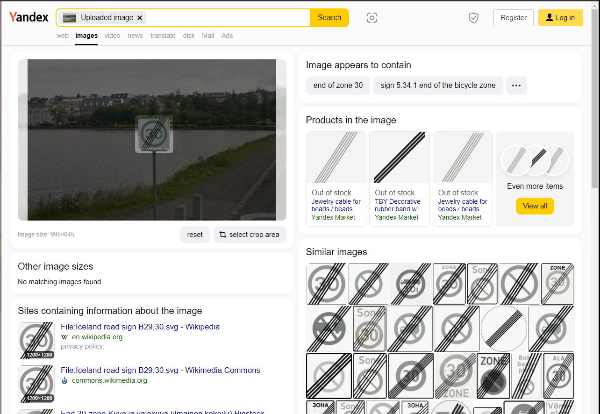

### Why Is Iceland So Small— OSINT Challenge 12

On Jan 17, 2022, OSINT Dojo shared a new OSINT quiz with us\. The objective was simple\. We had to figure out where the photo was taken\. Please refer to the embedded link below for the original post:

■■■■■■■■■■■■■■ 
> **[OSINT Dojo](https://twitter.com/OSINTDojo) @ Twitter Says:** 

> > This week's #OSINT challenge is geolocation based. See if you can find the lat/long of where this photo was taken. https://t.co/rLbRYpRbqM 

> **Tweeted at [2022-01-17 18:35:12](https://twitter.com/osintdojo/status/1483145898569863169).** 

■■■■■■■■■■■■■■ 

Don't read any further if you'd like to test your geolocation skills\. Open the picture and give it a try\. Don't scroll further down as I will be discussing how I found it and since I just started this hobby\. I'll probably be doing this the long way around :\)

> _Lastly, English is not my native language\. So, I apologise for any mistakes that I might make\._ 

### Warning spoilers ahead

The first thing I did was to use Google Lens and Yandex Image search, but there wasn't any good information\. Except I found this excellent clue\.

Yandex image search

Apparently, this sign is from Iceland\. Hmm, okay, we now know the general location\. From here on, I could have tried to find a clue on the image, but knowing there aren't that many residential areas in Iceland, I quickly checked some very populated zones\.

](assets/cea9e1fa9a06/1*A5HONmsQNdTIoiQtQDfV4w.png)

No Bridges, not it — [Link](https://www.google.com/maps/@63.9902561,-22.5440874,17766m/data=!3m1!1e3)

](assets/cea9e1fa9a06/1*IsvccDEph0boYHsVagcddw.png)

Biggest City, so many bridges — [Link](https://www.google.com/maps/@64.1153186,-21.842232,21033m/data=!3m1!1e3)

So, the capital, **Reykjaví** , has multiple bridges\. It won't take me that long to check them all, so here I go\. On my 4th Streetview test, I found the correct bridge\.

](assets/cea9e1fa9a06/1*xjTqDrxOhdv_39Q9kgH2-g.png)

Skothúsvegur — [Link](https://www.google.com/maps/@64.1430898,-21.9438302,3a,90y,86.85h,80.28t/data=!3m7!1e1!3m5!1sDLO0KfocK4Xdq7UliOarOg!2e0!6shttps:%2F%2Fstreetviewpixels-pa.googleapis.com%2Fv1%2Fthumbnail%3Fpanoid%3DDLO0KfocK4Xdq7UliOarOg%26cb_client%3Dmaps_sv.tactile.gps%26w%3D203%26h%3D100%26yaw%3D281.81747%26pitch%3D0%26thumbfov%3D100!7i13312!8i6656)

Well, that was easy, but It was pure luck\. If I find a better way to solve this question, I'll add it later, but this is the end for now\.

Thank you, OSINTDojo, for the questions\. I'll be randomly picking questions from your Twitter and solving them from now on\.

[**JavaScript is not available\.**](https://twitter.com/quiztime) 
[_Edit description_ twitter\.com](https://twitter.com/quiztime)

_[Post](https://medium.com/@leventd/why-is-iceland-so-small-osint-challenge-12-cea9e1fa9a06) converted from Medium by [ZMediumToMarkdown](https://github.com/ZhgChgLi/ZMediumToMarkdown)._
