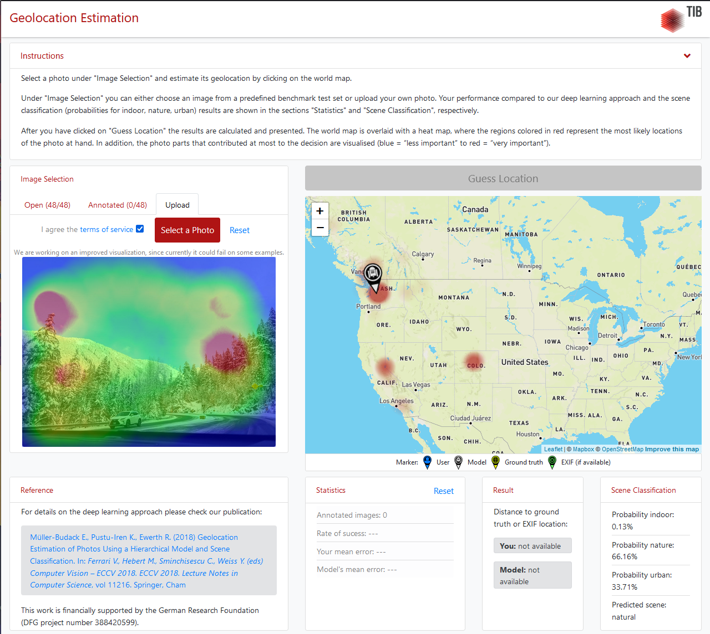
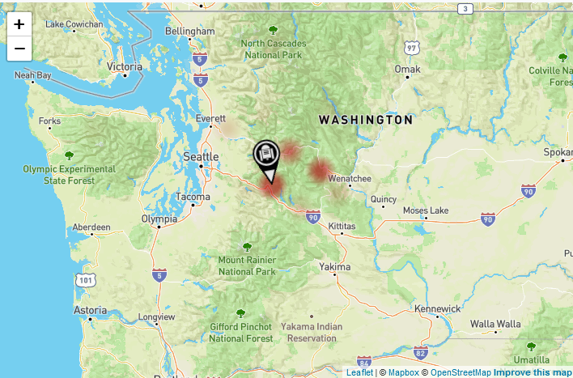
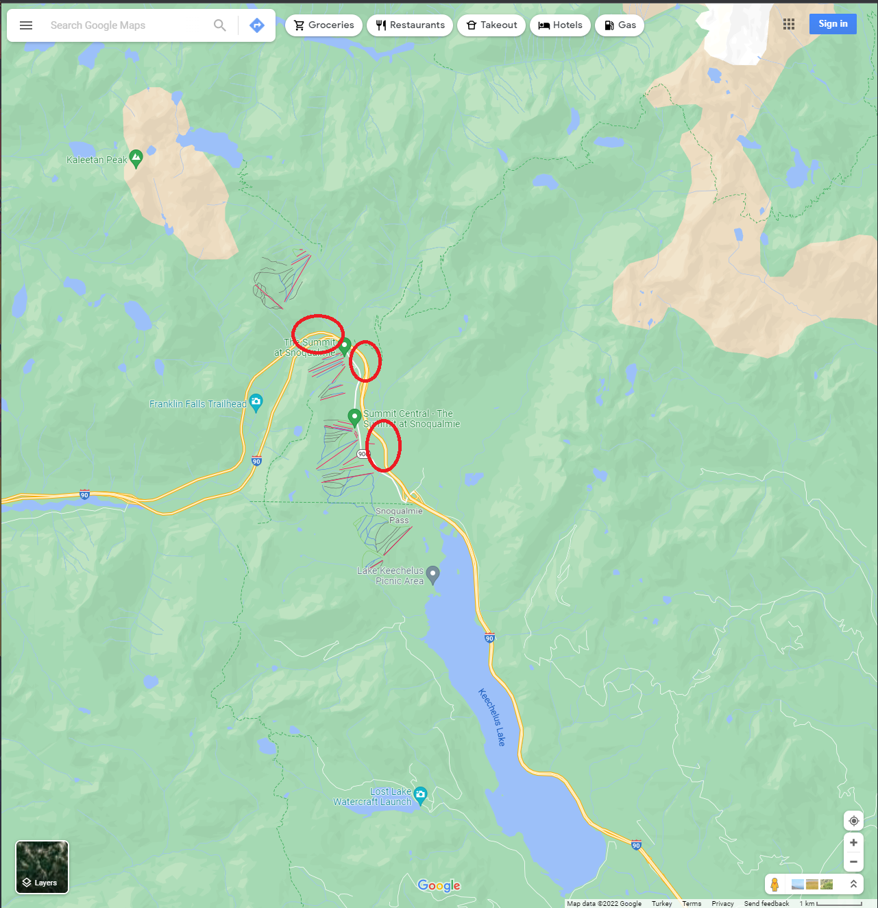
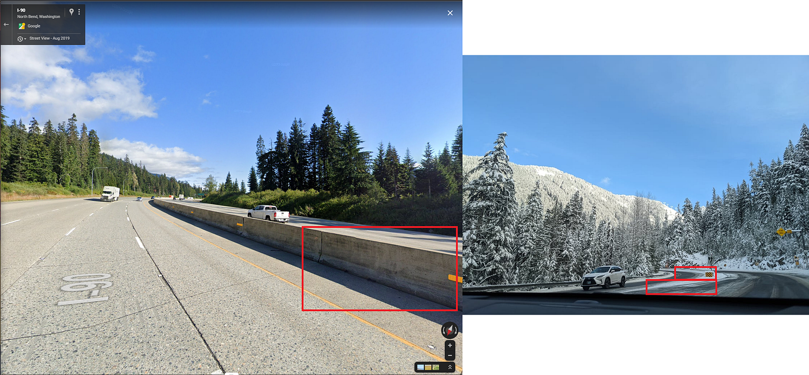
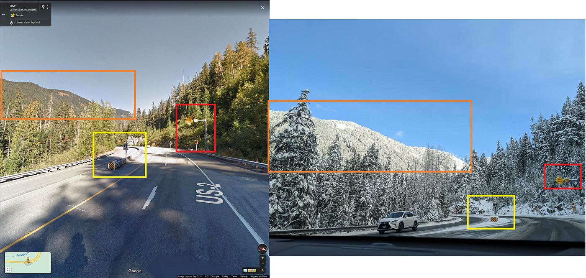

### Simply GeoEstimation — OSINT Challenge 13

On Dec 20, 2021, OSINT Dojo shared an OSINT quiz with us\. The objective was simple\. We had to determine where the photo was taken and their final destination\. Please refer to the embedded link below for the original post:

■■■■■■■■■■■■■■ 
> **[OSINT Dojo](https://twitter.com/OSINTDojo) @ Twitter Says:** 

> > As my hands were a bit busy at the time, Mrs. Win took the photo for this week's #OSINT challenge. See if you can answer the following questions:

Lat/Long where the photo was taken
Our final destination https://t.co/eGws2uz7fH 

> **Tweeted at [2021-12-20 14:14:49](https://twitter.com/osintdojo/status/1472933510696484869).** 

■■■■■■■■■■■■■■ 

Don’t read any further if you’d like to test your geolocation skills\. Open the picture and give it a try\. Don’t scroll further down as I will be discussing how I found it and since I just started this hobby, I’ll probably be doing this the long way around :\)

> _Small Note: I can’t resize images for some reason\. I’ll try to fix it later\._ 

> _Lastly, English is not my native language\. So, I apologise for any mistakes that I might make\._ 

### Warning spoilers ahead

Since I knew reverse image won’t bring me anything useful, I used the first tool that got me into Geolocation\. A tool/research called **Geoestimation \(** more information can be found here [GeoEstimation](https://github.com/TIBHannover/GeoEstimation) **\)** Using that tool, I found some crucial information\.

Hmm

Interestingly the tool believes it’s in Washington, USA\.

3 possible locations

The tool is confident in that marked location but also has other guesses\. So we should check the others as well\. All those locations are marked in Google Maps below\.

](assets/3ecf71bff4c8/1*Adr7gnEtAFG18k0P5PoDyw.png)

Google Maps — [Link](https://www.google.com/maps/@47.5808552,-121.0431343,11z)

So let’s check the roads close to the marked locations\. And since the road in the image is curving very aggressively, we should be able to check every road here incredibly fast\.
Also, the road seems to be a Highway, so we don’t need to check all the streets here\.

First Location to check

But no roads here seem like the one on the image,

Sad

The second location to check,

](assets/3ecf71bff4c8/1*Nllc51VC2a5wo89oxwCong.png)

Google Maps — [Link](https://www.google.com/maps/@47.7275882,-121.1192223,12.75z)

So let’s check the red markers I put\. \(The blue marker was too far away from the original location\. \)

WHOA\. We actually found it\. The lowest marked place on the image was the correct location\.

](assets/3ecf71bff4c8/1*IpmY8Nb_VP4atiSqqWmNNQ.png)

Cool — [Link](https://www.google.com/maps/@47.7165778,-121.1250291,3a,90y,71.29h,95.3t/data=!3m7!1e1!3m5!1sZSyVENEB7GgEuOJr3xw7FQ!2e0!6shttps:%2F%2Fstreetviewpixels-pa.googleapis.com%2Fv1%2Fthumbnail%3Fpanoid%3DZSyVENEB7GgEuOJr3xw7FQ%26cb_client%3Dmaps_sv.tactile.gps%26w%3D203%26h%3D100%26yaw%3D179.51355%26pitch%3D0%26thumbfov%3D100!7i13312!8i6656)

As you can see, we found the location\.

YEY

The location:
- 47\.71668013192945, \-121\.12567364527123

As a recap, I couldn’t have solved this question without the **Geoestimation \(** more information can be found here [GeoEstimation](https://github.com/TIBHannover/GeoEstimation) **\)** tool\. Thanks to it, I found the general location, and the rest was basic resigning\.

Thank you, OSINTDojo, for the questions\. I’ll be randomly picking questions from your Twitter and solving them from now on\.

[**JavaScript is not available\.**](https://twitter.com/quiztime) 
[_Edit description_ twitter\.com](https://twitter.com/quiztime)

_[Post](https://medium.com/@leventd/simply-geoestimation-osint-challenge-13-3ecf71bff4c8) converted from Medium by [ZMediumToMarkdown](https://github.com/ZhgChgLi/ZMediumToMarkdown)._
