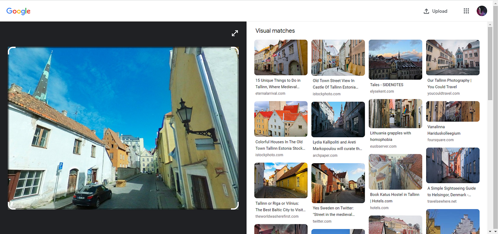
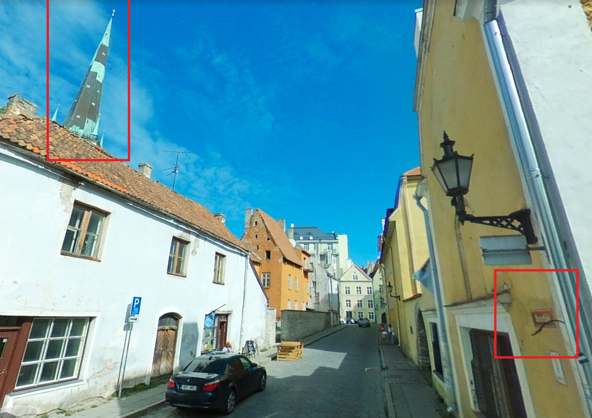
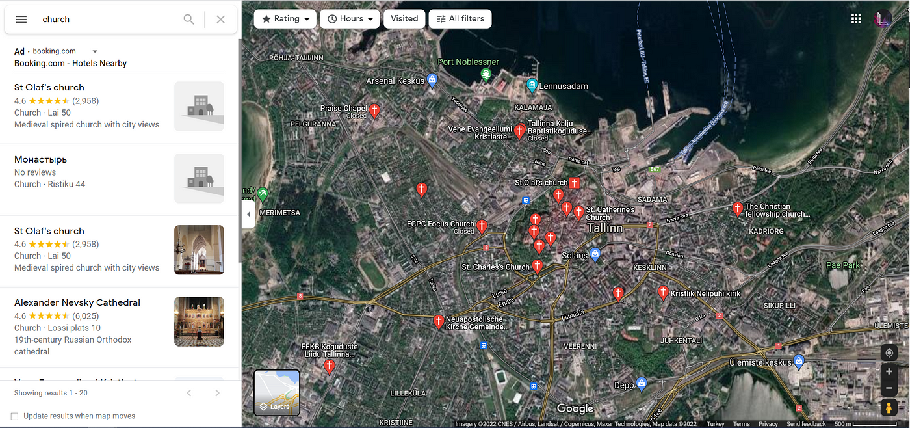
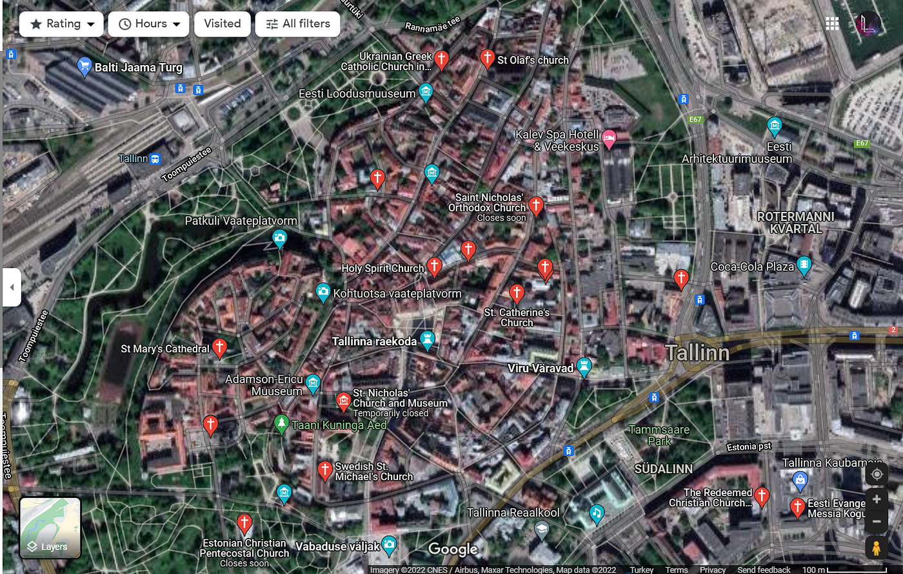

### Tallinn To Search More Churches — OSINT Challenge 14

On Dec 27, 2021, OSINT Dojo shared an OSINT quiz with us\. The objective was simple\. We had to figure out where the photo was taken\. Please refer to the embedded link below for the original post:

■■■■■■■■■■■■■■ 
> **[OSINT Dojo](https://twitter.com/OSINTDojo) @ Twitter Says:** 

> > The final #OSINT challenge for 2021 is a traditional geolocation challenge. See if you can find the lat and long of the attached photo. https://t.co/gkYNcGFhgX 

> **Tweeted at [2021-12-27 14:09:13](https://twitter.com/osintdojo/status/1475468816746356738).** 

■■■■■■■■■■■■■■ 

If you’d like to test your geolocation skills, then don’t read any further; open the picture and give it a try\. Don’t scroll further down as I will be discussing how I found it and since I just started this hobby, I’ll probably be doing this the long way around :

> Small Note: I can’t resize images for some reason; I’ll try to fix it later\. 

> _Lastly, English is not my native language\. So, I apologise for any mistakes that I might make\._ 

### Warning spoilers ahead

As always, I start by doing a reverse image search\. And to my surprise, Google Lens actually came back with overwhelming confidence, saying it was Tallinn, Estonia\.

Okay, let’s recheck the picture to see if we can find some clues,

2 Major clues

So there are two significant clues, one on the left is some kind of Church, and the one on the right reads **Suu??ki Road\.** Okay, let’s see how many Churches Tallinn has\.

Hmm, About 20 Churches

The photo seems like it’s a densely populated zone, so I’m going to check the town centre first to see if anything sticks out\.

Cool

Oh yeah, it’s definitely in here somewhere; even the Rooftop Bricks checks out\. After a minute or so, I found the location\.

](assets/2d8b8fc3c2d/1*22LLInPFWMTFS4YfwKb13A.png)

[Cool, oh, and the Roads name is Suurtük](https://www.google.com/maps/@59.4411231,24.7453825,3a,53.2y,126.79h,94.21t/data=!3m6!1e1!3m4!1sxUCKuEvxbZ5K7bLdpEky2A!2e0!7i13312!8i6656)

The location,
- [59\.44119329795244, 24\.745436000675834](https://www.google.com/maps/place/59%C2%B026'28.4%22N+24%C2%B044'43.7%22E/@59.44121,24.7448384,219m/data=!3m2!1e3!4b1!4m10!1m3!2m2!1schurch!6e1!3m5!1s0x0:0x3ab1e434e3219202!7e2!8m2!3d59.4412103!4d24.7454572)
- The Church in the image: [Ukrainian Greek Catholic Church in Estonia Tallinn parish](https://www.google.com/maps/place/Ukrainian+Greek+Catholic+Church+in+Estonia+Tallinn+parish/@59.4412873,24.7454997,124m/data=!3m1!1e3!4m10!1m3!2m2!1schurch!6e1!3m5!1s0x46929363787c56df:0xbfea809ca5760a51!8m2!3d59.4413253!4d24.7458072!15sCgZjaHVyY2iSAQ9jYXRob2xpY19jaHVyY2g)

Well, that was very easy\.

Thank you, OSINTDojo, for the questions\. I’ll be randomly picking questions from your Twitter and solving them from now on\.

[**JavaScript is not available\.**](https://twitter.com/quiztime) 
[_Edit description_ twitter\.com](https://twitter.com/quiztime)

_[Post](https://medium.com/@leventd/tallin-to-search-more-churches-osint-challenge-14-2d8b8fc3c2d) converted from Medium by [ZMediumToMarkdown](https://github.com/ZhgChgLi/ZMediumToMarkdown)._
