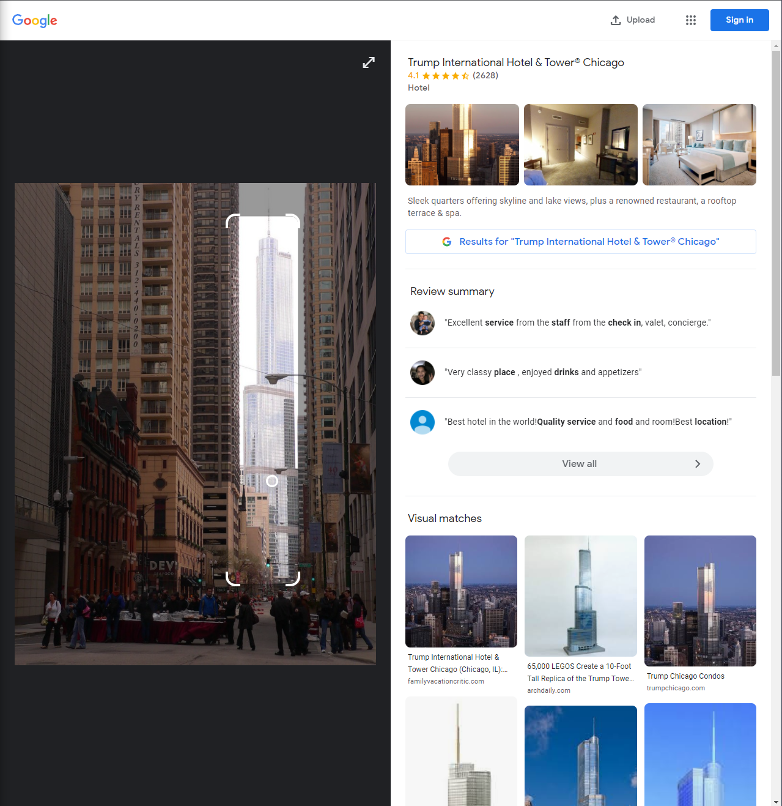
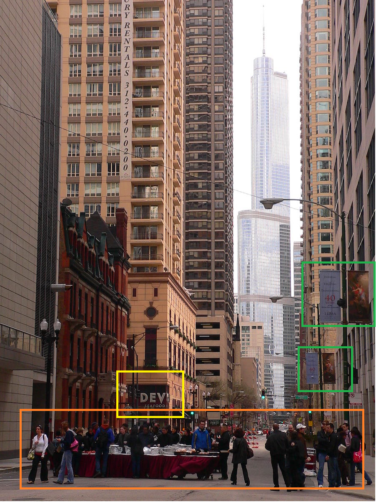
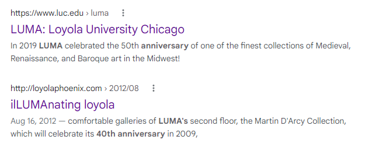
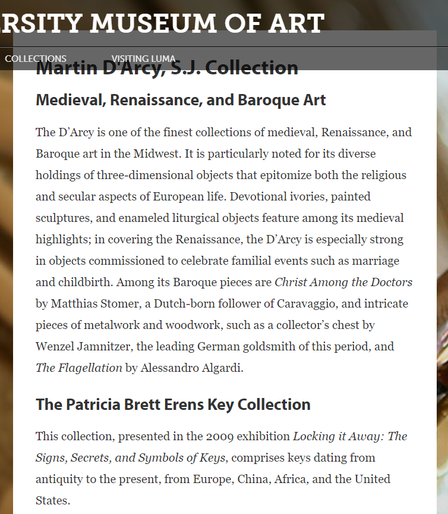
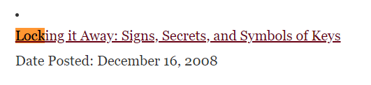

### Now I Want a Key Collection — OSINT Challenge 15

On Jan 20, 2022, Quiztime \(contributor [@twone2](https://twitter.com/twone2/) \) shared a new OSINT quiz with us\. The objective was simple\. We had to figure out when the photo was taken\. Please refer to the embedded link below for the original post:

■■■■■■■■■■■■■■ 
> **[Tilman | 🇺🇦 | Now also: @twone2@journa.host](https://twitter.com/twone2) @ Twitter Says:** 

> > Good evening @[quiztime](https://twitter.com/quiztime) - happy #WednesdayQuiz-ing!

Been digging through my archive and found this: 👇🏻
- - -
How close can you get to when I took this photo❓
- - -
🔁 to invite others
🤝 cooperations welcome
✅ Solutions👇🏻 the GIF
💬 Explain how you did it https://t.co/4BM0x6hNQF 

> **Tweeted at [2021-12-15 19:50:22](https://twitter.com/twone2/status/1471206014846439435).** 

■■■■■■■■■■■■■■ 

If you’d like to test your geolocation skills, then don’t read any further; open the picture and give it a try\. Don’t scroll further down as I will be discussing how I found it and since I just started this hobby; I’ll probably be doing this the long way around :\) Oh, and this is actually a [**Chronolocation**](https://sector035.nl/articles/chronolocation-of-media) question _\._

> _Lastly, English is not my native language\. So, I apologise for any mistakes that I might make\._ 

### Warning spoilers ahead

As I always do, I did a reverse image search with Google and Yandex\.

Apparently, the tower in the middle is **Trump International Hotel & Tower®** in Chicago\. Okay, cool, now we have to find the street\. By checking the building in 3D maps, you can easily guess the direction in which the photo was taken\.

](assets/ad02214fd02/1*2UZk1x6MLeiJ-AXs-XJY4A.png)

[Google Earth Web Link](https://earth.google.com/web/search/Trump+International+Hotel+%26+Tower,+North+Wabash+Avenue,+Chicago,+IL,+USA/@41.8895675,-87.62776846,210.84892633a,1961.15365691d,35y,173.52730006h,54.40852298t,0r/data=CigiJgokCV3_K2mKH0VAEYrpQ002G0VAGcuUpAXSPlbAIe4Xr8A2Q1bA)

The green marker \(antennas\) are closer to the picture, so we can safely say that the photo was taken on Yellow Marked street\.
After looking for buildings with similar window layouts, I found the location in a couple of seconds\.

](assets/ad02214fd02/1*-7qcKZx9WdqUTjwttGCTaA.png)

[Google Earth Streetview Link](https://earth.google.com/web/search/Trump+International+Hotel+%26+Tower,+North+Wabash+Avenue,+Chicago,+IL,+USA/@41.89703221,-87.62688872,180.30502319a,0d,60y,176.6047568h,102.20448935t,0r/data=CigiJgokCV3_K2mKH0VAEYrpQ002G0VAGcuUpAXSPlbAIe4Xr8A2Q1bAIhoKFkVYUzNLeWdpemEwSWlXNTFzc1p6MFEQAg)

**The Location:**
- 41\.89725749817298, \-87\.62688202780497
- 824–800 N Wabash Ave, Chicago, IL 60611, USA

Now to do some [**Chronolocation**](https://sector035.nl/articles/chronolocation-of-media) , I marked the only leads we have below,

Time Leads

I’ll see if I can find something about the “Luma”? Banners \(green marker\) \.

So searching “ **Luma 40th Anniversary** ”, we get the results below, assuming that they removed the 40th\-anniversary banner at least before the end of the year\. Then we can safely say that this picture was taken somewhere in 2009\.

Google Search

Let’s try to narrow down the possible time frame\. I started browsing Luma’s website; while doing that, I saw a familiar name [Martin D’Arcy, S\.J\. Collection](https://www.luc.edu/luma/collections/martindarcysjcollection/) \(you can see this name on the second result\. \)

](assets/ad02214fd02/0*xbKxe3QTIlrLRq25.jpg)

The Annunciation [Luma Website Link](https://www.luc.edu/luma/collections/martindarcysjcollection/theannunciation/)

From here, I found the painting on the 40th\-anniversary banner\. I have no clue how this is going to help me\. But hey, cool information to know\.

Oh, and a side note, as you might have noticed, trees on from the image have very few leaves, and the people are wearing jackets, so knowing this, we can safely say it is close to the end of winter 2009\.

The only thing I can think of is to check Luma’s Events in **December 2018, January and February 2009**

Okay Cool

And If you check [Luma’s news page](https://www.luc.edu/luma/news/index.shtml) and scroll down, we find this

Whoa

And if you check that link, you can see that the collection was on display from January 31 to March 8, 2009\.
I couldn’t narrow it down anymore, so my answer is,
- The Location: [824–800 N Wabash Ave, Chicago, IL 60611, USA](https://earth.google.com/web/search/Trump+International+Hotel+%26+Tower,+North+Wabash+Avenue,+Chicago,+IL,+USA/@41.89703221,-87.62688872,180.30502319a,0d,60y,176.6047568h,102.20448935t,0r/data=CigiJgokCV3_K2mKH0VAEYrpQ002G0VAGcuUpAXSPlbAIe4Xr8A2Q1bAIhoKFkVYUzNLeWdpemEwSWlXNTFzc1p6MFEQAg)
- Time Frame: \(Exhibition start\)January 31 to March 8, 2009\(At most\), and if we assume that they were there before the exhibition, the time frame is **December 16? 2008 — March 8, 2009**

Well, this was fun\. If you know the date, then feel free to comment\.

Thank you, Quiztime, for the questions\. I’ll be randomly picking questions from your Twitter and solving them from now on\.

[**JavaScript is not available\.**](https://twitter.com/quiztime) 
[_Edit description_ twitter\.com](https://twitter.com/quiztime)

_[Post](https://medium.com/@leventd/i-too-want-a-key-collection-osint-challenge-15-ad02214fd02) converted from Medium by [ZMediumToMarkdown](https://github.com/ZhgChgLi/ZMediumToMarkdown)._
