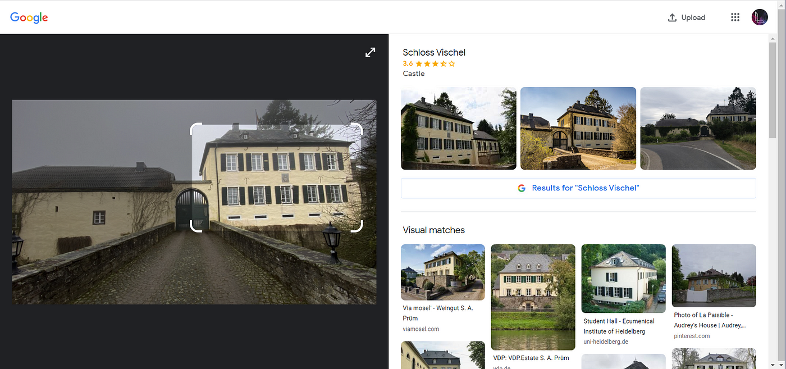
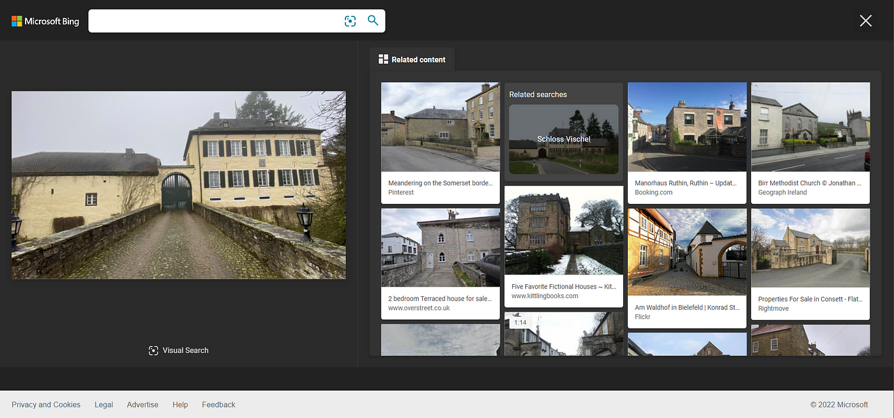
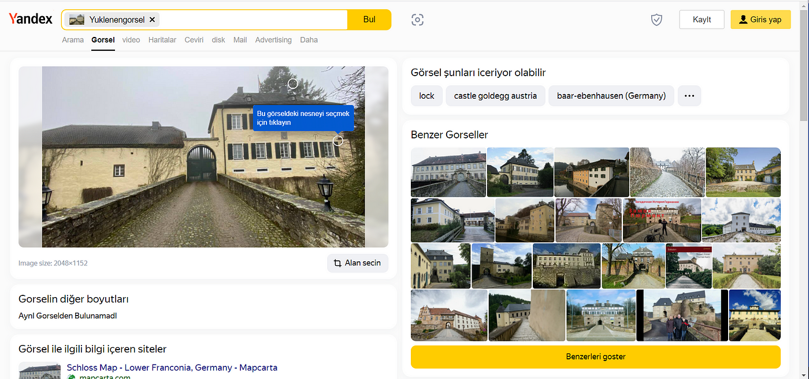
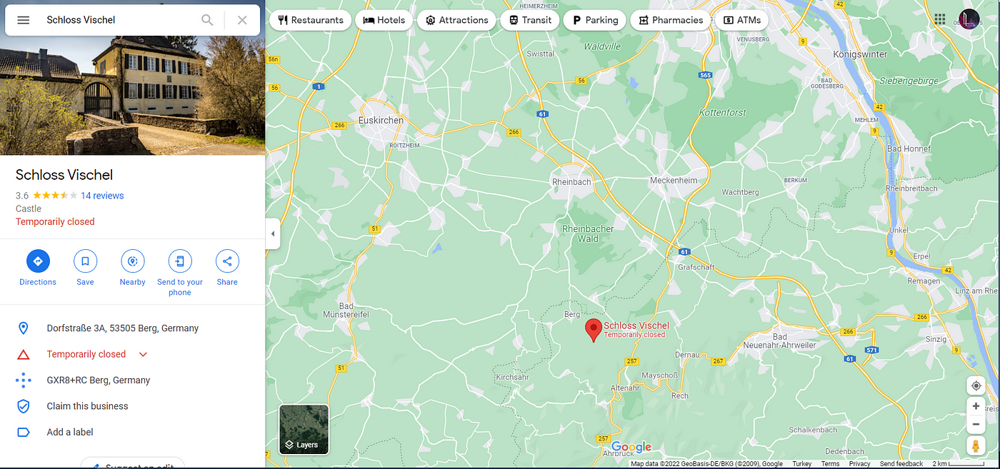

### Power of Reverse Image Search — OSINT Challenge 16

On Dec 22, 2021, Quiztime \(contributor [@twone2](https://twitter.com/twone2/) \) shared a new OSINT quiz with us\. The objective was simple\. We had to figure out where the photo was taken\. Please refer to the embedded link below for the original post:

■■■■■■■■■■■■■■ 
> **[Tilman | 🇺🇦 | Now also: @twone2@journa.host](https://twitter.com/twone2) @ Twitter Says:** 

> > Happy #WednesdayQuiz @[quiztime](https://twitter.com/quiztime)!

🤔 How much is a night at the nearest guest house at the next available weekend?

🔁 to invite others
🤝 cooperations welcome
✅ Solutions👇🏻 the GIF or via DM 🙋🏻‍♂️
💬 Explain how you did it
⛔ No solutions below this tweet! https://t.co/rdxFecuSMr 

> **Tweeted at [2021-12-22 16:34:13](https://twitter.com/twone2/status/1473693369843036168).** 

■■■■■■■■■■■■■■ 

Don't read any further if you'd like to test your geolocation skills\. Open the picture and give it a try\. Don't scroll further down as I will be discussing how I found it and since I just started this hobby\. I'll probably be doing this the long way around :\)

> _Lastly, English is not my native language\. So, I apologise for any mistakes that I might do\._ 

### Warning spoilers ahead

Like I always do, I did a reverse image search with Google Lens, and to my absolute surprise, Google actually found it\.

Whoa, that's actually correct\.

Now I'm curious to see if Bing and Yandex can find it\.

Cool\. Bing also found it\.

Whoa

And so did Yandex \(not quite, but still it worked\),

Whoa

Okay, that was cool\. These Reverse Image Search options are getting better by the day\. Now let's find "How much is a night at the nearest guest house" is\.

> Note: Since I’m doing this quiz two weeks later I won't bother to find the prices for Dec 23 

The location for **Schloss Vischel** is 50\.54306144592362, 6\.965052411829519

Cool

Checking Airbnb for places to stay, I found that we can actually stay really close to this location\.

The Red marker is very close to our original location

Here is the [Airbnb link](https://www.airbnb.com/rooms/10247032?adults=1&children=0&infants=1&check_in=2022-12-16&check_out=2022-12-18&previous_page_section_name=1000&display_extensions%5B%5D=MONTHLY_STAYS&federated_search_id=b8699957-57f4-42ee-a22a-ee31736423b0) \.

Well, this was kind of underwhelming\. Thanks to reverse image search, it became too easy\. But thank you, Quiztime, for the question\. I'll be randomly picking questions from your Twitter and solving them from now on\.

[**JavaScript is not available\.**](https://twitter.com/quiztime) 
[_Edit description_ twitter\.com](https://twitter.com/quiztime)

_[Post](https://medium.com/@leventd/power-of-reverse-image-search-osint-challenge-16-5465b62ea035) converted from Medium by [ZMediumToMarkdown](https://github.com/ZhgChgLi/ZMediumToMarkdown)._
