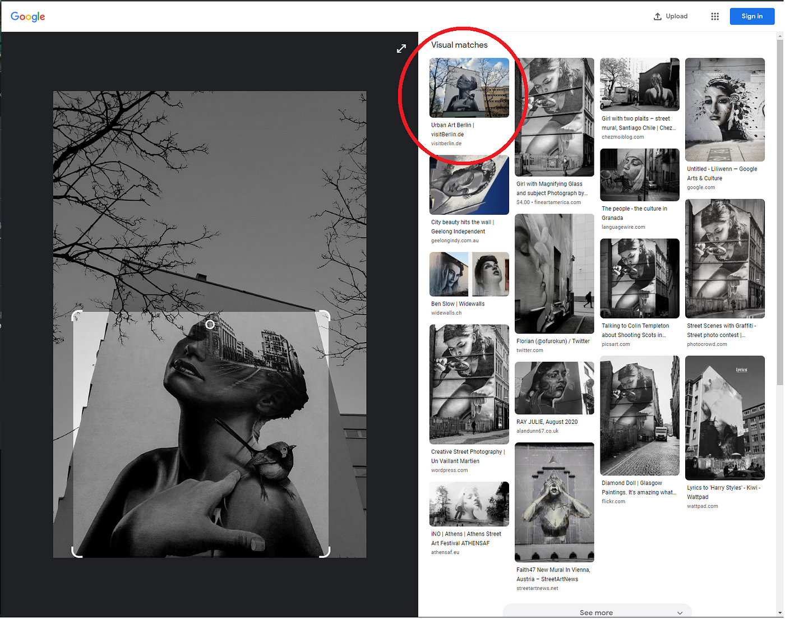
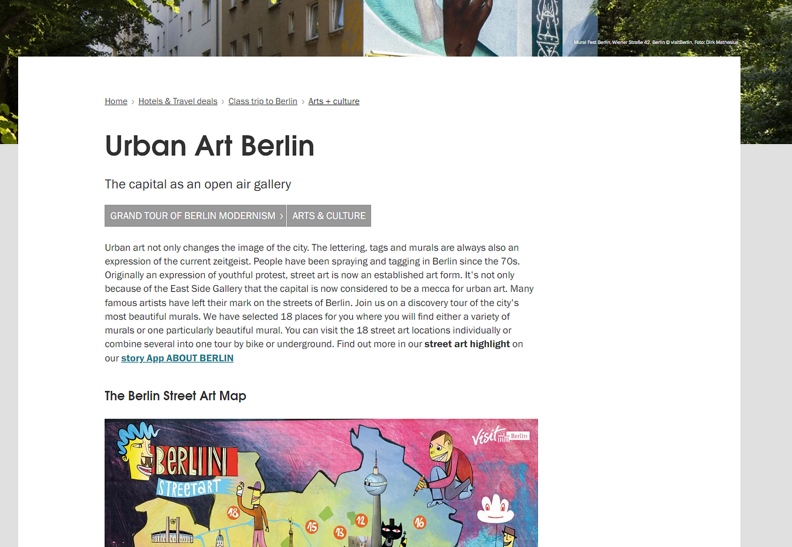
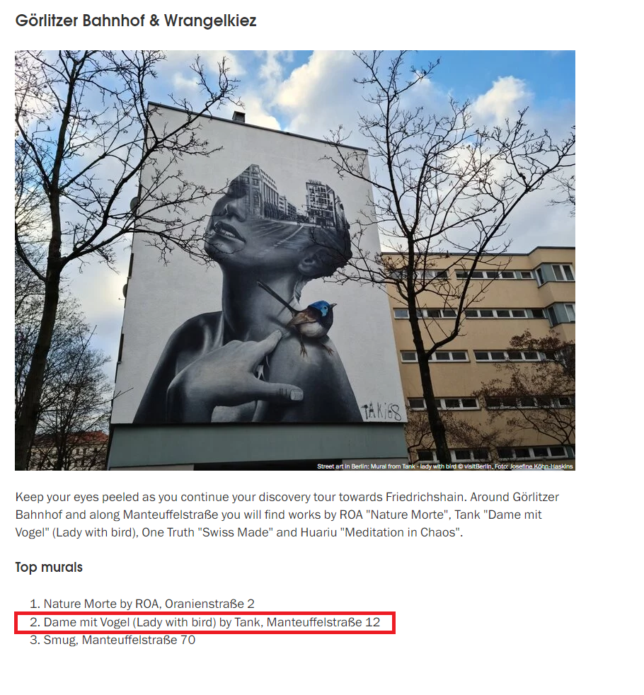
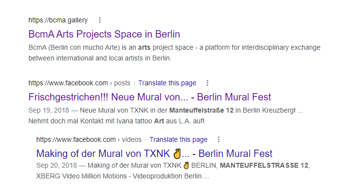
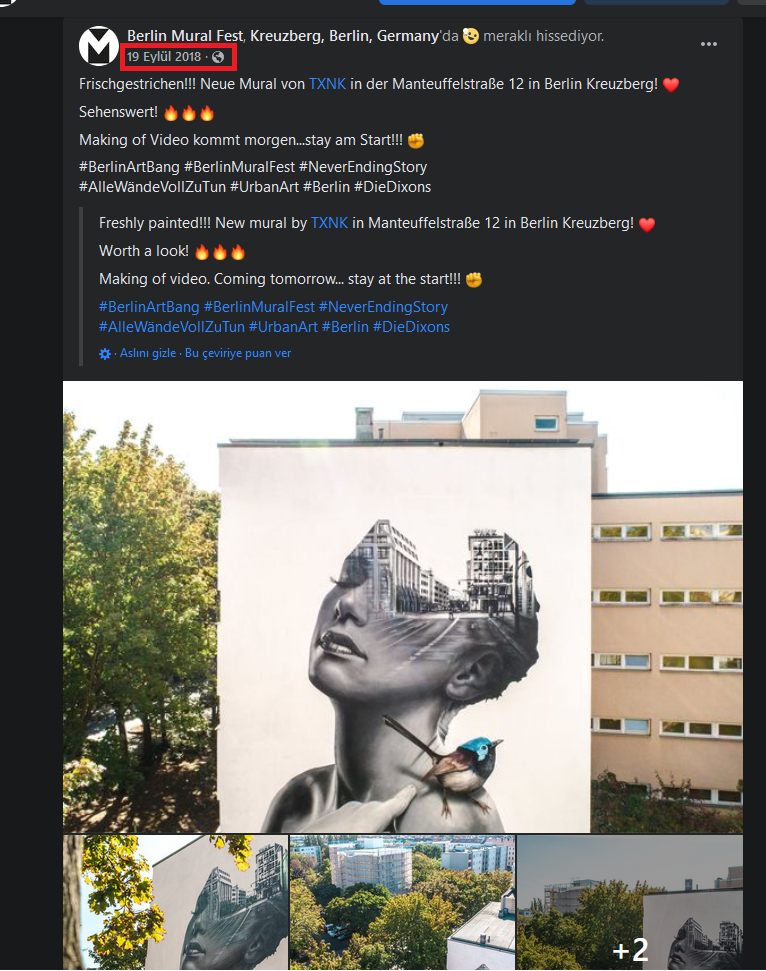
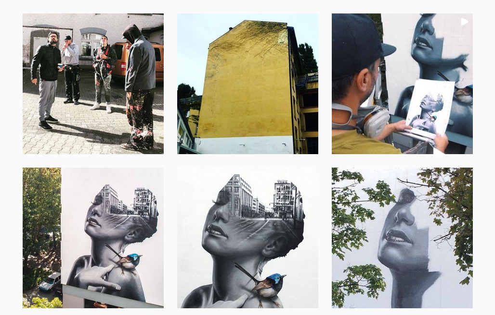
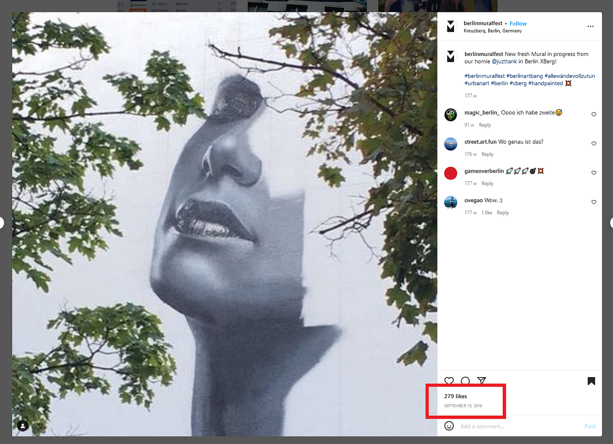

### Building Tattoos — OSINT Challenge 17

On January 24, 2022, Quiztime \(contributor [@bayer\_julia](https://twitter.com/bayer_julia) \) shared a new OSINT quiz with us\. The objective was cooler than most\. We had to figure out when that art was created\. Please refer to the embedded link below for the original post:

■■■■■■■■■■■■■■ 
> **[Julia Bayer](https://twitter.com/bayer_julia) @ Twitter Says:** 

> > It‘s @Quiztime 🥳

🦜 When was this art created?

✍️ Reply to me with your answer 
🤝 Reply to all for collaboration 
🌈 Good luck with the #MondayQuiz https://t.co/OlxMzfhxmB 

> **Tweeted at [2022-01-24 20:30:34](https://twitter.com/bayer_julia/status/1485711645531951108).** 

■■■■■■■■■■■■■■ 

Don't read any further if you'd like to test your geolocation skills\. Open the picture and give it a try\. Don't scroll further down as I will be discussing how I found it and since I just started this hobby\. I'll probably be doing this the long way around :\) Let's go [**Chronolocation**](https://sector035.nl/articles/chronolocation-of-media) **\.**

> _Lastly, English is not my native language\. So, I apologise for any mistakes that I might do\._ 

### Warning spoilers ahead

As always, I start with a Google Lens search, and if nothing comes up, I move on to Yandex and Bing\. But this time, Google Maps found an exact match\.

Very Nice find Google, very nice\.

Okay, let's check the site\.

Very Cool Read

[The site is very interesting](https://www.visitberlin.de/en/urban-art-berlin) \. I suggest you check it out sometime\. There are some cool stuff in there\. But anyways, let's find our image on the site\.

We are looking for picture no\. 2

How do I know it's the second mural? Well, it's in the name Lady with Bird… So what do we know,
- Name of Mural: Dame mit Vogel \(Lady with bird\)
- The Creator of the Mural: by ? Tank ?
- The Location: Somewhere named Manteuffelstraße 12

Okay, time to search these one by one, but I'll skip my irrelevant findings and tell you how I got to a credible source\. I couldn't find anything while searching the Name and Creator\. But when I search the location, oh boy, jackpot\.

The first result was a fluke\.

Here I found a Facebook post from an account called [Berlin Mural Fest](https://www.facebook.com/berlinmuralfest) \. Lovely page, by the way\. [The link sent me to a post](https://www.facebook.com/berlinmuralfest/posts/2205071236416532/) telling us that this mural was freshly painted on September 19 2018\. \(Eylül is Turkish for September\)

This was the post

Okay, now we know the last possible date for creating this mural is September 19, 2018\. I searched this Facebook page for some more, and I did find a time\-lapse kind of [video from its creation](https://www.facebook.com/watch/?v=474121663083932&ref=sharing) \. So, I could theoretically find the time and date by that video with some Choronolocaiton, but I believe we can narrow down our time frame even more\. So, I figured if they have a Facebook page, they probably have an Instagram page as well\.

So I found their website from their About section, [https://berlinmuralfest\.de/](https://berlinmuralfest.de/) , and from there, I found the [Instagram page](https://www.instagram.com/berlinmuralfest/) \.

Nice Page\.

We have to scroll down a bit since it's 2018, but here we are,

Cool

Excellent, we have an incomplete one, and as you can see, this was posted on September 10 [, 2018](https://www.instagram.com/p/BniPYx_jDyc/)

Nice\.

The second picture of our mural is kind of quoted as finished the latest mural for Berlin and its time\-stamped as September 19 [, 2018](https://www.instagram.com/p/Bn6W8wRjbOk/) \.

What we know so far,
- Timeframe: September 10, 2018 \- September, 19 2018

9 whole days, hmm, that's a lot, but for now, I'm going to leave it like this\.

If I had time to narrow it down, then I'd start by checking the tags of our mural\. I'd probably start with [\#berlinmuralfest](https://www.instagram.com/explore/tags/berlinmuralfest/) or \#berlinmuralfes18 or \#berlinmuralfest2018 and see if anyone posted anything relevant\. If nothing came up, then I'd open the time\-lapse video we found and do a Chornolocation from some frames there\. But I'll have to leave it here\. My final answer is,
- Timeframe: September 10, 2018 — September 19 2018

Thank you, Quiztime, for the questions\. I'll be randomly picking questions from your Twitter and solving them from now on\.

[**JavaScript is not available\.**](https://twitter.com/quiztime) 
[_Edit description_ twitter\.com](https://twitter.com/quiztime)

_[Post](https://medium.com/@leventd/tattoos-for-buildings-osint-challenge-17-af109e74a53a) converted from Medium by [ZMediumToMarkdown](https://github.com/ZhgChgLi/ZMediumToMarkdown)._
