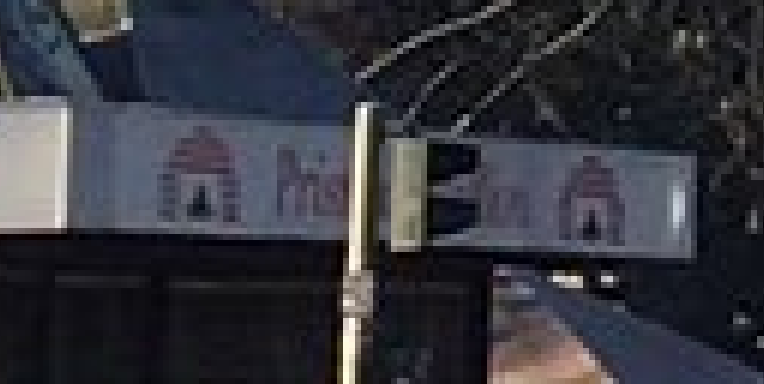
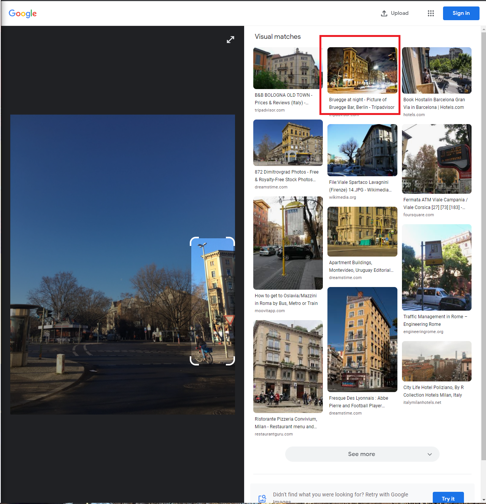
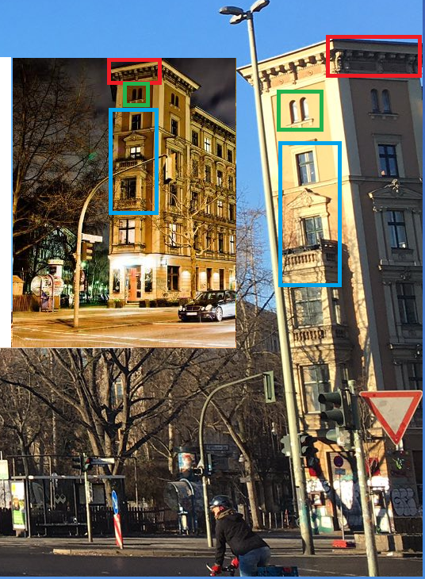
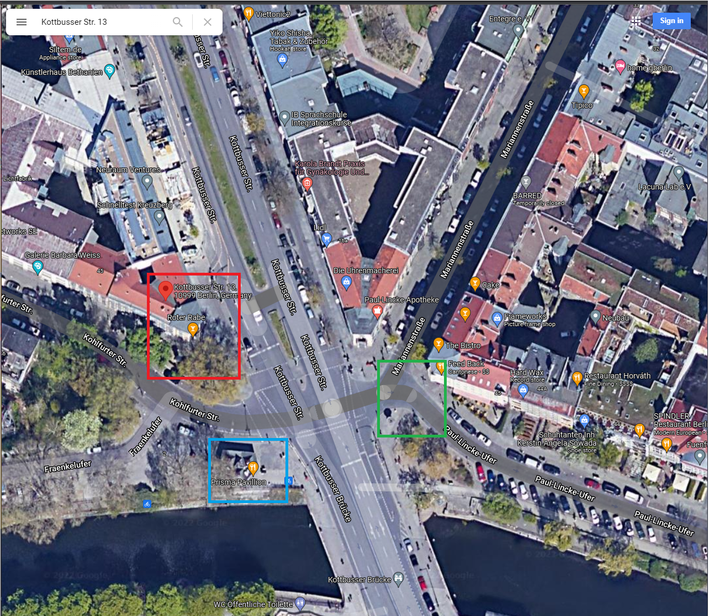
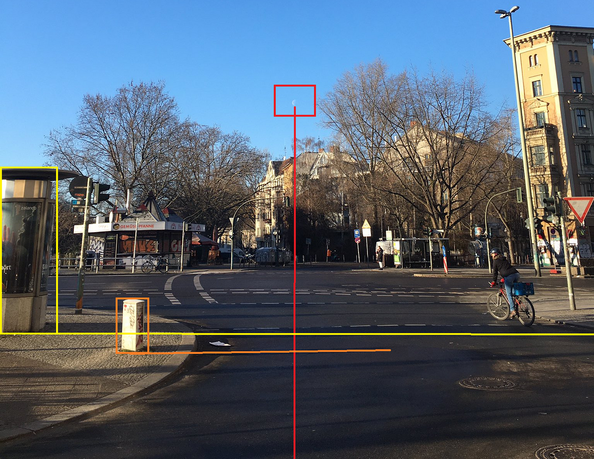
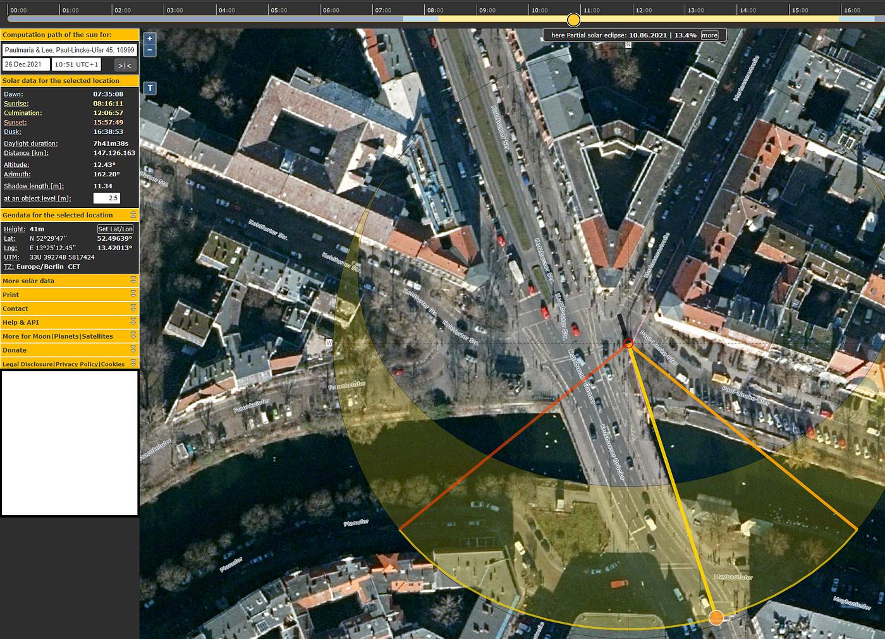
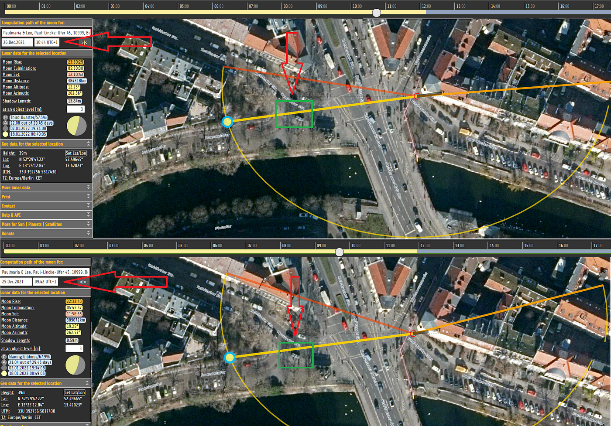

### Never Forget The Moon — OSINT Challenge 18

On December 28, 2021, Quiztime \(contributor [@bayer\_julia](https://twitter.com/bayer_julia) \) shared a new OSINT quiz with us\. The objective was simple\. We had to figure out when the photo was taken\. Please refer to the embedded link below for the original post:

■■■■■■■■■■■■■■ 
> **[Julia Bayer](https://twitter.com/bayer_julia) @ Twitter Says:** 

> > It‘s @Quiztime 🥳

🎨Mark 20 hints in the photo that guide you to the location?

⌚️What date &amp; time was this photo taken in the last 7 days?

✍️ Reply to me with your answer 
🤝 Reply to all for collaboration 
🌈 Good luck with the #MondayQuiz https://t.co/NC5iVMEzSM 

> **Tweeted at [2021-12-27 22:26:18](https://twitter.com/bayer_julia/status/1475593909996765186).** 

■■■■■■■■■■■■■■ 

Don't read any further if you'd like to test your geolocation skills\. Open the picture and give it a try\. Don't scroll further down as I will be discussing how I found it and since I just started this hobby\. I'll probably be doing this the long way around :\) \.

> _Lastly, English is not my native language\. So, I apologise for any mistakes that I might do\._ 

### Warning Spoilers Ahead

> Before I start I have to say, Chronolocation part of the quiz was more exciting than simply finding the location\. 

As I always do, I started with Google Lens and Yandex Image search, but there wasn't any good information\. With immense disappointment, I began to check the image for some clues\.

This place here is currently our only major clue\. It reads **"Gemüs?pfanne"** searching this on google corrects it to **"Gemüsepfanne"** \. That dish looks fantastic\. Now I want to try it :\( Anyways the only thing I learned from this is we are in a German\-speaking country\. Not sure why but I'm thinking **Germany, Austria or Belgium** \. Soo, we're stuck again\. Let's go back to the image\.

Hmm, it could mean something\.

So here we can see the word **"Pris??????"** with some kind of Brick Stove looking logo next to it\. Cloud be Pizza, Bread I don't know\. Let's search with Bread/Pizza \+ Priss \+ City Name\. OH\., we still don't know the city name\. Well, we're stuck again\.

About 10 minutes later, I remembered that I didn't use the cropped image search option of Google Lens so, let's try that\. The first thing I checked was the building on the right\.

Red Marked Picture

Hmm, that red marked picture seems similar\. Let's check that one first\. So I checked the site, and indeed it was the correct building\. It's called [**Bruegge Bar,** according to Tripadvisor\.](https://www.tripadvisor.com/Attraction_Review-g187323-d5948699-Reviews-Bruegge_Bar-Berlin.html)

Nice\.

Okay, now let's open this place on Google Maps\.

- Red Marked place is Bruegge Bar\.
- Green Marked place our location\.
- Blue Marked Place is [Prisma Pavillion](https://goo.gl/maps/KQvRxJW9D7PfMSHT7) \(Which makes Pizzas, My guess was kind of correct\. \)

**Location is:** [52\.49643806674942, 13\.420248968191713](https://www.google.com/maps/place/Kottbusser+Str.+13/@52.4964618,13.4200956,101m/data=!3m1!1e3!4m6!3m5!1s0x47a84fcb428f82cb:0xacf7a4eadf91335d!4b1!8m2!3d52.4966769!4d13.4191951) \. Here [is the street view **proof**](https://goo.gl/maps/GgZfyAyc1AyHMhho9) \.
### **Now For The fun Part**

Now that we know the exact location, we can try to find the Date and Time\. Time for some Chornolocation\. \(For more information, please check out Sector035's amazing article called [**Chronolocation of Media**](https://sector035.nl/articles/chronolocation-of-media) \)

The tweet specifies one thing "What date & time was this photo taken **in the last 7 days?** " and it was posted on [1:26 AM · December 28, 2021](https://twitter.com/bayer_julia/status/1475593909996765186) \(Turkey Time\) \. So what do we now,
- Possible Time Frame: December 22, 2021, and December 28, 2021
- No clouds\.
- Very few people\.

The first thing to do is determine the possible date\. We can do this by searching **"Weather History"** on google\. I found a site called [**Timeanddate**](https://www.timeanddate.com/weather/germany/berlin/historic?month=12&year=2021) and used it to search archival weather data\.

](assets/4ccad3023635/1*t7KVBGlAesOvkpZgyO0Q8Q.png)

[December 2021 Weather Link](https://www.timeanddate.com/weather/germany/berlin/historic?month=12&year=2021)

As you can see, Dec 24, 27 and 28 cannot be our date as it's not Sunny\. So, it's either **Dec 22, 23, 25 or 26\.** Having very few people in the image might mean it's a weekend, but the person could have timed it to have the least amount of people\. The only way left for us is to either use [SunCalc](https://www.suncalc.org/) or [MoonClac](https://www.mooncalc.org/) \. Why because of this\.

Check out these Boxes and Lines, lol\.

For [MoonClac](https://www.mooncalc.org/) , the moon can barely be seen in the image, but it can be seen, so we can draw some sort of a line to determine the objects that it crosses\.

For [SunCalc](https://www.suncalc.org/) , we clearly see two objects marked in Yellow and Orange\. We can roughly determine the heights of these things that's to that one biker\. Since a normal bike is about 1 meter tall, we can safely say that the Yellow marked advert thing is about 3 meters and the Orange marked thing is about 1 meter tall\.

> Note: We don't have to use a real measurement unit\. Since both these objects are relative to each other in terms of length\. 

Let's use both :\)

](assets/4ccad3023635/1*LCcFJ1zpszbcYfH85T3-Iw.png)

[MoonClalc — Image Link](https://www.mooncalc.org/#/52.4965,13.4203,19/2021.12.22/06:28/3/1)

I tried dates December 22 and December 23, but MoonCalc says when the moon crosses that blue line, there should be Sunlight\. So we eliminate these dates\. The only ones reaming are Dec 25 and 26\. From here on, MoonCalc doesn't help much, so let's move to SunCalc\. Trying December 26 first, I believe that the Latest Possible Moment could be is **10:50** and the Earliest Possible Moment is **10:35\.**

Cool

The same goes for December 25 as well\. So, what do we know up until this point?
- Possible Date: Dec 25 or Dec 26
- Possible Time Frame: 10:35 and 10:50
- Location: [52\.49643806674942, 13\.420248968191713](https://www.google.com/maps/place/Kottbusser+Str.+13/@52.4964618,13.4200956,101m/data=!3m1!1e3!4m6!3m5!1s0x47a84fcb428f82cb:0xacf7a4eadf91335d!4b1!8m2!3d52.4966769!4d13.4191951)

After 10 minutes of fiddling with Moon and Sun Calc's, I realized something incredibly important\. It can't be December 25 because, the moon crosses the same place with a 1\-hour difference\.

On December 25 it crosses the same place on 9\.45, and on December 26 it crosses it at 10:45\. This means that our **Date is December 26, 2021\.**

**These sites are so cool\.**

Well, that was it…

Everything we found up till now,
- Date: **December 26, 2021**
- Time Frame: **10:35 and 10:50** \-> Most likely **10:42/43**
- Location: [**52\.49643806674942, 13\.420248968191713**](https://www.google.com/maps/place/Kottbusser+Str.+13/@52.4964618,13.4200956,101m/data=!3m1!1e3!4m6!3m5!1s0x47a84fcb428f82cb:0xacf7a4eadf91335d!4b1!8m2!3d52.4966769!4d13.4191951)

This was the most exciting challenge I solved in a while\. Thank you, Quiztime…

I'll be randomly picking questions from your Twitter and solving them from now on\.

[**JavaScript is not available\.**](https://twitter.com/quiztime) 
[_Edit description_ twitter\.com](https://twitter.com/quiztime)

_[Post](https://medium.com/@leventd/never-forget-the-moon-osint-challenge-18-4ccad3023635) converted from Medium by [ZMediumToMarkdown](https://github.com/ZhgChgLi/ZMediumToMarkdown)._
