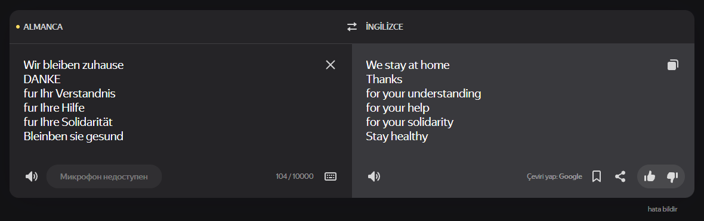
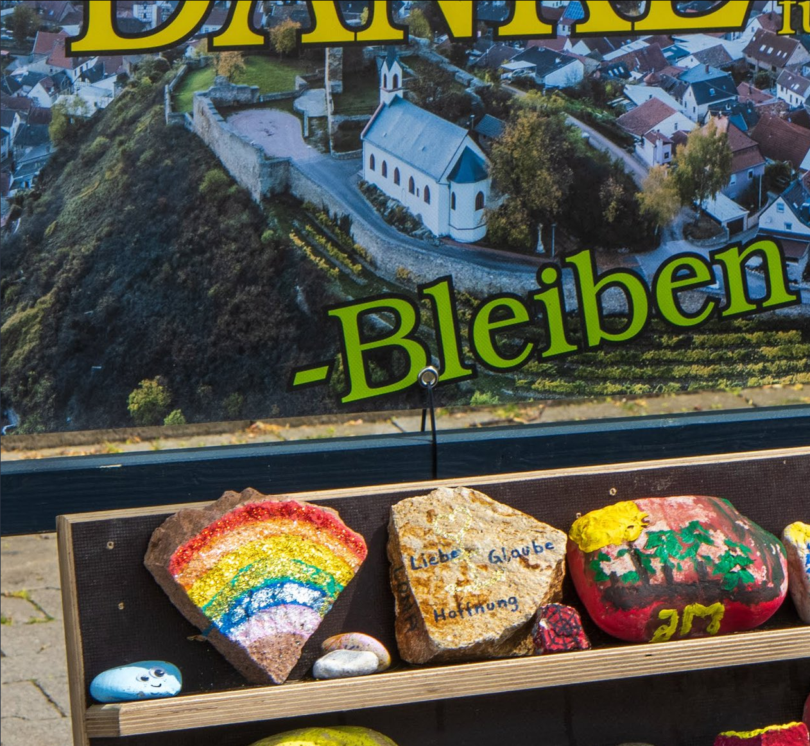
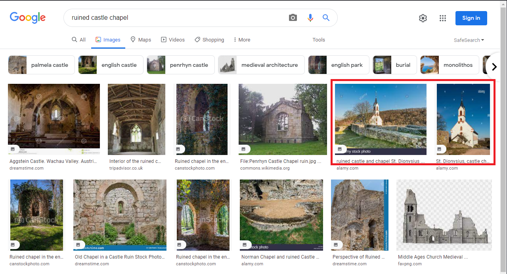

### Bus and Rocks— OSINT Challenge 19 and 20

Quiztime \(contributor [@kollege](https://twitter.com/kollege/) and [@mahrko](https://twitter.com/mahrko) \) shared two OSINT quizzes with us\. Both objects were kind of wired\. For kollege's we have to figure out what the obfuscated text reads, and for mahrko's, we have to find the location on the advert\. Please refer to the embedded links below for the original posts:

■■■■■■■■■■■■■■ 
> **[Marc Krueger](https://twitter.com/kollege) @ Twitter Says:** 

> > 👋@[[quiztime](https://twitter.com/quiztime)](https://twitter.com/[quiztime](https://twitter.com/quiztime))! Welcome to #TuesdayQuiz 🚌

1. From which city is the plan?
2. Give the words in the 3⃣ red boxes!
3. Find and post the link to the schedule!

🔁Want help: retweet!
🎯Solutions: reply to/DM me!
🤝Collaborate: reply below!
🧐Daily #verification: follow @[[quiztime](https://twitter.com/quiztime)](https://twitter.com/[quiztime](https://twitter.com/quiztime))! https://t.co/limnT18fj6 

> **Tweeted at [2022-02-15 21:04:01](https://twitter.com/kollege/status/1493692598631993360).** 

■■■■■■■■■■■■■■ 

■■■■■■■■■■■■■■ 
> **[Marco Bereth 🇪🇺](https://twitter.com/mahrko) @ Twitter Says:** 

> > Hey @[quiztime](https://twitter.com/quiztime), time again for my #FridayQuiz!  

1️⃣ Where was it?
2️⃣ When was it?

🔁 to invite others
🤝 cooperations welcome
✅ Solutions👇🏻 the GIF or via DM 🙋🏻‍♂️
💬 Explain how you did it! https://t.co/nUpxBcuHBp 

> **Tweeted at [2022-01-28 19:01:09](https://twitter.com/mahrko/status/1487138697598361600).** 

■■■■■■■■■■■■■■ 

> **Both questions were fairly short that's why I combined them into a single post** 

Don't read any further if you'd like to test your geolocation skills\. Open the picture and give it a try\. Don't scroll further down as I will be discussing how I found it and since I just started this hobby\. I'll probably be doing this the long way around :\)

> _Lastly, English is not my native language\. So, I apologise for any mistakes that I might do\._ 

### Warning spoilers ahead
### First Question

The first question was very easy since I basically found it by googling\. I simply searched **"bahnhof/zob markt — krankenhaus"** opened images, and about 4–5 rows down, I found a similar picture\.

](assets/4d54b1da204d/1*Pr-AIdf5o1uSD-NarumUfA.png)

This one — [Link](https://images.app.goo.gl/gTfL8D2jUmRh7oV17)

I downloaded the image, which turned out to be a PDF\. And it was an exact match\.

](assets/4d54b1da204d/1*N1OrX2n1D9h1DwfsZk9GzA.png)

[Link to the PDF](https://www.google.com/url?sa=i&url=https%3A%2F%2Fvsninfo.de%2Ffrontend%2Factions%2Fmedia-download%2F306095%2F0%2F1%2F1&psig=AOvVaw0aA9nzq44F4jb6whHA2AGP&ust=1645288201311000&source=images&cd=vfe&ved=2ahUKEwj16c2n1on2AhX1X_EDHSK7Dy0Q3YkBegQIABAL)

Answer:
- Northeim
- 1\->249, 2\-> Wieterviertel, 3\-> Fuchsbäumer Weg
- [Link to the PDF](https://www.google.com/url?sa=i&url=https%3A%2F%2Fvsninfo.de%2Ffrontend%2Factions%2Fmedia-download%2F306095%2F0%2F1%2F1&psig=AOvVaw0aA9nzq44F4jb6whHA2AGP&ust=1645288201311000&source=images&cd=vfe&ved=2ahUKEwj16c2n1on2AhX1X_EDHSK7Dy0Q3YkBegQIABAL)

### Second Question

As always, I did a reverse image search using Google and Yandex, helpful nothing came up, I even tested various cropped versions of the image, but it didn't work\.

Then I started translating the text on the advert\. Nothing really useful came up except that this image was taken in COVID times…

Hmm, Okay\.

After this, I started translating the writings on the rocks and gave up after finishing the first row\. But than I realized something\.

liebe glaube hoffnung<\->love faith hope

Here we can see a ruined castle and a chapel\. Time for some googling…

> Note: Searching with “ruined castle church” doesn't give any useful results for some reason\. I tried it after I solved this question\. 

Hmm

Those two result send gave this description, “ **ruined castle and chapel St\. Dionysius in Neu\-Bamberg, Rheinhessische Schweiz, district Alzey,** ” Very cool\. Let's go there to see if it is correct\.

](assets/4d54b1da204d/1*qytpjgWyrnCTfgMzaoTMAA.png)

[Link Here](https://goo.gl/maps/aTufwwJ7euHHqDTSA)

Well, satellite view doesn't give me any confidence, but the images near here prove it is the correct location\.

I couldn't find the location for this board\. If I do, I'll edit this part and since I couldn't find the place\. The only thing I can say bout the time frame is it's after COVID started, after March 2020 probably\.

Thank you, Quiztime, for the questions\. I'll be randomly picking questions from your Twitter and solving them from now on\.

[**JavaScript is not available\.**](https://twitter.com/quiztime) 
[_Edit description_ twitter\.com](https://twitter.com/quiztime)

_[Post](https://medium.com/@leventd/bus-and-rocks-osint-challenge-19-and-20-4d54b1da204d) converted from Medium by [ZMediumToMarkdown](https://github.com/ZhgChgLi/ZMediumToMarkdown)._
