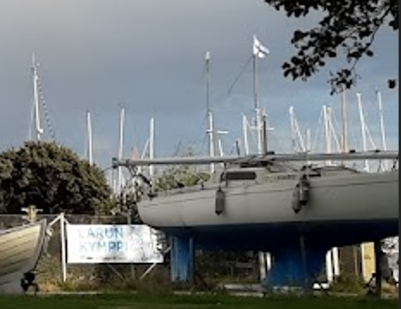
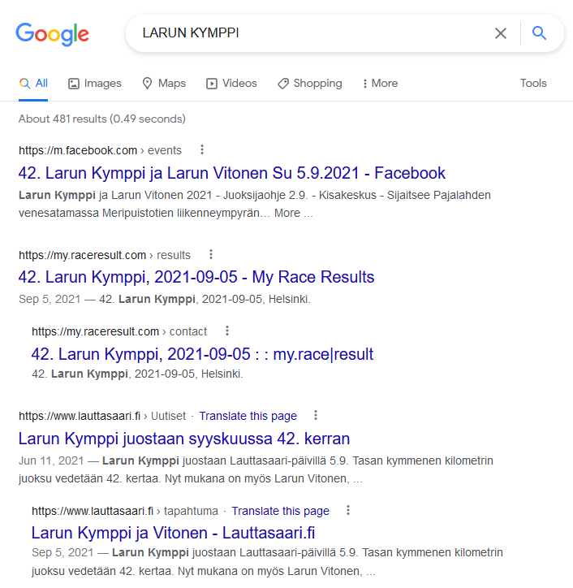
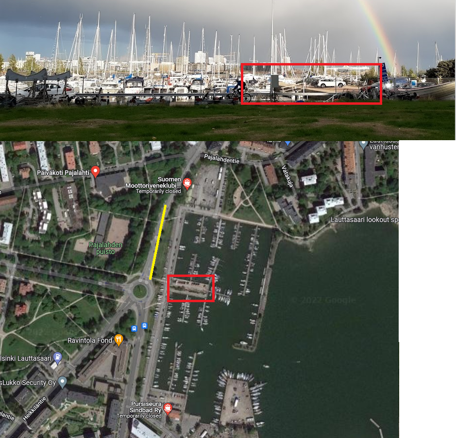
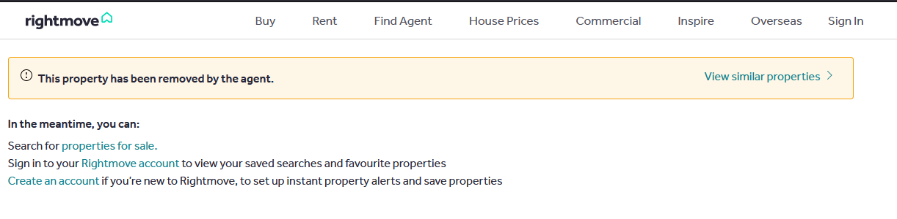
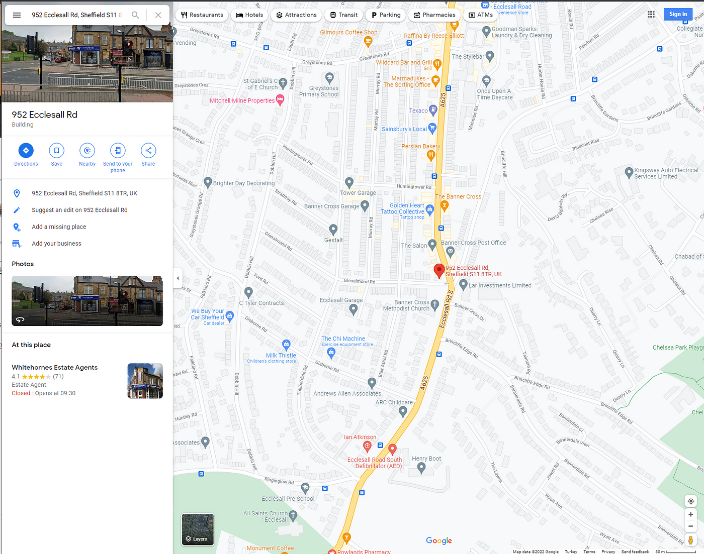
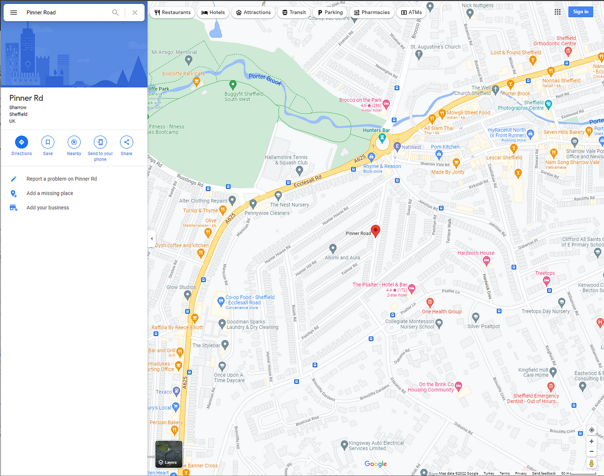

### I hate Marinas, It’s too Crowded —OSINT Challenge 21 and 22

While I was reading some Medium blogs, I came across @ [Sofia Santos](https://gralhix.medium.com/) ’s blogs \(this writeup specifically: [Walkthrough — Hacktoria: Geolocation 02 \| by Sofia Santos](https://gralhix.medium.com/walkthrough-hacktoria-geolocation-02-a987eef13dbe) \) There, I saw a cool looking site called [Hacktoria OSINT](https://hacktoria.com/) \.

They are an OSINT , news, resource and blog site **"That provide people with something fun, unique and educational\."** their words, not mine\. They have six categories of challenges on the site, and they look fun as hell\. So aside from Quiztime and OSINTDojo's challenges, I'll start solving Hacktoria's Challenges as well\. Well, the one’s that I haven't read on [Sofia Santos](https://gralhix.medium.com/) blogs :\)

> **I didn’t have time to solve long Quiztime/OSINTDojo quizzes this week so after the Hactoria Challenge you can find a really short Quiztime challenge as well\.** 

> _Lastly, English is not my native language\. So, I apologise for any mistakes that I might do\._ 

### Warning Spoilers Ahead for Two Challenges
### Hacktoria Challenge 1

](assets/597843374cc2/1*jpnQpYNH7JrUUNc_CqITig.jpeg)

[Geolocation 1 — Link](https://hacktoria.com/practice-ctf-questions/geolocation/geolocation-01/)

So nothing immediately jumps out, and I highly doubt that reverse image search will help me\. The only thing to do is closely examine the image and list the details I found\.
- We can see a densely populated area on the far backside of the image\.
- We are in some kind of park/grass area\. A narrow road is in between us and the boats\.
- We can see relatively new cars\.
- Some Finnish flag\. \( **Blue Cross Flag** \) if you didn't know what flag that was and need a site to help you out\. Try these, [Flagid](https://flagid.org/) and [Flaggenlexikon](https://www.flaggenlexikon.de/flag-finder/index_dt.htm)
- Some weird text\.

The text and Flag\.

Okay, let us assume this is in Finland and we are on an island because the town back there doesn't have any high rise buildings and there are lots of small boats\.

The text probably read, **“LARUN KYMPPI”,** we could have modified the lighting of the image but we can make most of it out so I didn't bother\.

Cool\.

So we get exact word matches from Finland and which is some sort of a race\. Very cool\.

](assets/597843374cc2/1*MMgw4wKt1UdWZ5yNBxr52Q.png)

Oh — [Link](https://m.facebook.com/events/470167334051998)

That first Facebook link is an event link\. And it looks awfully similar to where we are looking for\. We can even see the location, “ **Pajalahden Venesatama”** and clicking that location send me here,

](assets/597843374cc2/1*5amSWL0YCUhKG7n6EAnR7A.png)

[Link](https://wego.here.com/finlandiya/helsinki/street-square/meripuistotie--loc-dmVyc2lvbj0xO3RpdGxlPUxhdXR0YXNhYXJpO2xhdD02MC4xNTcwNTtsb249MjQuODg1Njc7Y2l0eT1IZWxzaW5raTtwb3N0YWxDb2RlPTAwMjEwO2NvdW50cnk9RklOO2Rpc3RyaWN0PUxhdXR0YXNhYXJpO3N0YXRlQ29kZT1FdGVsJUMzJUE0LVN1b21pO2NvdW50eT1VdXNpbWFhO2NhdGVnb3J5SWQ9cG9zdGFsLWFyZWE7c291cmNlU3lzdGVtPWludGVybmFs?map=60.15502,24.89181,15,normal&fb_locale=tr_TR&msg=Meripuistotie)

Let’s open this area in google maps to find the exact location\.

Hmm\.

I’m fairly certain that the car park in the middle of the marina is the place I marked\. Let’s go to Strewview to confirm it\. And since we see some grass on the image we are probably right on the yellow marked road\. As such, I believe this is the location,

](assets/597843374cc2/1*jlgqEqZi6XKPXJDLjMvjyA.png)

[Streetview Link](https://www.google.com/maps/@60.1576126,24.8858592,3a,75y,103.62h,84.8t/data=!3m6!1e1!3m4!1s4eEvLN9fMFHt2THjPHI4eg!2e0!7i13312!8i6656)

Answers,
- Location: [**60\.157598, 24\.885922**](https://goo.gl/maps/xaMVkyp1qXReP3Lf7)
- Hactoria Question Answer: Name of the Island, **Lauttasaari**

Thank you, Hactoria, for the questions\. I’ll be randomly picking questions from your site and solve them from now on\.
### Really Short Quiztime Challenge :\)

On Jan 26, 2022, Quiztime \(contributor [@twone2](https://twitter.com/twone2) \) shared a new OSINT quiz with us\. The objective was simple\. We had to figure out when the photo was taken\. Please refer to the embedded link below for the original post:

■■■■■■■■■■■■■■ 
> **[Tilman | 🇺🇦 | Now also: @twone2@journa.host](https://twitter.com/twone2) @ Twitter Says:** 

> > It's #Wednesdayquiz @[quiztime](https://twitter.com/quiztime)! 🥳

Someone found an ad for a house with this gorgeous 'private compact courtyard garden' online

1️⃣ Who's the finder?
2️⃣ Where is it?
3️⃣ Find the original listing!

🔁 to invite others
🤝 cooperations welcome
✅ Solutions &amp; 💬explainers 👇🏻 the GIF https://t.co/GRKrQ4gU5l 

> **Tweeted at [2022-01-26 16:53:49](https://twitter.com/twone2/status/1486381876914933771).** 

■■■■■■■■■■■■■■ 

Thinking that Reverse Image Search won’t bring anything useful, I searched for the text written on the image, “ **private compact courtyard garden** ”\. This got me this tweet\. Wow, that was very easy\.

](assets/597843374cc2/1*aY0fji6GxeUyZb5Wvr9xWQ.png)

[Tweet Link](https://twitter.com/LukeMNeve/status/1485670868915216391)

Let’s check the site,

Sad

This is so sad\. It’s not there anymore\. Well, from here, we can do two things;
- Check Web Archive\.
- Check the comments of the tweet for the location or similar places\.

Let’s check Web Archive first,

](assets/597843374cc2/1*2m9nvp7w88fcYNS0e_jWMA.png)

[Page Link](https://web.archive.org/web/*/https://www.rightmove.co.uk/properties/119110382#/?channel=RES_BUY)

Huh, people really loved that property advert, So let’s check the archived site\.

](assets/597843374cc2/1*MpD4N3syRzfBLAZzGMxXSw.png)

[Okey Nice — Link](https://web.archive.org/web/20220125135817/https://www.rightmove.co.uk/properties/119110382#/?channel=RES_BUY)

So what did we learn from this page,
- The property is on: Pinner Road, Hunters Bar
- Marketing Company’s location is: 952 Ecclesall Road, Sheffield, S11 8TR, UK\.

Time for Google Maps\. Let’s search for that company [address](https://goo.gl/maps/Knh17WKjjbzPkvrR8) \.

Sheffield, okay

I could have searched for “Pinner Road, Hunters Bar” directly, but I assumed that the company was likely to be close to our target, so I went there first\. When we search [**Pinner Road**](https://goo.gl/maps/qhnLLPKEoL9qp3bv8) , Google Maps brought me to the nearest Pinner road there is\.

Cool Name

And lastly let’s check Streetview for confirmation\.

](assets/597843374cc2/1*sH8iLQ1d5mGb8VZ8Y5dQHw.png)

[Streetview Link](https://www.google.com/maps/@53.3656149,-1.5026682,3a,75y,193.54h,88.95t/data=!3m6!1e1!3m4!1s6HlF6mG174cglMB74o7eNQ!2e0!7i16384!8i8192)

Yey, it checks out\. We found the location\.

Last Coordinates: [53\.3656240555799, \-1\.50257828272235](http://google.com/maps/place/55+Pinner+Rd,+Sharrow,+Sheffield+S11+8UH,+UK/@53.3656215,-1.5034845,18z/data=!3m1!4b1!4m5!3m4!1s0x487982135b2fdb5d:0xd5ca22daeb03f9ea!8m2!3d53.3656199!4d-1.5023875)

Thank you, Quiztime, for the questions\. I’ll be randomly picking questions from your Twitter and solving them from now on\.

[**JavaScript is not available\.**](https://twitter.com/quiztime) 
[_Edit description_ twitter\.com](https://twitter.com/quiztime)

_[Post](https://medium.com/@leventd/i-hate-marinas-its-too-crowded-osint-challenge-21-and-22-597843374cc2) converted from Medium by [ZMediumToMarkdown](https://github.com/ZhgChgLi/ZMediumToMarkdown)._
