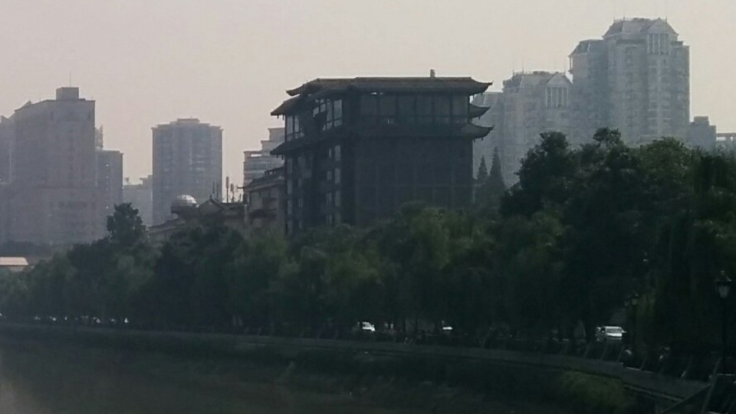
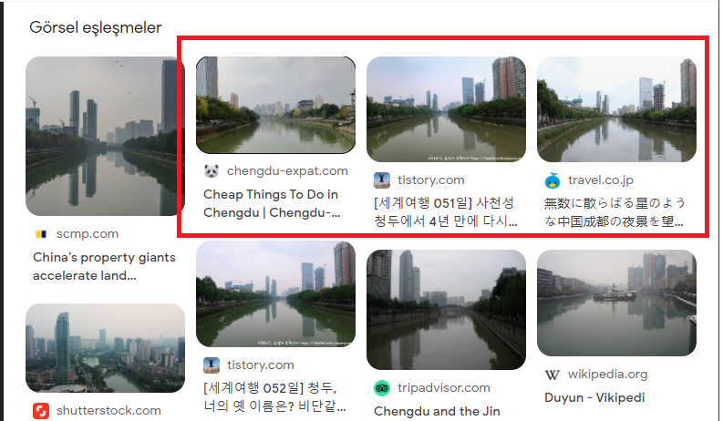
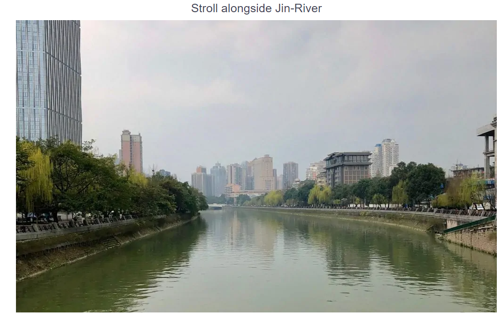

### A new Coordinate System — OSINT Challenge 23

After a very long break from my blogs I’m back with a standard Quiztime\. Shared by contributor [@kollege](http://twitter.com/kollege) \. The objective was simple\. We had to figure out where the photo was taken\. Please refer to the embedded link below for the original post:

■■■■■■■■■■■■■■ 
> **[Marc Krueger](https://twitter.com/kollege) @ Twitter Says:** 

> > 👋@[[quiztime](https://twitter.com/quiztime)](https://twitter.com/[quiztime](https://twitter.com/quiztime))! This time, #TuesdayQuiz is this:

Spot the spot: Geolocate where I took this pic or give #What3Words.

🔁Want help: retweet!
🎯Solutions: reply to/DM me!
🤝Collaborate: reply below!
🧐Daily #verification: follow @[[quiztime](https://twitter.com/quiztime)](https://twitter.com/[quiztime](https://twitter.com/quiztime))! https://t.co/DIzbykM5u2 

> **Tweeted at [2022-02-01 20:54:45](https://twitter.com/kollege/status/1488616835532705793).** 

■■■■■■■■■■■■■■ 

Don’t read any further if you’d like to test your geolocation skills\. Open the picture and give it a try\. I will be discussing how I found it and since I just started this hobby\. I’ll probably be doing this the long way around :\)

> _Lastly, English is not my native language\. So, I apologize for any mistakes that I might make\._ 

Before we start, check out “what3words” it’s an cool and easy way to give coordinates\. In their words, “ **What3words is the simplest way to talk about location\.** ” It has divided the world into 3m x 3m squares, each with a unique three\-word address\.
### Warning spoilers ahead

After looking at the image, I believe this is near an Asian embassy or from Asia\.

Because of this building\.

But let’s do some RIS \(Reverse Image Search\) on Google\.

Hmm\.

These three images look really close to what we are searching for\.

WOW

And we have an perfect match\. YEY\.

And after searching for the location on Google Maps for about 5 minutes, I found this place\. If you did search this by yourself, you should have noticed some weird stuff about China’s roads on Google Maps\. The satellite view and the map markings don’t match up\. If you wonder why, check out this short video, [Why Every Map of China is Just Slightly Wrong](https://www.youtube.com/watch?v=L9Di-UVC-_4) \.

](assets/6f7d87819358/1*foYcBaMydCP98DYBWhgZqg.png)

[Location](https://www.google.com/maps/place/30%C2%B038'56.7%22N+104%C2%B003'50.7%22E/@30.6466388,104.0662038,3a,63.6y,93.77h,96.12t/data=!3m11!1e1!3m9!1sAF1QipMZf9bgyI-ki0_tY1FhAMqtLXKVCudEvRn9fykS!2e10!3e11!6shttps:%2F%2Flh5.googleusercontent.com%2Fp%2FAF1QipMZf9bgyI-ki0_tY1FhAMqtLXKVCudEvRn9fykS%3Dw203-h100-k-no-pi-0-ya121.74795-ro0-fo100!7i8704!8i4352!9m2!1b1!2i27!4m5!3m4!1s0x0:0xe6731e6bf7cc3792!8m2!3d30.6490833!4d104.0640687)

A perfect match in every way\.

The answer: [**30°38'47\.9"N 104°03'58\.4"E**](https://www.google.com/maps/place/30%C2%B038'47.9%22N+104%C2%B003'58.4%22E/@30.6466502,104.0656678,19z/data=!3m1!4b1!4m6!3m5!1s0x0:0x5175c23e63137212!7e2!8m2!3d30.6466485!4d104.0662147) a bridge\.

Answer for **what3words:** [///champions\.presenter\.gained](https://what3words.com/turkeys.lyricism.handbag)

Thank you, Quiztime, for the questions\. I’ll be randomly picking questions from your Twitter and solving them from now on\.

[**JavaScript is not available\.**](https://twitter.com/quiztime) 
[_Edit description_ twitter\.com](https://twitter.com/quiztime)

_[Post](https://medium.com/@leventd/a-new-coordinate-system-osint-challenge-22-6f7d87819358) converted from Medium by [ZMediumToMarkdown](https://github.com/ZhgChgLi/ZMediumToMarkdown)._
