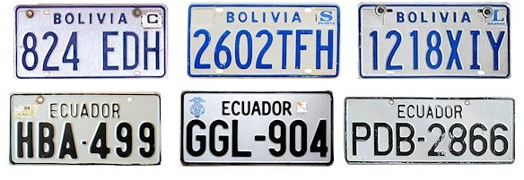
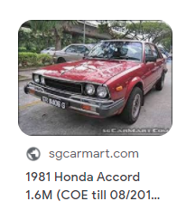
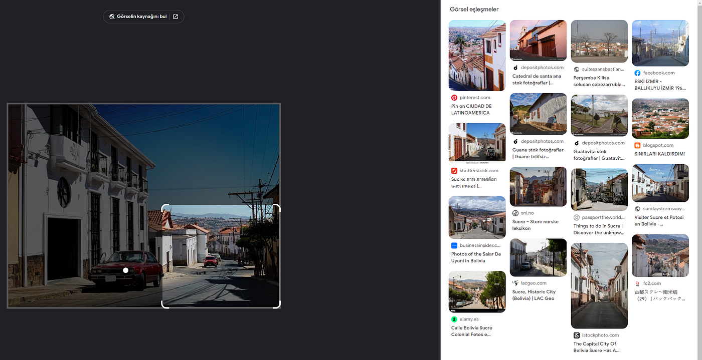
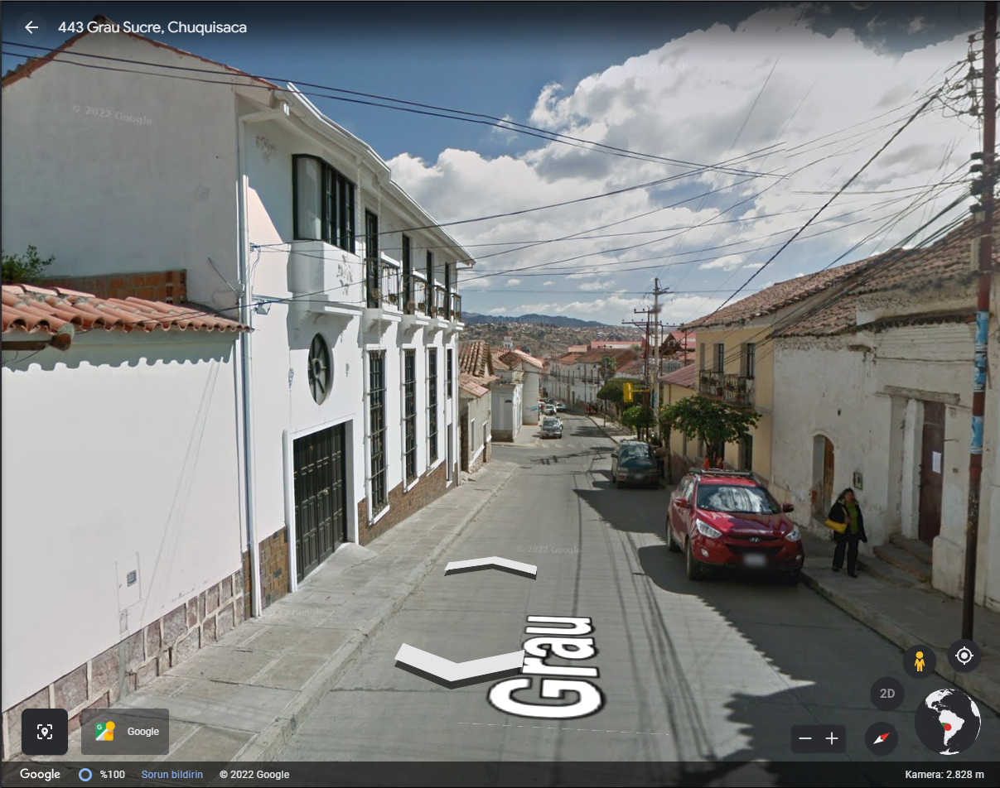

### Searching for **The White City** — OSINT Challenge 24

Quiztime \(contributor [@Sector035](https://twitter.com/Sector035) \) shared a new OSINT quiz with us\. The objective was simple\. We had to figure out where the photo was taken\. Please refer to the embedded link below for the original post:

■■■■■■■■■■■■■■ 
> **[𝕊𝕖𝕔𝕥𝕠𝕣𝟘𝟛𝟝](https://twitter.com/Sector035) @ Twitter Says:** 

> > I skipped a few times, but I'm back for a #Thursdayquiz!

Where exactly was this photo taken?

🤝 Reply all = collaboration
👇 Reply in thread = answers
🔃 Retweet = invite others
👣 Follow @[quiztime](https://twitter.com/quiztime) = more #verification https://t.co/bRra7l8jj6 

> **Tweeted at [2022-02-10 15:06:19](https://twitter.com/sector035/status/1491790641147179016).** 

■■■■■■■■■■■■■■ 

Don’t read any further if you’d like to test your geolocation skills\. Open the picture and give it a try\. I will be discussing how I found it and since I just started this hobby\. I’ll probably be doing this the long way around :\)

> _Lastly, English is not my native language\. So, I apologize for any mistakes that I might make\._ 

### Warning spoilers ahead

First of all, that’s a nice dam car\.

Secondly, I don’t know what to do, so let’s check [**World License Plates**](http://www.worldlicenseplates.com/) \. This image gives Balkans or Central/South American country vibes, so after a quick look at Central/South American license plates, I can safely say that it’s either **Ecuador** or **Bolivia** \.

Cool

Let’s leave it at that for now and try RIS \(Reverse Image Search\) \. Oh, Sector035 is included in their weakly blog\.

](assets/54275da2e88a/1*V2WBVHX54SL55iW-NJZDDQ.png)

[Week in OSINT \#2022–06 \| Sector035](https://sector035.nl/articles/2022-06)

Side Note: Thanks, Google, for the car name, lol\.

1976–1981 Honda Accord

So, RIS doesn’t give any good results, but all the images it finds are from Uruguay, Colombia etc\. So my license plate findings are spot on… But what do now? The only thing I could think of was to see if any of the results were from **Ecuador** or **Bolivia** \.

RIS \(Reverse Image Search\)

After searching for small parts of the image, I found many pictures from Bolivia, probably meaning that the location and the plate are from Bolivia\. After checking the images, most of these are from a city called **La Ciudad Blanca** and **Sucre\.** After a couple of searches, apparently, they are the same thing, and **La Ciudad Blanca** means **The White City, Sucre\.** But now I’m stuck again…\.

When this happens, I tend to write what I know,
- We are on some hill/slope\.
- There is a crossroad near\.
- The main white building is kind of taller than all the buildings\.
- Does the white building have some sort of logo, cross?
- The white building seems to have a car entrance\. Maybe it’s a big complex\.
- Next to the white building, there is an orange shorter building\.
- There is a Utility pole over the crossroads\.
- From the shadows, the road is facing North\-Westish, kind of, maybe, hopefully\.

So I opened a random road to see if I was right about the direction and location\.

](assets/54275da2e88a/1*_SAR5lMm2puEZ45w51mJvA.png)

[Location](https://earth.google.com/web/search/church/@-19.04822477,-65.25870617,2797.57604641a,1242.00707707d,35y,307.85310378h,0t,0r/data=CigiJgokCW5J-fTTCTPAESgYWDSwDzPAGbAttFYwT1DAIRafGtUdUlDA)

And it kind of does check out\. Meaning I’m probably really close\. I should be close to this location\. Fifteen minutes later I found the place…\. \.

Location: [**Grau 443, Sucre, Bolivya**](https://earth.google.com/web/search/church/@-19.0519106,-65.25536443,2827.50415039a,0d,60y,304.19195283h,85.89595732t,0r/data=CigiJgokCW5J-fTTCTPAESgYWDSwDzPAGbAttFYwT1DAIRafGtUdUlDAIhoKFkdNSzhfR241WDRQR1hfVUozZUpEdlEQAg)

Nice\!

Thank you, Quiztime, for the questions\. I’ll be randomly picking questions from your Twitter and solving them from now on\.

[**JavaScript is not available\.**](https://twitter.com/quiztime) 
[_Edit description_ twitter\.com](https://twitter.com/quiztime)

_[Post](https://medium.com/@leventd/searching-for-the-white-city-osint-challenge-23-54275da2e88a) converted from Medium by [ZMediumToMarkdown](https://github.com/ZhgChgLi/ZMediumToMarkdown)._
