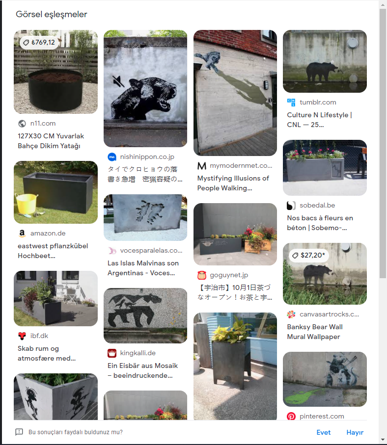
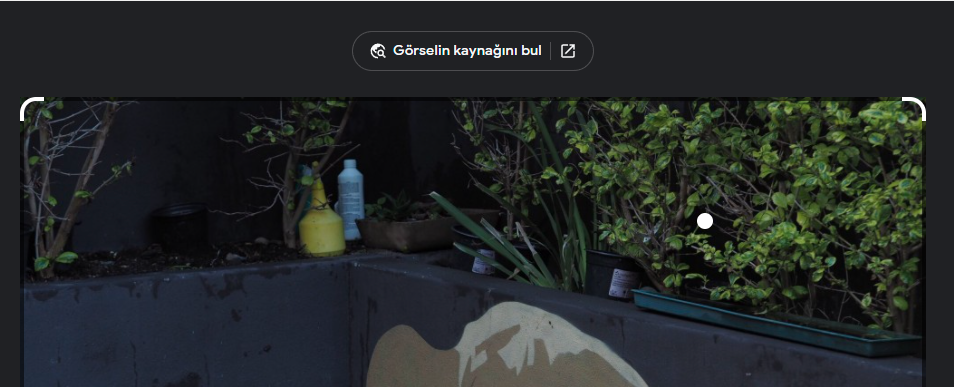
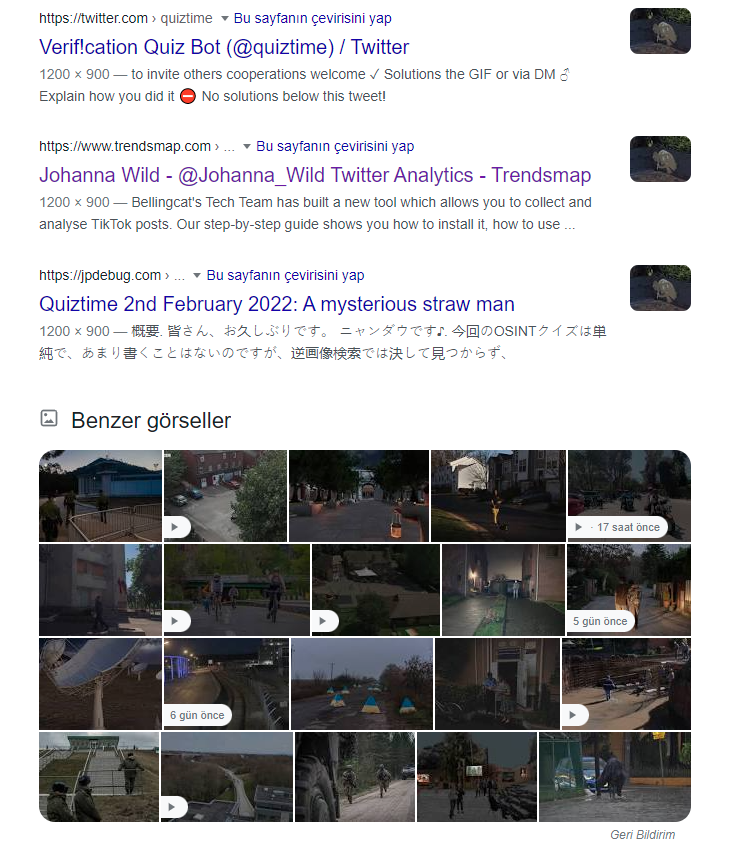
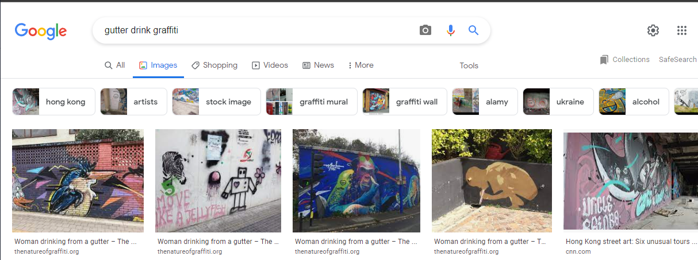

### Don’t Rely on Tools — OSINT Challenge 25

Quiztime \(contributor [@bayer\_julia](https://twitter.com/bayer_julia/) \) shared a new OSINT quiz with us\. The objective was simple\. We had to figure out where it was taken\. Please refer to the embedded link below for the original post:

■■■■■■■■■■■■■■ 
> **[Julia Bayer](https://twitter.com/bayer_julia) @ Twitter Says:** 

> > It‘s @Quiztime 🥳

🧐 In which city was this photo taken? 

✍️ Reply to me with your answer 
🤝 Reply to all for collaboration 
🌈 Good luck with the #MondayQuiz https://t.co/ztHsyBUjJw 

> **Tweeted at [2022-01-31 20:33:09](https://twitter.com/bayer_julia/status/1488249011169640453).** 

■■■■■■■■■■■■■■ 

Don’t read any further if you’d like to test your geolocation skills\. Open the picture and give it a try\. I will be discussing how I found it and since I just started this hobby\. I’ll probably be doing this the long way around :\)

> _Lastly, English is not my native language\. So, I apologize for any mistakes that I might make\._ 

### Warning spoilers ahead

As some who constantly uses tools or RIS \(Reverse Image Search\) or any other site to find locations: this was hard because everything I did was way over the top\.
RIS returns absolutely nothing,

Sad :\(

How about the new searchability, **Find The Source of Image\.**

Nope, nothing\. Aside from the tweet itself, it brought nothing\. \.

So, sad

So what did I do? I listed the things that I know,
- Its a graffiti
- Art over a gutter
- Outside
- Inside a public place, garden, school, parking lot?
- Has some utilities inside the bushes\. This could mean regular maintenance, further supporting the places I listed

Soo, after thinking for about 15 minutes, I thought, why don’t I just search this on google? Lol\.

Uh, it worked\.

The answer: **Cape Town, South Africa**

](assets/f523fddcb693/1*I_q7ABSHX7ncSp-RSWPDQA.png)

[Website](https://thenatureofgraffiti.org/2016/01/11/boy-drinking/)

Today I learned one simple thing,

> **If everything could be solved with automated tools, many people would be out of a job\.** 

Thank you, Quiztime, for the questions\. I’ll be randomly picking questions from your Twitter and solving them from now on\.

[**JavaScript is not available\.**](https://twitter.com/quiztime) 
[_Edit description_ twitter\.com](https://twitter.com/quiztime)

_[Post](https://medium.com/@leventd/dont-rely-on-tools-osint-challenge-24-f523fddcb693) converted from Medium by [ZMediumToMarkdown](https://github.com/ZhgChgLi/ZMediumToMarkdown)._
