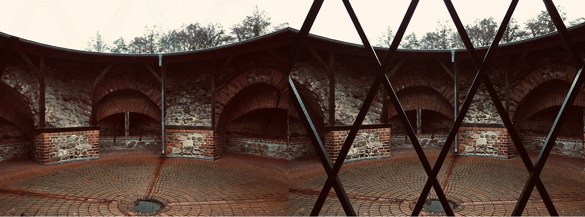
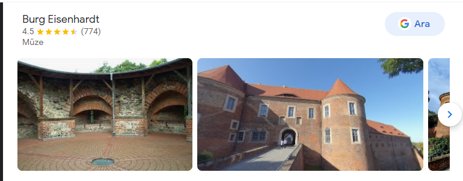

### Clean Your Images— OSINT Challenge 26

We have a really short one for this round of quizzes\. Quiztime \(contributor [@bayer\_julia](https://twitter.com/bayer_julia/) \) shared a new OSINT quiz with us\. The objective was simple\. We had to figure out where it was taken\. Please refer to the embedded link below for the original post:

■■■■■■■■■■■■■■ 
> **[Julia Bayer](https://twitter.com/bayer_julia) @ Twitter Says:** 

> > It‘s @Quiztime 🥳

😁 What is the name of this city?

✍️ Reply to me with your answer 
🤝 Reply to all for collaboration 
🌈 Good luck with the #MondayQuiz https://t.co/A234j3y55G 

> **Tweeted at [2022-02-14 21:50:21](https://twitter.com/bayer_julia/status/1493341868314271754).** 

■■■■■■■■■■■■■■ 

Don’t read any further if you’d like to test your geolocation skills\. Open the picture and give it a try\. I will be discussing how I found it and since I just started this hobby\. I’ll probably be doing this the long way around :\)

> _Lastly, English is not my native language\. So, I apologize for any mistakes that I might make\._ 

### Warning spoilers ahead

So there are multiple photos this time, and after learning about a site that can basically clean up anything from a photo, I started with an image that I could use it on\. https://cleanup\.pictures/

Cool huh\.

After RIS on Google, I found this place\.

Burg Eisenhardt

So after checking the location, here it is,

](assets/c57eecf03b47/1*A8HparxxbPeDuWICjgouZQ.png)

[Location](https://www.google.com/maps/place/Burg+Eisenhardt/@52.1374743,12.5839573,289m/data=!3m1!1e3!4m5!3m4!1s0x0:0x894296fb1e8ae54b!8m2!3d52.137203!4d12.5845683?hl=tr)

The Answer: **Museum Burg Eisenhardt,**

](assets/c57eecf03b47/1*ZGttHRUFmsQveV3WQBhhDg.png)

[Google Earth Map](https://earth.google.com/web/search/Burg+Eisenhardt,+Wittenberger+Stra%c3%9fe,+Bad+Belzig,+Almanya/@52.13800647,12.58456733,96.75329086a,494.4981616d,35y,47.60816382h,0t,0r/data=CigiJgokCXf8CqVp_jLAEXQLWOIlETPAGaTMvtlXUFDAIaWlzD4rVFDA)

Thank you, Quiztime, for the questions\. I’ll be randomly picking questions from your Twitter and solving them from now on\.

[**JavaScript is not available\.**](https://twitter.com/quiztime) 
[_Edit description_ twitter\.com](https://twitter.com/quiztime)

_[Post](https://medium.com/@leventd/clean-your-images-osint-challenge-25-c57eecf03b47) converted from Medium by [ZMediumToMarkdown](https://github.com/ZhgChgLi/ZMediumToMarkdown)._
